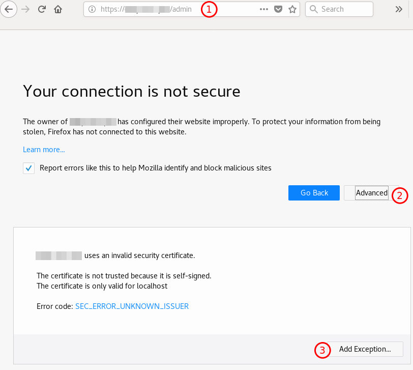

*******
AdminUI
*******

AdminUI is the management interface for Wazo. This is your entry point to the configuration of your
Wazo server. It is accessible at `https://\<wazo\>/admin <https://\<wazo\>/admin>`_

If you did not :ref:`configure your own HTTPS certificates <https_certificate>` you will have to accept
the self signed certificate that was generated on your Wazo.

.. toctree::
   :maxdepth: 2

   login
   plugins
