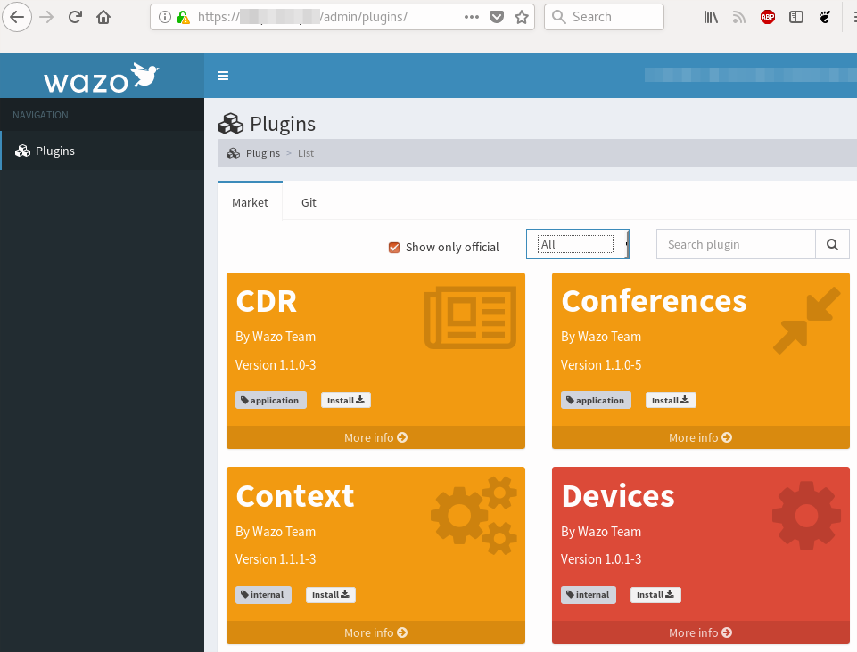
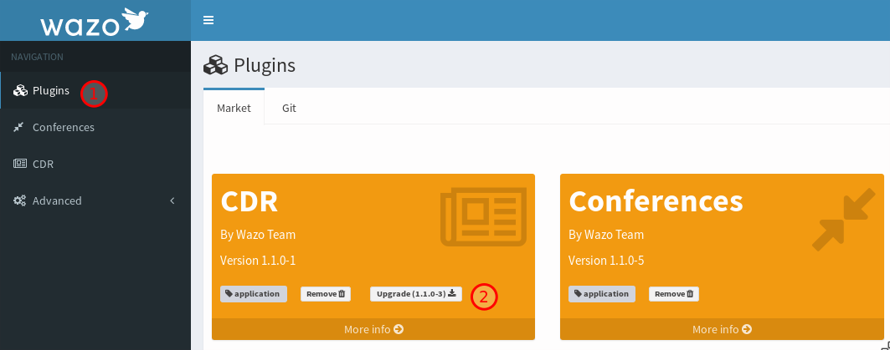

.. _admin_ui_plugins:

*******
Plugins
*******

Wazo plugins can be installed from AdminUI in the plugin menu. Features can be installed here
to customize your Wazo installation.

Official plugins are developed by the Wazo development team, are tested and should not break
during an upgrade. Non-official plugins are developed by the community and are available in
the market for your convenience. The default is to show only official plugins.

Installing plugins
==================

Installing a plugin will also install all of its dependencies. This process is done in the
background: you can continue to use the web interface while the plugins are being installed.

Upgrading plugins
=================

All official plugins will be automatically upgraded when you manually :ref:`upgrade Wazo<upgrade>`.

However, you may still upgrade individual plugins: when a plugin is installed on your system and a
new version of that plugin is available, an upgrade button will be available.

Dependencies
------------

Dependencies are not upgraded when upgrading a single plugin.

For example, the plugin "user" needs the plugin "extension":

=================== ================== ====================
Before upgrade      Upgrades available After upgrading user
=================== ================== ====================
user(1.0.1-1)       user(1.2.0-0)      user(1.2.0-0)
extension(1.5.42-0) extension(2.0.0-4) extension(1.5.42-0)
=================== ================== ====================

The "extension" plugin was not upgraded during the upgrade of the "user" plugin. You will need to
upgrade the "extension" plugins as well.

Removing plugins
================

Removing a plugin will remove the plugin and any other plugin depending on it.

For example, removing "extension" will remove "user" since "user" depends on extension.

Writing a plugin
================

See :ref:`plugin development<developing_plugins>`.
