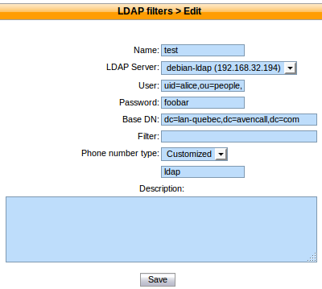
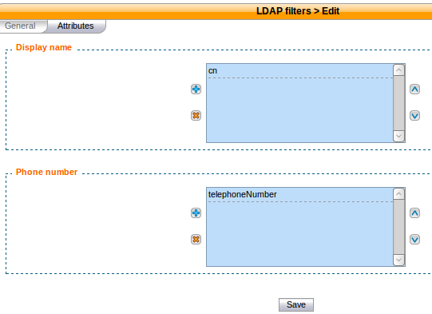
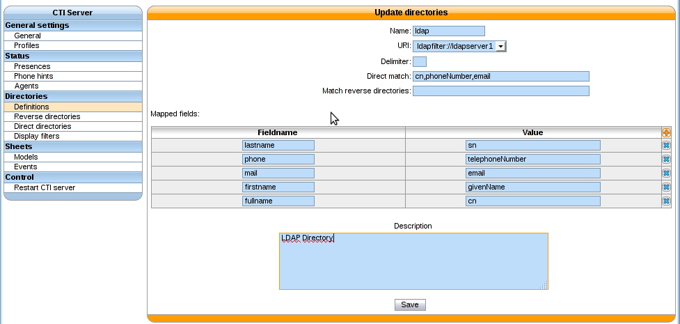
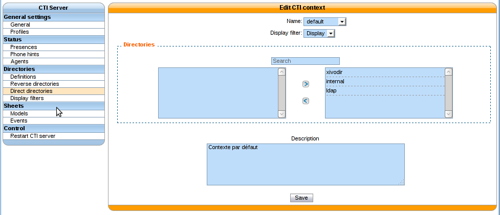

.. _ldap:

****
LDAP
****

XiVO offers the possibility to integrate LDAP servers. Once configured properly,
you'll be able to search your LDAP servers directly from your phones (if they
support this feature).

.. note:: This page describes how to add LDAP servers as sources of contacts. For other sources of
          contacts, see :ref:`phonebook`, and :ref:`directories`.

Add a LDAP Server
=================

You can add a LDAP server by clicking on the add button at the top right corner of the
:menuselection:`Configuration --> Management --> LDAP Servers` page. You'll then
be shown this page:

.. figure:: images/ldap_addserver.png

   Adding a LDAP server

Enter the following information:

* Name: the server's display name
* Host: the hostname or IP address
* Port: the port number (default: 389)
* Security layer: select SSL if it is activated on your server and you want to use it (default: disabled)

  * SSL means TLS/SSL (doesn't mean StartTLS) and port 636 should then be used

* Protocol version: the LDAP protocol version (default: 3)

.. warning::

   When editing an LDAP server, you'll have to restart the CTI server
   for the changes to be taken into account.

.. _ldaps:

Notes on SSL/TLS usage
----------------------

If you are using SSL with an LDAP server that is using a CA certificate from an
unknown certificate authority, you'll have to put the certificate file as a
single file ending with ``.crt`` into :file:`/usr/local/share/ca-certificates`
and run ``update-ca-certificates``.

You also need to make sure that the :file:`/etc/ldap/ldap.conf` file contains a
line ``TLS_CACERT /etc/ssl/certs/ca-certificates.crt``.

After that, restart spawn-fcgi with ``/etc/init.d/spawn-fcgi restart``.

Also, make sure to use the :abbr:`FQDN (Fully Qualified Domain Name)` of the server
in the host field when using SSL. The host field must match exactly what's in the CN
attribute of the server certificate.

.. _add-ldap-filter:

Add a LDAP Filter
=================

Next thing to do after adding a LDAP server is to create a LDAP filter via the
:menuselection:`Services --> IPBX configuration --> LDAP Filters` page.

LDAP filters define the information that will be searched and displayed when you do a
directory search.

You can add a LDAP filter by clicking on the add button at the top right of the page.
You'll then be shown this page:

   Adding a LDAP Filter

Enter the following information:

* Name: the filter's display name
* LDAP server: the LDAP server this filter applies to
* User: the ``dn`` of the user used to do search requests
* Password: the password of the given user
* Base DN: the base ``dn`` of search requests
* Filter: if specified, :ref:`it replace the default filter <custom-filter>`
* Phone number type: this string is appended next to each result display name

You'll also probably need to modify some values in the :guilabel:`Attributes` tab:

   Adding a LDAP Filter

In the :guilabel:`Display name` section, add and order the attributes that are going be used
to display the results. The first attribute will be used for each result which have this
attribute, else the second will be used, etc.

The :guilabel:`Phone number` section is similar, but is used for the phone number in the
results.

.. _custom-filter:

Use a Custom Filter
-------------------

In some cases, you might have to use a custom filter for your search requests instead
of the default filter.

By default, the search tries to match any attribute you choose in the :guilabel:`Attributes`
tab.

In custom filters, occurrence of the pattern ``%Q`` is replaced by what the user entered
on its phone.

Here's some examples of custom filters:

* ``cn=*%Q*``
* ``&(cn=*%Q*)(mail=*@example.org)``
* ``|(cn=*%Q*)(displayName=*%Q*)``

Add a LDAP filter to the Phonebook
==================================

In the :menuselection:`Services --> General settings --> Phonebook` page, click
on the :guilabel:`LDAP filters` page and add your filter to the list of enabled
filters.

Please refer to the :ref:`remote-directory` section in order to properly configure a remote directory.

You'll then be able to search your LDAP server directly from your phone and dial
from the displayed results.

Use with CTI Server and Client XiVO
===================================

Add a LDAP Directory Filter to the CTI Server
---------------------------------------------

In the :menuselection:`Services --> CTI Server --> Directories --> Definitions` page,
click on the add button

   Adding a directory LDAP Filter to CTI Server

* ``Direct match`` searched fields used in the filter
* ``Match reverse directory`` use to search into this field for the reverse directory
* ``Fieldname/value`` match to the CTI field> server> | field> LDAP> server.

If a a custom filter is defined in the LDAP filter configuration, the `direct
match` configuration will be added to that filter using an `&`. To use the
`filter` field of you LDAP filter configuration only do not configure any
`direct match` in your directory definition.

Example:

* Given an LDAP filter with `filter` ``st=Canada``
* Given a directory definition using the previously configured ldap filter with a
  `direct match` ``cn,o``
* Then the resulting filter when doing a search will be ``&(st=Canada)(|(cn=*%Q*)(o=*%Q*))``

Add a LDAP Directory to the CTI Server
--------------------------------------

In the :menuselection:`Services --> CTI Server --> Directories --> Direct directories` page,
click on the edit button for ``default`` directory

To use this directory, you must then add to the list of searchable directories.

   Adding a directory LDAP to CTI Server

.. warning:: The CTI server settings resonates in contexts. This means creating a context for each 
   CTI context of membership of your users who will examine the "Directories".

* eg: CTI Context ``default`` for users in context ``default``

Restart CTI Server
