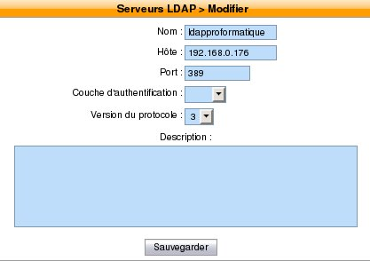
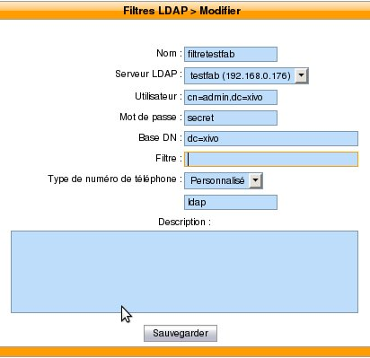
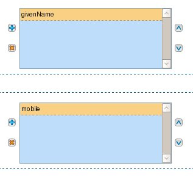

***********
LDAP SERVER
***********

XiVO offers the possibility to create and manage LDAP Server via the
the :menuselection:`Configuration --> Management --> LDAP Servers` page.

Add a LDAP Server
*****************

You can add a LDAP Server by clicking on the add button at the top right of the page.
You'll then be shown this page:

   Adding a LDAP Server

Enter the following information:

* Name: The name of the ldap server (eg ldapxivo)
* Host: what is the ip address of ldap server
* Port: ldap server port (default: 389)
* Authentication layer: the security of the connection
* Protocol version: let the version 3 by default

Add a LDAP Filter
*****************

Click on :menuselection:`Services --> IPBX configuration --> LDAP Filters` page.

You can add a LDAP Server by clicking on the add button at the top right of the page.
You'll then be shown this page:

   Adding a LDAP Filter

Enter the following information:

* Name: the name you want to give it a ldap filter
* LDAP server: ldap.xivo.fr
* User: cn=admin,dc=xivo,dc=com
* Password: ``***********``
* Base DN: dc=xivo,dc=com
* Filter: example: cn=*%Q*,%Q being that the user taps on his phone
* Type of telephone number: here you can specify what type is this issue. 
  In our example it's clear that he is "ldap".

Now click on the "Attributes" tab. In the "Name displays" add "givenName" 
and then in the "Phone number" add "mobile". Here we will display the number 
of mobile users. But we can also display the number of sets with "phone".

   Adding a LDAP Filter

Associate a LDAP Server to Phonebook
************************************

Click "Address Book" in "Global Settings" tab then "LDAP filter". 
And add your filter to right.
