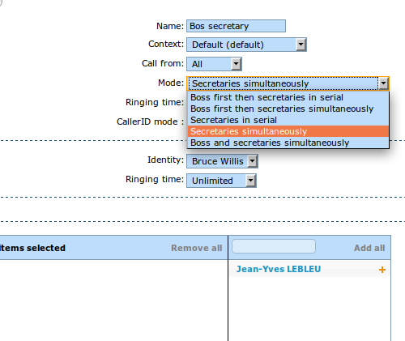

*********************
Boss secretary filter
*********************

The boss secretary filter allow to set a secretary or a boss role to a user. Filters can then be
created to filter calls directed to a boss using different strategies.

Defining a role
===============

The secretary or boss role can be set in the user's configuration page under the service tab. To use
this feature, at least one boss and one secretary must be defined.

Creating a filter
=================

The filter is used to associate a boss to one or many secretaries and to set a ring strategy. The
call filter can be added in Services > Call management > Call filters.

Usage
=====

The call filter function can be activated and deactivated by the boss using the \*37 extension. The
extension is defined in IPBX services > Extensions.

The call filter has to be activated for each secretary if more than one is defined for a given boss.

The extension to use is ``*37<boss number>*<secretary number>``.

For a boss with extension 100 and 2 secretaries with extensions 101 and 102 the boss would have to
type ``*37100*101`` and ``*37100*102``.

Function keys
=============

A more convenient way to active the boss secretary filter is to assign a function key on the boss'
phone. In the user's configuration under ``Func Keys``. A function key can be added for each
secretaries of a boss.

If supervision is activated, the key will light up when filter is activated for this secretary.
