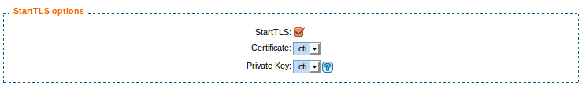
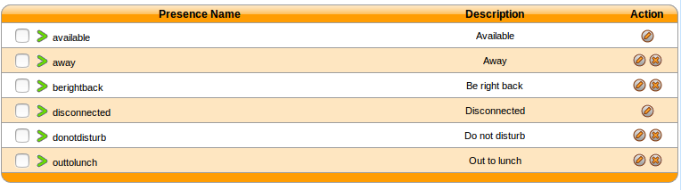
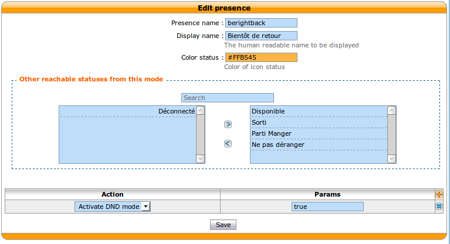
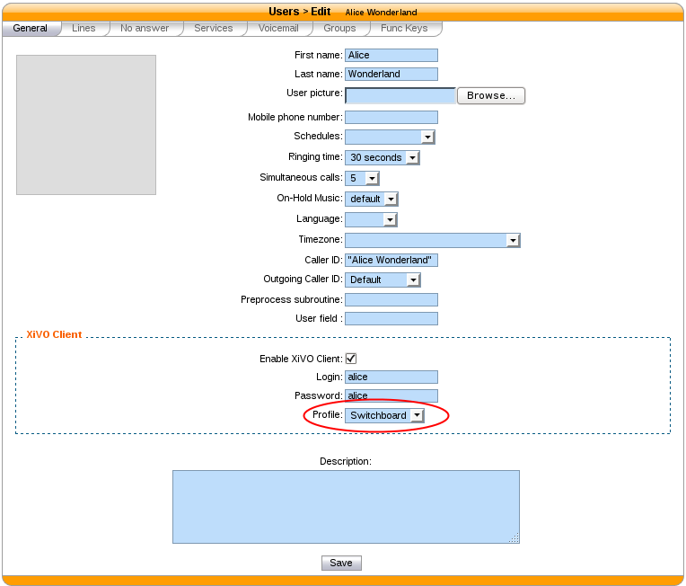
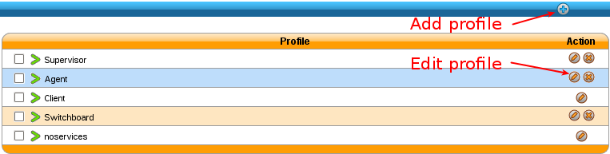

**********
CTI Server
**********

.. index:: ctiserver

The CTI server configuration options can be found in the web-interface under the services tab.

General Options
===============

The general options allow the administrator to manage network connections between the CTI server and
the clients.

The section named ``STARTTLS options`` allows the administrator to enable
encrypted communications between the clients and xivo-ctid and specify the
certificate and private keys to use.

If no certificate and private key is configured, xivo-ctid will use the ones
located in */usr/share/xivo-certs*.

Parting options are used to isolate XiVO users from each other. These options
should be used when using the same XiVO for different enterprises.

Context separation is based on the user's line context. A user
with no line is not the member of any context and will not be able to do
anything with the CTI client.

.. note:: The CTI Server must be restarted to take into account this parameter.

.. _authentication:

Authentication
================

xivo-ctid uses xivo-auth to authenticate users. The default authentication
backend is `xivo_user`. To change the authentication backend, add a
configuration file in `/etc/xivo-ctid/conf.d` with the following content:

.. code-block:: yaml

    auth:
        backend: backend_name

where *backend* name is the name of an enabled *xivo-auth* :ref:`auth-backends`.

.. _presence_option:

Presence Option
===============

In the `Status` menu, under `Presences`, you can edit presences group.
The default presence group is xivo. When editing
a group, you will see a list of presences and there descriptions.

.. _presence-actions:

Available configuration
-----------------------

* `Presence name` is the name of the presence
* `Display name` is the human readable representation of this presence
* `Color status` is the color associated to this presence
* `Other reachable statuses` is the list of presence that can be switched from this presence state
* `Actions` are post selection actions that are triggered by selecting this presence

Actions
-------

============================= ==================
action                        param
============================= ==================
`Enable DND`                  `{'true','false'}`
`Pause agent in all queues`
`Unpause agent in all queues`
`Agent logoff`
============================= ==================

.. _ctid-encryption:

Enable encryption
=================

To enable encryption of CTI communications between server and clients, you have
to enable STARTTLS in :menuselection:`CTI Server --> General settings -->
General`

Custom certificates can be added in :menuselection:`Configuration --> Certificates`
and used in :menuselection:`CTI Server --> General settings --> General`

In your XiVO Client, in the menu :menuselection:`XiVO Client --> Configure -->
Connection`, click on the lock icon.

.. note::

   A client which chooses to use encryption will not be able to connect to a
   server that does not have STARTTLS enabled.

.. warning::

   For now, there is no mechanism for strong authentication of the server. The
   connection is encrypted, but the identity of the server is not verified.

.. _cti-profiles:

CTI profiles
============

The CTI profiles define which features are made available to a user. You can
configure which profile will be used by a user in the menu :menuselection:`IPBX
--> PBX Settings --> Users`:

You can also customize the default profiles or add new profiles in the menu
:menuselection:`CTI Server --> Profiles`:

Xlets
-----

To choose which features are available to users using a profile, you have to
select which *Xlets* will be available.

The Xlets are detailed in :ref:`xlet-list`.

The *Position* attribute determines how the Xlets will be laid out:

* *dock* will display a Xlet in its own frame. This frame can have some options:

  * *Floating* means that the frame can be detached from the main window of the CTI
    Client.
  * *Closable* means that the Xlet can be hidden
  * *Movable* means that the Xlet can be moved (either inside the main window or outside)
  * *Scroll* means that the Xlet will display a scroll bar if the Xlet is too large.

* *grid* will display a Xlet inside the main window, and it will not be
  movable. Multiple *grid* Xlets will be laid out vertically (the second below
  the first).
* *tab* will display a Xlet inside a tab of the Xlet *Tabber*. Thus the Xlet
  *Tabber* is required and can't be in a *tab* position.

The *Number* attribute gives the order of the Xlets, beginning with 0. The order
applies only to Xlets having the same *Position* attribute.
