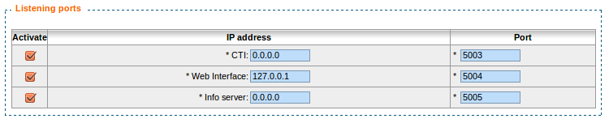
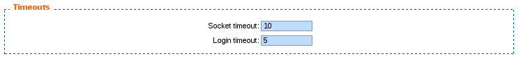

**********
CTI Server
**********

.. index:: ctiserver

The CTI server configuration options can be found in the web-interface under the services tab. 

General Options
===============

The general options allow the administrator to manage network connections between the CTI server 
and other services and clients.

The section named AMI connection allows the administrator to configure the
information required to connect to the Asterisk Manager Interface
(AMI). These fields should match the entries in :file:`/etc/asterisk/manager.conf`.

.. figure:: images/ami_connection.png
   :scale: 85%

The section named ``Listening Ports`` allows the administrator to specify listening
addresses and ports for the CTI server's interfaces.

* Fast AGI is the CTI server's entry point for the Asterisk dialplan. This
  address and port have nothing to do with the listening port and address of
  xivo-agid.
* CTI and CTIs are for the client's connection and secure connection respectively.
* Web Interface is for the port used to receive events from the XiVO web interface
* Info server a debugging console to do some introspection on the state of the CTI server
* Announce is used to notify the CTI server when a dialplan reload is requested

The timeout section allow the administrator to configure multiple timeouts.

* Socket timeout is the default timeout used for network connections.
* Login timeout is the timeout before a CTI connection is dropped if the
  authentication is not completed.

Parting options are used to isolate XiVO users from each other. These options
should be used when using the same XiVO for different enterprises.

Context separation is based on the user's line context. A user
with no line is not the member of any context and will not be able to do
anything with the CTI client.

.. note:: The CTI Server must be restarted to take into account this parameter.

.. figure:: images/cti_others.png
   :scale: 85%

Presence Option
===============

In the `Status` menu, under `Presences`, you can edit presences group. 
The default presence group is xivo. When editing
a group, you will see a list of presences and there descriptions.

.. figure:: images/presence_list.png
   :scale: 85%

.. _presence-actions:

Available configuration
-----------------------

* `Presence name` is the name of the presence
* `Display name` is the human readable representation of this presence
* `Color status` is the color associated to this presence
* `Other reachable statuses` is the list of presence that can be switched from this presence state
* `Actions` are post selection actions that are triggered by selecting this presence

.. figure:: images/presence_configuration.png
  :scale: 85%

Actions
-------

============================= ==================
action                        param
============================= ==================
`Enable DND`                  `{'true','false'}`
`Pause agent in all queues`
`Unpause agent in all queues`
`Agent logoff`
============================= ==================

.. _ctid-encryption:

Enable encryption
=================

To enable encryption of CTI communications between server and clients, you have
to create a certificate in :menuselection:`Configuration --> Certificates`.

Then, go in the menu :menuselection:`CTI Server --> General settings -->
General`, and in the section ``Listening ports``, check the line CTIS, and
select both the certificate and the private key you created earlier. By default,
the CTIS port is 5013.

In your XiVO Client, in the menu :menuselection:`XiVO Client --> Configure -->
Connection`, check the option ``Encrypt connection`` and adjust the server port
if necessary.

.. warning:: For now, there is no mechanism for strong authentification of the
   server. The connection is encrypted, but the identity of the server is not
   verified.

CTI profiles
============

The CTI profiles define which features are made available to a user. You can
configure which profile will be used by a user in the menu :menuselection:`IPBX
--> PBX Settings --> Users`:

.. figure:: images/user_profile.png

You can also customize the default profiles or add new profiles in the menu
:menuselection:`CTI Server --> Profiles`:

.. figure:: images/profiles_list.png

Xlets
-----

To choose which features are available to users using a profile, you have to
select which *Xlets* will be available.

The Xlets are detailed in :ref:`xlet-list`.

The *Position* attribute determines how the Xlets will be laid out:

* *dock* will display a Xlet in its own frame. This frame can have some options:

  * *Floating* means that the frame can be detached from the main window of the CTI
    Client.
  * *Closable* means that the Xlet can be hidden
  * *Movable* means that the Xlet can be moved (either inside the main window or outside)
  * *Scroll* means that the Xlet will display a scroll bar if the Xlet is too large.

* *grid* will display a Xlet inside the main window, and it will not be
  movable. Multiple *grid* Xlets will be laid out vertically (the second below
  the first).
* *tab* will display a Xlet inside a tab of the Xlet *Tabber*. Thus the Xlet
  *Tabber* is required and can't be in a *tab* position.

The *Number* attribute gives the order of the Xlets, beginning with 0. The order
applies only to Xlets having the same *Position* attribute.
