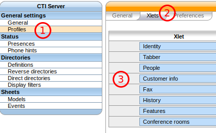
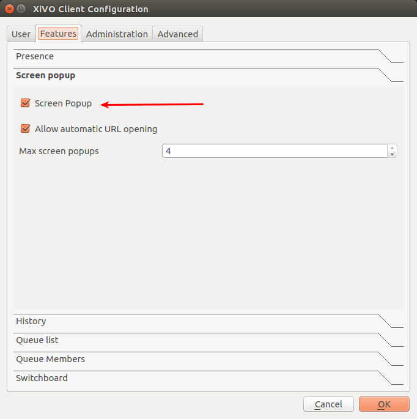

*********************
Customer Informations
*********************

Display customer informations
=============================

.. toctree::

   sheetconfiguration

The informations about a call are displayed via the Wazo Client on forms called
sheets. Sheets or customer info is a mechanism that allow the user to receive information
about a call in its client. There are many events that can trigger a sheet to be
displayed and there are many variables available for display.

Enabling the sheets for a user
==============================

To be able to receive sheets, a user must have a CTI profile with the `Customer Info` xlet.

The user must also enable `Screen Popup` in its client.

Example: Display a Web page when an agent answers a call
--------------------------------------------------------

The first step is to assign the URL to a dialplan variable. Go in the
:menuselection:`Services --> IPBX --> Configuration files` and create a new file
called ``setsheeturl.conf``. In this file, put the following::

   [setsheeturl]
   exten = s,1,NoOp(Starting Set Sheet URL)
   same  = n,Set(SHEET_URL_CTI=http://documentation.wazo.community)
   same  = n,UserEvent(dialplan2cti,UNIQUEID: ${UNIQUEID},CHANNEL: ${CHANNEL},VARIABLE: mysheeturl,VALUE: ${SHEET_URL_CTI})
   same  = n,Return()

You can replace ``documentation.wazo.community`` by the URL you want.

The second step is to set the URL when the call is queued. To do that, we will
use a preprocessing subroutine. This is configured in the queue configuration :
go to :menuselection:`Services --> Call center --> Queues` and edit the
queue. Set the field ``Preprocessing subroutine`` to ``setsheeturl`` (the same
as above).

The third step is to configure the sheet to open the wanted URL. Go to
:menuselection:`Services --> CTI Server --> Sheets --> Models` and create a new
sheet. Keep the default for everything except the Action tab, add a field and
set it to ``{dp-mysheeturl}`` (the same as above).

The fourth and final step is to trigger the sheet when the agent answers the
queued call. Go to :menuselection:`Services --> CTI Server --> Sheets -->
Events` and link the event ``Agent linked`` to the sheet you just created.

That's it, you can assign agents to your queue, log the agents and make them
answer calls with the Wazo Client opened, and your browser should open the
specified URL.
