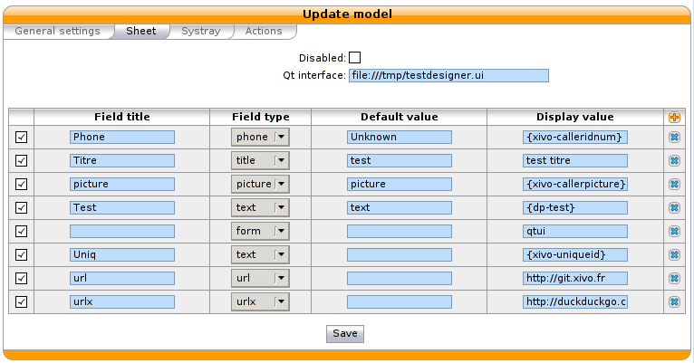

*******************
Sheet Configuration
*******************

Sheets can be defined under :menuselection:`Services --> CTI Server --> Models`
in the web interface. Once a sheet is defined, it has to be assigned to an event
in the :menuselection:`Services --> CTI Server --> Events` menu.

Model
   The model is the content of the displayed sheet.
Event
   Events are action that trigger the defined sheet. A sheet can be assigned to
   many events. In that case, the sheet will be raised for each events.

.. figure:: images/sheets_configuration.png
   :scale: 85%

General settings
================

In the first tab the name of your model can be configured.
When you checkbox focus is checked, your xivo client focus when you received a sheet.
The description allow the administrator to give an overview of a given sheet.

.. figure:: images/sheets_configuration_general.png
   :scale: 85%

.. _custom-call-form:

Sheets
======

This tab is dedicated for the form/information of your sheet. You can define an
external form created with qt-designer.

.. warning:: In qt-designer, one must set 'vertical layout' on the top widget
   (right click on the top widget > Lay out > Vertical layout).

You can configure the path to a ``file://`` or ``http://``. The check box is for
activated this ui. The qt file is an xml file.

Here an example of a small form develop with qt-designer.

.. figure:: images/sheets_configuration_qtui.png
   :scale: 85%

The qt-designer screenshot.

.. figure:: images/sheets_configuration_qtdesigner.png
   :scale: 85%

the generated file from qt-designer :

.. code-block:: javascript

 <?xml version="1.0" encoding="UTF-8"?>
 <ui version="4.0">
  <class>widget</class>
  <widget class="QWidget" name="widget">
   <property name="geometry">
    <rect>
     <x>0</x>
     <y>0</y>
     <width>225</width>
     <height>146</height>
    </rect>
   </property>
   <property name="windowTitle">
    <string>Form</string>
   </property>
   <layout class="QVBoxLayout" name="verticalLayout">
    <item>
     <layout class="QGridLayout">
      <item row="0" column="0">
       <widget class="QLabel" name="label">
        <property name="text">
         <string>Nom</string>
        </property>
       </widget>
      </item>
      <item row="1" column="0">
       <widget class="QLabel" name="label_2">
        <property name="text">
         <string>Prenom</string>
        </property>
       </widget>
      </item>
      <item row="2" column="0">
       <widget class="QLabel" name="label_3">
        <property name="text">
         <string>Sexe</string>
        </property>
       </widget>
      </item>
      <item row="1" column="1">
       <widget class="QLineEdit" name="XIVOFORM_lastname_2"/>
      </item>
      <item row="0" column="1">
       <widget class="QLineEdit" name="XIVOFORM_name"/>
      </item>
      <item row="3" column="1">
       <widget class="QPushButton" name="save">
        <property name="text">
         <string>Envoyer</string>
        </property>
       </widget>
      </item>
      <item row="2" column="1">
       <widget class="QComboBox" name="comboBox">
        <item>
         <property name="text">
          <string>Masculin</string>
         </property>
        </item>
        <item>
         <property name="text">
          <string>Féminin</string>
         </property>
        </item>
       </widget>
      </item>
     </layout>
    </item>
   </layout>
  </widget>
  <resources/>
  <connections/>
  </ui>

When a CTI client submits a custom sheet, a :ref:`bus-call_form_result` event is published on the bus.

On the second part of the tab, you can configure the fields to appear on the sheet. Each field is represented by the following parameters :

* Field title : name of your line used as label on the sheet.
* Field type : define the type of field displayed on the sheet. Supported field types :

  * title : to create a title on your sheet
  * text : show a text
  * url : a simple url link, open your default browser.
  * urlx : an url button
  * picture : show a picture from an internal user in your sheet, you need to use {xivo-picture} variable.
  * phone : create a tel: link, you can click to call on your sheet.
  * form : show the form from an ui predefined. It's an xml ui. You need to define qtui in display format.

* Default value : if given, this value will be used when all substitutions in the display value field fail.
* Display value : you can define text, variables or both. Three kinds of variables are available :

  * `xivo-` prefix is reserved and set inside the CTI server:

    * `xivo-where` for sheet events, event triggering the sheet
    * `xivo-origin` place from where the lookup is requested (did, internal, forcelookup)
    * `xivo-direction` incoming or internal
    * `xivo-did` DID number
    * `xivo-calleridnum`
    * `xivo-calleridname`
    * `xivo-calleridrdnis` contains information whether there was a transfer
    * `xivo-calleridton` Type Of Network (national, international)
    * `xivo-calledidnum`
    * `xivo-calledidname`
    * `xivo-ipbxid` (`xivo-astid` in 1.1)
    * `xivo-directory` : for directory requests, it is the directory database the item has been found
    * `xivo-queuename` queue called
    * `xivo-agentnumber` agent number called
    * `xivo-date` formatted date string
    * `xivo-time` formatted time string
    * `xivo-channel` asterisk channel value (for advanced users)
    * `xivo-uniqueid` asterisk uniqueid value (for advanced users)

  * `db-` prefixed variables are defined when the reverse lookup returns a result.

  For example if you want to access to the reverse lookup full name, you need to define a field
  ``fullname`` in the directory definition, mapping to the full name field in your directory. The
  ``{db-fullname}`` will be replaced by the caller full name. Every field of the directory is
  accessible this way.

  * `dp-` prefixed ones are the variables set through the dialplan (through UserEvent application)

  For example if you want to access from the dialplan to a variable dp-test you
  need to add in your dialplan this line (in a subroutine)::

   UserEvent(dialplan2cti,UNIQUEID: ${UNIQUEID},CHANNEL: ${CHANNEL},VARIABLE: test,VALUE: "Salut")

The ``{dp-test}`` displays Salut.

.. warning:: fields of type 'form' work differently from other field
   types. Fields `Field title` and `Default value` are not used and
   field `Display value` MUST be set to ``qtui``.

Default XiVO sheet example :

.. figure:: images/sheets_configuration_sheet.png
   :scale: 85%

Other example with more bells and whistles :

Systray
=======

Mostly the same syntax as the sheet with less field types available (title,
body). A Systray popup will display a single title (the last one added to the
list of fields) and zero, one or more fields of type 'body'.

.. figure:: images/sheets_configuration_systray.png
   :scale: 85%

.. warning:: The popup message on MacOSX works with Growl http://growl.info. We could get simple sheet popup to work using the free Growl Fork http://www.macupdate.com/app/mac/41038/growl-fork
  Note that this is not officially supported.

Actions
=======

The action is for the xivo client, so if you configure an action, please be sure
you understand it's executed *by the client*. You need to allow this action in
the client configuration too (menu `XiVO Client -> Configure`, tab `Functions`,
tick option `Customer Info` and in sub-tab `Customer Info` tick the option
`Allow the Automatic Opening of URL`).

The field in this tab receives the URL that will be displayed in your
browser. You can also use variable substitution in this field.

 * ``http://example.org/foo`` opens the URL on the default browser
 * ``http://example.org/{xivo-did}`` opens the URL on the default browser, after
   substituting the ``{xivo-did}`` variable. If the substitution fails, the URL will
   remain ``http://example.org/{xivo-did}``, i.e. the curly brackets will still be present.
 * ``http://example.org/{xivo-did}?origin={xivo-origin}`` opens the URL on the default
   browser, after substituting the variables. If at least one of the substitution is
   successful, the failing substitutions will be replaced by an empty string. For example,
   if ``{xivo-origin}`` is replaced by 'outcall' but ``{xivo-did}`` is not substituted,
   the resulting URL will be ``http://example.org/?origin=outcall``
 * ``tcp://x.y.z.co.fr:4545/?var1=a1&var2=a2`` connects to TCP port 4545
   on x.y.z.co.fr, sends the string ``var1=a1&var2=a2``, then closes
 * ``udp://x.y.z.co.fr:4545/?var1=a1&var2=a2`` connects to UDP port 4545
   on x.y.z.co.fr, sends the string ``var1=a1&var2=a2``, then closes

.. note:: any string that would not be understood as an URL will be handled like and URL
   it is a process to launch and will be executed as it is written

For `tcp://` and `udp://`, it is a requirement that the string between `/` and `?` is empty.
An extension could be to define other serialization methods, if needed.

.. figure:: images/sheets_configuration_actions.png
   :scale: 85%

Event configuration
===================

You can configure a sheet when a specific event is called. For example if you want to receive a sheet when an agent answers to a call, you can choose a sheet model for the Agent link event.

The following events are available :

 * Dial: When a new call enters the queue (all the members of the queue will be notified, even if they are not logged)
 * Link: When a user or agent answers a call
 * Unlink: When a user or agent hangup a call
 * Incoming DID: Received a call in a DID
 * Hangup: Hangup the call

.. figure:: images/events_configuration.png
   :scale: 85%
