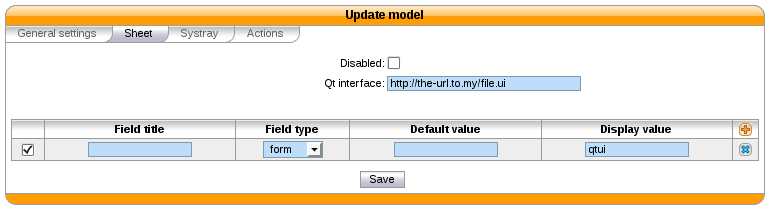

*******************
Sheet Configuration
*******************

Sheets can be defined under :menuselection:`Services --> CTI Server --> Models`
in the web interface. Once a sheet is defined, it has to be assigned to an event
in the :menuselection:`Services --> CTI Server --> Events` menu.

Model
   The model contains the content of the displayed sheet.
Event
   Events are actions that trigger the defined sheet. A sheet can be assigned to many events. In
   that case, the sheet will be raised for each event.

.. figure:: images/sheets_configuration.png
   :scale: 85%

General settings
================

.. figure:: images/sheets_configuration_general.png
   :scale: 85%

You must give a name to your sheet to be able to select it later.

The ``Focus`` checkbox makes the XiVO Client pop up when the sheet is displayed, if the XiVO Client
was hidden.

.. _custom-call-form:

Sheets
======

There are two different ways to configure the contents of the sheet:

* creating a custom sheet from the Qt designer. This gives you a total control on the layout of the
  information and allows you to save and process data entered during or after a call.
* listing the different fields and their content. The information will be automatically laid out in
  a linear fashion and will be read-only.

Custom sheet
------------

Configuring the sheet
^^^^^^^^^^^^^^^^^^^^^

The ``Qt interface`` field is the path to the UI file created by the Qt Designer. The path can
either be a local file on your XiVO starting with ``file://``, or a HTTP URL.

You must add a field with type ``form`` and display value ``qtui`` for the form to be displayed.

Create a custom sheet with Qt Designer
^^^^^^^^^^^^^^^^^^^^^^^^^^^^^^^^^^^^^^

The Qt Designer is part of the Qt development kit and is also available in the Qt Creator. They are
available on the `Qt project website`_.

.. _Qt project website: http://qt-project.org/downloads

Here is an example of a small form created with Qt Designer.

.. figure:: images/sheets_configuration_qtui.png
   :scale: 85%

The Qt Designer screenshot.

.. figure:: images/sheets_configuration_qtdesigner.png
   :scale: 85%

.. warning:: In Qt Designer, one must set 'vertical layout' on the top widget (right click on the
   top widget > Lay out > Vertical layout).

You can download the file generated by this example from Qt Designer:
:download:`example-form.ui<resources/example-form.ui>`

Text fields (QLineEdit, QLabel, QPlainTextEdit) can contain variables that will be substituted. See
the :ref:`variable list<sheet-variables>` for more information.

List of fields
--------------

Default XiVO sheet example :

.. figure:: images/sheets_configuration_sheet.png
   :scale: 85%

Example showing all kinds of fields:

.. figure:: images/sheets_configuration_sheet_demo.png
   :scale: 85%

Each field is represented by the following parameters :

* Field title : name of your line used as label on the sheet.
* Field type : define the type of field displayed on the sheet. Supported field types :

  * title : to create a title on your sheet
  * text : show a text
  * url : a simple url link, open your default browser.
  * urlx : an url button
  * picture : show a picture from an internal user in your sheet, you need to use {xivo-picture} variable.
  * phone : create a tel: link, you can click to call on your sheet.
  * form : show the form from an ui predefined. It's an xml ui. You need to define qtui in display format.

* Default value : if given, this value will be used when all substitutions in the display value field fail.
* Display value : you can define text, variables or both. See the :ref:`variable list<sheet-variables>` for more
  information.

.. _sheet-variables:

Variables
---------

Three kinds of variables are available :

  * `xivo-` prefix is reserved and set inside the CTI server:

    * `xivo-where` for sheet events, event triggering the sheet
    * `xivo-origin` place from where the lookup is requested (did, internal, forcelookup)
    * `xivo-direction` incoming or internal
    * `xivo-did` DID number
    * `xivo-calleridnum`
    * `xivo-calleridname`
    * `xivo-calleridrdnis` contains information whether there was a transfer
    * `xivo-calleridton` Type Of Network (national, international)
    * `xivo-calledidnum`
    * `xivo-calledidname`
    * `xivo-ipbxid` (`xivo-astid` in 1.1)
    * `xivo-directory` : for directory requests, it is the directory database the item has been found
    * `xivo-queuename` queue called
    * `xivo-agentnumber` agent number called
    * `xivo-date` formatted date string
    * `xivo-time` formatted time string
    * `xivo-channel` asterisk channel value (for advanced users)
    * `xivo-uniqueid` asterisk uniqueid value (for advanced users)

  * `db-` prefixed variables are defined when the reverse lookup returns a result.

  For example if you want to access to the reverse lookup full name, you need to define a field
  ``fullname`` in the directory definition, mapping to the full name field in your directory. The
  ``{db-fullname}`` will be replaced by the caller full name. Every field of the directory is
  accessible this way.

  * `dp-` prefixed ones are the variables set through the dialplan (through UserEvent application)

  For example if you want to access from the dialplan to a variable dp-test you
  need to add in your dialplan this line (in a subroutine)::

   UserEvent(dialplan2cti,UNIQUEID: ${UNIQUEID},CHANNEL: ${CHANNEL},VARIABLE: test,VALUE: "Salut")

The ``{dp-test}`` displays Salut.

Sending informations during/after a call
----------------------------------------

After showing a sheet, the XiVO Client can also send back information to XiVO for post-processing or
archiving.

Here are the requirements:

* The sheet must contain a button named ``save`` to submit information
* Supported widgets:

  * QCalendarWidget
  * QCheckBox
  * QComboBox
  * QDateEdit
  * QDateTime
  * QDateTimeEdit
  * QDoubleSpinBox
  * QLabel
  * QLineEdit
  * QList
  * QPlainTextEdit
  * QRadioButton
  * QSpinBox
  * QTimeEdit

* Fields must have their name starting with ``XIVOFORM_``

When a CTI client submits a custom sheet, a :ref:`bus-call_form_result` event is published on the
event bus.

Systray
=======

Mostly the same syntax as the sheet with less field types available (title,
body). A Systray popup will display a single title (the last one added to the
list of fields) and zero, one or more fields of type 'body'.

.. figure:: images/sheets_configuration_systray.png
   :scale: 85%

.. warning:: The popup message on MacOSX works with Growl http://growl.info. We could get simple sheet popup to work using the free Growl Fork http://www.macupdate.com/app/mac/41038/growl-fork
  Note that this is not officially supported.

Actions
=======

The action is for the xivo client, so if you configure an action, please be sure
you understand it's executed *by the client*. You need to allow this action in
the client configuration too (menu `XiVO Client -> Configure`, tab `Functions`,
tick option `Customer Info` and in sub-tab `Customer Info` tick the option
`Allow the Automatic Opening of URL`).

The field in this tab receives the URL that will be displayed in your
browser. You can also use variable substitution in this field.

 * ``http://example.org/foo`` opens the URL on the default browser
 * ``http://example.org/{xivo-did}`` opens the URL on the default browser, after
   substituting the ``{xivo-did}`` variable. If the substitution fails, the URL will
   remain ``http://example.org/{xivo-did}``, i.e. the curly brackets will still be present.
 * ``http://example.org/{xivo-did}?origin={xivo-origin}`` opens the URL on the default
   browser, after substituting the variables. If at least one of the substitution is
   successful, the failing substitutions will be replaced by an empty string. For example,
   if ``{xivo-origin}`` is replaced by 'outcall' but ``{xivo-did}`` is not substituted,
   the resulting URL will be ``http://example.org/?origin=outcall``
 * ``tcp://x.y.z.co.fr:4545/?var1=a1&var2=a2`` connects to TCP port 4545
   on x.y.z.co.fr, sends the string ``var1=a1&var2=a2``, then closes
 * ``udp://x.y.z.co.fr:4545/?var1=a1&var2=a2`` connects to UDP port 4545
   on x.y.z.co.fr, sends the string ``var1=a1&var2=a2``, then closes

.. note:: any string that would not be understood as an URL will be handled like and URL
   it is a process to launch and will be executed as it is written

For `tcp://` and `udp://`, it is a requirement that the string between `/` and `?` is empty.
An extension could be to define other serialization methods, if needed.

.. figure:: images/sheets_configuration_actions.png
   :scale: 85%

Event configuration
===================

You can configure a sheet when a specific event is called. For example if you want to receive a sheet when an agent answers to a call, you can choose a sheet model for the Agent link event.

The following events are available :

 * Dial: When a new call enters the queue (all the members of the queue will be notified, even if they are not logged)
 * Link: When a user or agent answers a call
 * Unlink: When a user or agent hangup a call
 * Incoming DID: Received a call in a DID
 * Hangup: Hangup the call

.. figure:: images/events_configuration.png
   :scale: 85%
