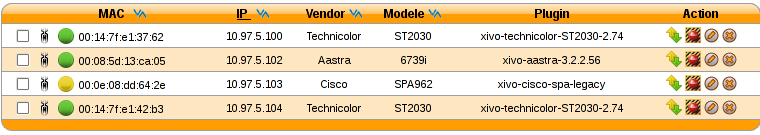
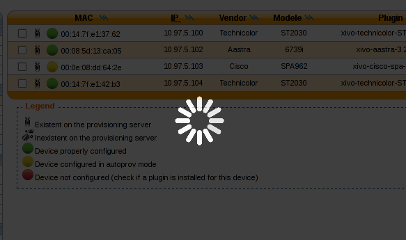

*******
Devices
*******

.. index:: devices
.. _synchronize-device:

Synchronize a device
====================

First you have to display the list of devices.

.. figure:: images/updating.png

   Click on the synchronize button for a device.

   List devices
    
You will see a pop-up to confirm synchronization
 Click on the <ok> button.

.. figure:: images/alert_confirm_synchronize.png
   :scale: 80%
   :alt: Alert confirm synchronize

   Alert confirm synchronize

You must wait until the full synchronization process has completed to determine the state returned back from the device.
This can take several seconds. It is important to wait and do nothing during this time.

   Request synchronization processing

If synchronization is successful, a green information balloon notifies you of success.

.. figure:: images/synchronisation_successfully.png
   :scale: 80%
   :alt: Device successfully synchronized

   Device successfully synchronized

If synchronization fails, a red information balloon warns you of failure.

.. figure:: images/error_during_synchronize.png
   :scale: 80%
   :alt: Error during device synchronization

   Error during device synchronization
    

Synchronize multiple devices
============================

.. warning:: When using multiple synchronization, the individual return states will not be displayed.

Select the devices you want to synchronize by checking the boxes.

.. figure:: images/synchronize_multi_devices.png
   :scale: 80%
   :alt: Synchronize multiple devices

   Synchronize selected devices

A pop-up will appear requesting confirmation.

.. figure:: images/synchronize_multi_devices_confirm.png
   :scale: 80%
   :alt: Synchronize multiple devices confirmation

   Synchronize selected devices confirmation

If mass synchronization was successfully sent to the devices, a green information balloon notifies you of success.

.. figure:: images/mass_synchronize_send.png
   :scale: 80%
   :alt: Mass synchronization request sent successfully

   Mass synchronization request sent successfully
