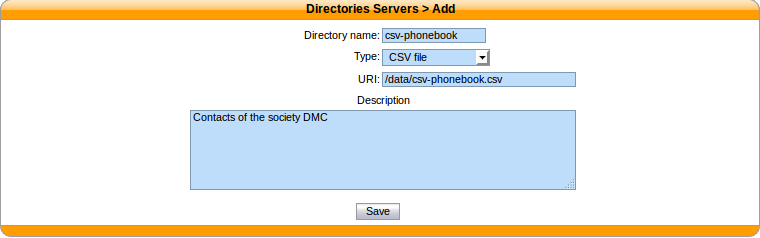
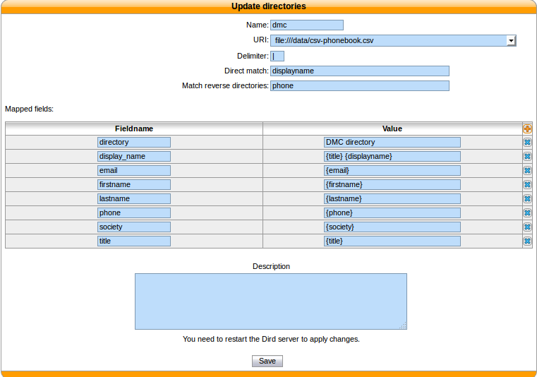

.. _csv-file-directory:

********************
CSV File directories
********************

The source file of the directory must be in CSV format. You will be able to choose the headers and the separator in the next steps. For example, the file will look like::

    title|firstname|lastname|displayname|society|mobilenumber|email
    mr|Emmett|Brown|Brown Emmett|DMC|5555551234|emmet.brown@dmc.example.com

This directory type matches the :ref:`dird-backend-csv` backend in `wazo-dird`.

For file directories, the :guilabel:`Direct match` and the :guilabel:`Match reverse directories`
must be filled with the name of the column used to match entries.

Available fields
================

Available fields are the one's contained in the CSV file.

Example
=======

csv-phonebook.csv::

    title|firstname|lastname|displayname|society|phone|email
    mr|Emmett|Brown|Brown Emmett|DMC|5555551234|emmet.brown@dmc.example.com
    ms|Alice|Wonderland|Wonderland Alice|DMC|5555551235|alice.wonderland@dmc.example.com

Adding a source
---------------

   :menuselection:`Configuration --> Management --> Directories`

Configuring source access
-------------------------

   :menuselection:`Services --> CTI Server --> Directories --> Definitions`
