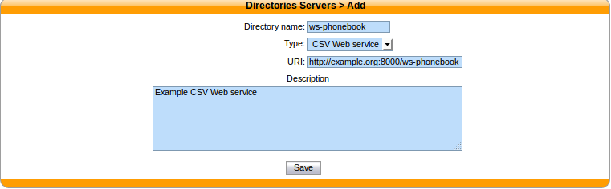
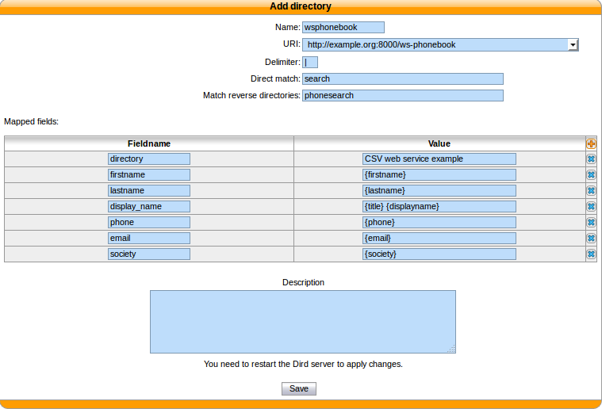

.. _csv-web-service-directory:

***************************
CSV Web service directories
***************************

The data returned by the Web service must have the same format than the file directory. In the same
way, you will be able to choose the headers and the separator in the next step.

This directory type matches the :ref:`dird-backend-csv_ws` backend in `xivo-dird`.

For web service directories, the :guilabel:`Direct match` and the :guilabel:`Match reverse
directories` must be filled with the name of the HTTP query parameter that will be used when doing
the HTTP requests.

Note that the CSV returned by the Web service is not further processed.

Available fields
================

Available fields are the ones contained in the CSV result.

Example
=======

http://example.org:8000/ws-phonebook return csv::

    title|firstname|lastname|displayname|society|phone|email
    mr|Emmett|Brown|Brown Emmett|DMC|5555551234|emmet.brown@dmc.example.com
    ms|Alice|Wonderland|Wonderland Alice|DMC|5555551235|alice.wonderland@dmc.example.com

Adding a source
---------------

   :menuselection:`Configuration --> Management --> Directories`

Configuring source access
-------------------------

Given you have the following directory definition:

* :guilabel:`Direct match` : ``search``
* :guilabel:`Match reverse directories` : ``phone``

When a direct lookup for "Alice" is performed, then the following HTTP request::

   GET /ws-phonebook?search=Alice HTTP/1.1

is emitted. When a reverse lookup for "5555551234" is performed, then the following HTTP request::

   GET /ws-phonebook?phone=5555551234 HTTP/1.1

is emitted. On the reverse lookup, a filtering is performed on the result. In this example, it should have
``phone`` as column.

   :menuselection:`Services --> CTI Server --> Directories --> Definitions`
