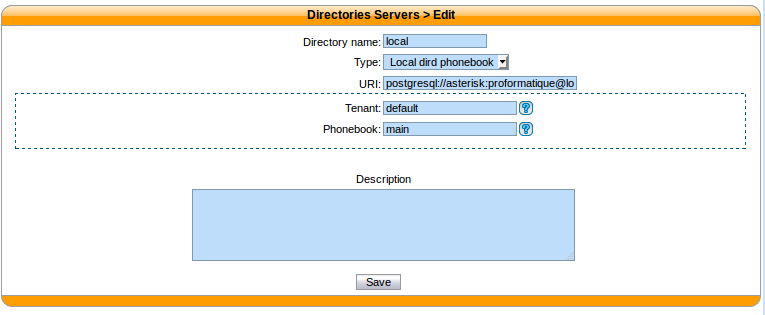
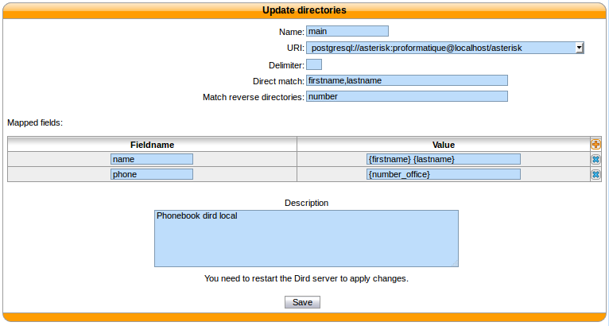
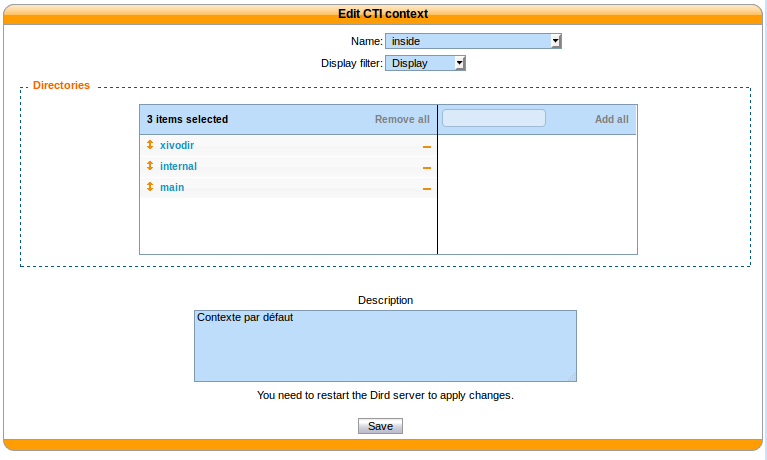

.. _dird_phonebook:

****************************
Wazo dird internal phonebook
****************************

This type of directory source is the internal phonebook of Wazo dird. The URI
field is used to connect to the wazo-dird database.

This directory type matches the :ref:`dird-backend-dird_phonebook` backend in `wazo-dird`.

Example
=======

Adding a source
---------------

  :menuselection:`Configuration --> Management --> Directories`

  :guilabel:`URI` : The URI to connect to the wazo-dird database

  :guilabel:`Tenant` : Name of the tenant, the entity is used in the default configuration

  :guilabel:`Phonebook` : Name of the phonebook to use

Configuring available fields
----------------------------

   :menuselection:`Services --> CTI Server --> Directories --> Definitions`

   :guilabel:`Name` : Name of this source

   :guilabel:`Direct match` : Fields to match when doing a lookup

   :guilabel:`Match reverse directories` : Fields to match when doing a reverse lookup

   :guilabel:`Mapped fields` : Add fields to be compatible with a configured display

Adding the source to a profile
------------------------------

   :menuselection:`Services --> CTI Server --> Directories --> Direct directories`

   :guilabel:`Directories` : Add the new directory source to the profile
