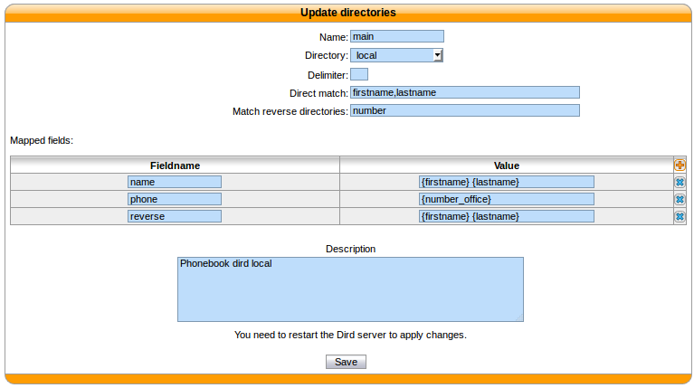
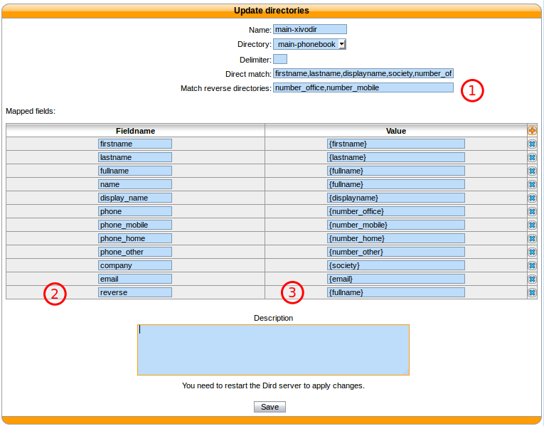
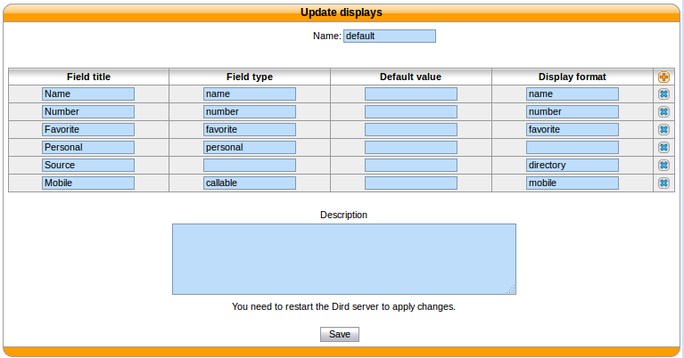

.. _directories:

***********
Directories
***********

This page documents how to add and configure directories from custom sources. Directories added from
custom sources can be used for lookup via the :ref:`Wazo Client <people-xlet>`, directory feature of
phones or for :ref:`reverse lookup <reverse_lookup>` on incoming calls.

An example of `adding a source`_ and `configuring source access`_ is made for each type of source:

.. toctree::
   :maxdepth: 1

   xivo
   csv_file
   csv_web_service
   dird_phonebook
   ldap_filter

.. note:: Phone IP should be in the authorized subnet to access the directories. See :ref:`remote-directory`.

Adding a source
===============

You can add new data sources via the :menuselection:`Configuration --> Management --> Directories`
page.

* :guilabel:`Directory name`: the name of the directory
* :guilabel:`Type`: there are 4 types of directory:

    * :ref:`XiVO<xivo-directory>`
    * :ref:`CSV File<csv-file-directory>`
    * :ref:`CSV Web service<csv-web-service-directory>`
    * :ref:`XiVO dird phonebook<dird_phonebook>`
    * :ref:`LDAP filter directory<ldap_filter_directory>`

* :guilabel:`URI`: the data source
* :guilabel:`Description`: (optional) a description of the directory

.. _directory-definition:

Configuring source access
=========================

  :menuselection:`Services --> CTI Server --> Directories --> Definitions`

  :guilabel:`Name`: the name of the source

  :guilabel:`Directory`: the name of the directory

  :guilabel:`Delimiter`: (optional) the field delimiter in the data source

  :guilabel:`Direct match`: the list used to match entries for direct lookup (comma separated)

  :guilabel:`Match reverse directories`: (optional) the list used to match entries for reverse lookup (comma separated)

  :guilabel:`Mapped fields`: used to add or modify columns in this directory source

  :guilabel:`Fieldname`: the identifier for this new field

  :guilabel:`Value`: a python format string that can be used to modify the data returned from a data source

.. _reverse_lookup:

Reverse lookup
--------------

It's possible to do reverse lookups on incoming calls to show a better caller ID name when
the caller is in one of our directories.

Reverse lookup will only be tried if at least one of the following conditions is true:

* The caller ID name is the same as the caller ID number
* The caller ID name is "unknown"

Also, reverse lookup is performed after :ref:`caller ID number normalization <callerid_num_normalization>` (since XiVO 13.11).

To enable reverse lookup, you need to add an entry in :guilabel:`Mapped fields`:

* :guilabel:`Fieldname`: ``reverse``
* :guilabel:`Value`: the header of your data source that you want to see as the caller ID on your
  phone on incoming calls

Example
^^^^^^^

* :guilabel:`Match reverse directories`: ``number_office,number_mobile``
* :guilabel:`Fieldname`: ``reverse``
* :guilabel:`Value`: ``{society}``

This configuration will show the contact's company name on the caller ID name, when the incoming
call will match office, mobile or home number.

   :menuselection:`Services --> CTI Server --> Directories --> Definitions`

Phone directory
---------------

Phone directory takes 2 :guilabel:`Fieldname` by default:

    * ``display_name``: the displayed name on the phone
    * ``phone``: the number to call

Examples:
---------

You will find below some useful configurations of :guilabel:`Mapped fields`.

Adding a name field from firstname and lastname
^^^^^^^^^^^^^^^^^^^^^^^^^^^^^^^^^^^^^^^^^^^^^^^

Given a configuration where the directory source returns results with fields firstname and lastname
. To add a `name` column to a directory, the administrator would add the following :guilabel:`Mapped
fields`:

* :guilabel:`Fieldname`: ``name``
* :guilabel:`Value`: ``{firstname} {lastname}``

Prefixing a field
^^^^^^^^^^^^^^^^^

Given a directory source that need a prefix to be called, a new field can be created from an exising
one. To add a prefix `9` to the numbers returned from a source, the administrator would add the
following :guilabel:`Mapped fields`:

* :guilabel:`Fieldname`: ``number``
* :guilabel:`Value`: ``9{number}``

Adding a static field
^^^^^^^^^^^^^^^^^^^^^

Sometimes, it can be useful to add a field to the search results. A string can be added without any
formatting. To add a `directory` field to the `xivodir` directory, the administrator would add the
following :guilabel:`Mapped fields`:

* :guilabel:`Fieldname`: ``directory``
* :guilabel:`Value`: ``XiVO internal directory``

Configuring source display
==========================

Wazo Client
-----------

Edit the default display filter or create your own in :menuselection:`Services --> CTI Server -->
Directories --> Display filters`.

   :menuselection:`Services --> CTI Server --> Directories --> Display filters`

Each line in the display filter will result in a header in your Wazo Client.

* :guilabel:`Field title`: text displayed in the header.
* :guilabel:`Field type`: type of the column, this information is used by the Wazo Client. (see
  :ref:`type description<dird-integration-views>`)
* :guilabel:`Default value`: value that will be used if this field is empty for one of the
  configured sources.
* :guilabel:`Field name`: name of the field in the directory definitions. The specified names
  should be available in the configured sources. To add new column name to a directory definition
  see above.

Phone
-----

The only way to configure display phone directory is through :ref:`dird-configuration-file`.

Adding a directory
==================

To include a directory in direct directory definition:

1. Go to :menuselection:`Services --> CTI Server --> Directories --> Direct directories`.
2. Edit your context.
3. Select your display filter.
4. Add the directories in the :guilabel:`Directories` section.

To include a directory in reverse directory definition:

1. Go to :menuselection:`Services --> CTI Server --> Directories --> Reverse directories`.
2. Add the directories to include to reverse lookups in the :guilabel:`Related directories` section.

Applying changes
================

To reload the directory configuration for Wazo Client, phone lookups and reverse lookups, use *one* of
these methods:

* :menuselection:`Services --> IPBX --> Control --> Restart Dird server`
* console ``service xivo-dird restart``
