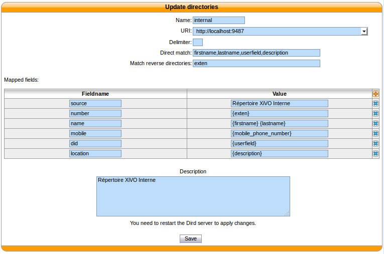

.. _directories:

***********
Directories
***********

This page documents how to add and configure directories from custom sources. Directories added from
custom sources can be used for lookup via the :ref:`CTI Client <people-xlet>` or for
:ref:`reverse lookup <reverse_lookup>` on incoming calls. The directory feature of phones do not use
these data sources.

.. note:: This page describes how to add custom sources of contacts. For other sources of contacts,
          see :ref:`phonebook`, and :ref:`ldap`.

Add a data source
=================

You can add new data sources via the :menuselection:`Configuration --> Management --> Directories` page.

XiVO directories
----------------

This type of directory is used to query the users of a XiVO. On a fresh install,
the local XiVO is already configured. The URI field for this type of directory
should be the base URL of a `xivo-confd` server.

This directory type matches the :ref:`dird-backend-xivo` backend in `xivo-dird`.

Example:

* `Directory name`: xivo-montreal
* `Type`: xivo
* `URI`: ``https://<remote-ip>:<port>``

Available fields are:

* id
* firstname
* lastname
* exten
* mobile_phone_number
* userfield
* description

Here is an example of a configuration where the userfield was used as a free
field to store the DID number of the user and the description to store it's
location.

CSV File directories
--------------------

The source file of the directory must be in CSV format. You will be able to choose the headers and the separator in the next steps. For example, the file will look like::

    title|firstname|lastname|displayname|society|mobilenumber|email
    mr|Emmett|Brown|Brown Emmett|DMC|5555551234|emmet.brown@dmc.example.com

This directory type matches the :ref:`dird-backend-csv` backend in `xivo-dird`.

Example:

* `Directory name`: csv-phonebook
* `Type`: CSV File
* `URI`: ``/data/csv-phonebook.csv``

Available fields are the one's contained in the CSV file.

CSV Web service directories
---------------------------

The data returned by the Web service must have the same format than the file directory. In the same way, you will be able to choose the headers and the separator in the next step.

This directory type matches the :ref:`dird-backend-csv_ws` backend in `xivo-dird`.

Example:

* `Directory name`: ws-phonebook
* `Type`: CSV Web Service
* `URI`: ``http://example.org:8000/ws-phonebook``

Available fields are the ones contained in the CSV result.

Phonebook directories
---------------------

This type of directory source is the internal phonebook of a XiVO. The `URI` field is the one used to query the phonebook.

This directory type matches the :ref:`dird-backend-phonebook` backend in `xivo-dird`.

Example:

* `Directory name`: phonebook
* `Type`: Phonebook
* `URI`: ``http://localhost/service/ipbx/json.php/private/pbx_services/phonebook``

Available fields are:

* phonebook.firstname
* phonebook.lastname
* phonebook.fullname
* phonebook.description
* phonebook.society
* phonebook.title
* phonebook.url
* phonebooknumber.fax.number
* phonebooknumber.home.number
* phonebooknumber.mobile.number
* phonebooknumber.office.number
* phonebooknumber.other.number

Configure the access to the data source
=======================================

Go in :menuselection:`Services --> CTI Server --> Directories --> Definitions` and add a new directory definition.

* `URI`: your data source
* `Delimiter`: (optional) the field delimiter in your data source
* `Direct match`: the key used to match entries for direct lookup
* `Match reverse directories`: (optional) idem, but for reverse lookup
* `Mapped fields`: is used to add or modify columns in this directory source.

  * the `fieldname` is the identifier for this new field.
  * the `value` is a python format string that can be used to modify the data returned from a data source.

Examples:
---------

Adding a name field from firstname and lastname
^^^^^^^^^^^^^^^^^^^^^^^^^^^^^^^^^^^^^^^^^^^^^^^

Given a configuration where the directory source returns results with fields firstname and lastname and a display with a name column. To add a `name` column to a directory, the administrator would add the following `Mapped fields`:

* name: "{firstname} {lastname}"

Prefixing a field
^^^^^^^^^^^^^^^^^

Given a directory source that need a prefix to be called, a new field can be created from an exising one. To add a prefix `9` to the numbers returned from a source, the administrator would add the following `Mapped fields`:

* number: "9{number}"

Adding a static field
^^^^^^^^^^^^^^^^^^^^^

Sometimes, it can be usefull to add a field to the search results. A string can be added without any formatting. To add a `directory` field to the `xivodir` directory, the administrator would add the following `Mapped fields`:

* directory: "XiVO internal directory"

File directories
----------------

For file directories, the `Direct match` and the `Match reverse directories` must be filled with
the name of the column used to match entries.

For example, given you have the following CSV::

   name|phone
   John|5551234

And you want to do direct lookup on the ``name`` column and reverse lookup on the ``phone`` column,
then you'll use:

* `Direct match`: name
* `Match reverse directories`: phone

Web service directories
-----------------------

For web service directories, the `Direct match` and the `Match reverse directories` must be filled
with the name of the HTTP query parameter that will be used when doing the HTTP requests.

For example, given you have the following directory definition:

* `Direct match`: search
* `Match reverse directories`: phonesearch

When a direct lookup for "John" is performed, then the following HTTP request::

   GET /ws-phonebook?search=John HTTP/1.1

is emitted. When a reverse lookup for "5551234" is performed, then the following HTTP request::

   GET /ws-phonebook?phonesearch=5551234 HTTP/1.1

is emitted.

Note that the CSV returned by the Web service is not further processed.

Reverse lookup
--------------

To enable reverse lookup, you need to add an entry in `Mapped fields`:

* `Fieldname`: reverse
* `Value`: the header of your data source that you want to see as the caller ID on your phone on incoming calls

.. warning:: the reverse lookup column format string can *only* specify the column to use, no modification allowed.

Configure the display of the data
=================================

Edit the default display filter or create your own in :menuselection:`Services --> CTI Server --> Directories --> Display filters`.

Each line in the display filter will result in a header in your XiVO Client.

* `Field title` will be the text displayed in the header
* `Display format` is the name of the field in the directory definitions. The specified names should be available in the configured sources. To add new column name to a directory definition see above.

Make your directory available
=============================

Go in :menuselection:`Services --> CTI Server --> Directories --> Reverse/Direct directories`, select your display filter if needed and add the directory you just created.

Applying your changes
=====================

To reload the directory configuration restart *xivo-dird* for XiVO client lookups and *xivo-agid* for reverse lookups.

    service xivo-dird restart
    service xivo-agid restart
