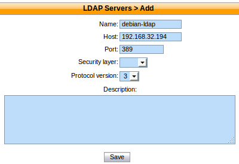
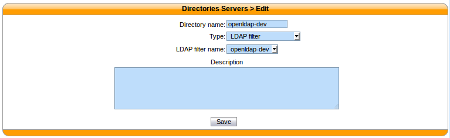
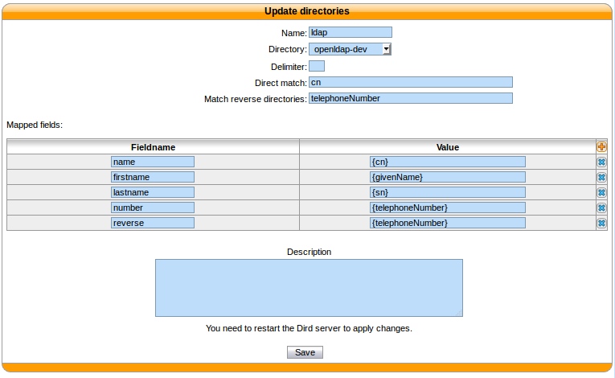

.. _ldap_filter_directory:

*********************
LDAP filter directory
*********************

This page describes how to configure XiVO to search a LDAP server from its
directory service.

Adding a LDAP server
====================

    :menuselection:`Configuration --> Management --> LDAP Servers`

    :guilabel:`Name`: the server's display name

    :guilabel:`Host`: the hostname or IP address

    :guilabel:`Port`: the port number (default: 389)

    :guilabel:`Security layer`: select SSL if it is activated on your server and you want to use it (default: disabled)

    :guilabel:`Protocol version`: the LDAP protocol version (default: 3)

.. note:: SSL means TLS/SSL (doesn't mean StartTLS) and port 636 should then be used

.. _ldaps:

Notes on SSL/TLS usage
----------------------

If you are using SSL with an LDAP server that is using a CA certificate from an
unknown certificate authority, you'll have to put the certificate file as a
single file ending with ``.crt`` into :file:`/usr/local/share/ca-certificates`
and run ``update-ca-certificates``.

You also need to make sure that the :file:`/etc/ldap/ldap.conf` file contains a
line ``TLS_CACERT /etc/ssl/certs/ca-certificates.crt``.

After that, restart spawn-fcgi with ``service spawn-fcgi restart``.

Also, make sure to use the :abbr:`FQDN (Fully Qualified Domain Name)` of the server
in the host field when using SSL. The host field must match exactly what's in the CN
attribute of the server certificate.

.. _add-ldap-filter:

Adding a LDAP Filter
====================

Next thing to do after adding a LDAP server is to create a LDAP filter via the
:menuselection:`Services --> IPBX configuration --> LDAP Filters` page.

You can add a LDAP filter by clicking on the add button at the top right of the page.
You'll then be shown this page:

.. figure:: images/ldap_addfilter.png

    :menuselection:`Services --> IPBX configuration --> LDAP Filters`

    :guilabel:`Name`: the filter's display name

    :guilabel:`LDAP server`: the LDAP server this filter applies to

    :guilabel:`User`: the ``dn`` of the user used to do search requests

    :guilabel:`Password`: the password of the given user

    :guilabel:`Base DN`: the base ``dn`` of search requests

    :guilabel:`Filter`: if specified, :ref:`it replace the default filter <custom-filter>`

.. _custom-filter:

Use a Custom Filter
-------------------

In some cases, you might have to use a custom filter for your search requests instead
of the default filter.

In custom filters, occurrence of the pattern ``%Q`` is replaced by what the user entered
on its phone.

Here's some examples of custom filters:

* ``cn=*%Q*``
* ``&(cn=*%Q*)(mail=*@example.org)``
* ``|(cn=*%Q*)(displayName=*%Q*)``

Adding a source
===============

    :menuselection:`Configuration --> Management --> Directories`

    :guilabel:`LDAP filter name`: The LDAP filter this directory should use.

Adding a Directory Definition
=============================

The next step is to add a directory defintion for the LDAP directory you just created. See the
:ref:`directories <directory-definition>` section for more information.

Here's an example of an LDAP directory definition:

   :menuselection:`Services --> IPBX --> IPBX configuration --> LDAP filters`

If a custom filter is defined in the LDAP filter configuration, the fields in `direct match` will be
added to that filter using an `&`. To only use the `filter` field of your LDAP filter configuration,
do not add any `direct match` fields in your directory definition.

Example:

* Given an LDAP filter with `filter` ``st=Canada``
* Given a directory definition with a `direct match` ``cn,o``
* Then the resulting filter when doing a search will be ``&(st=Canada)(|(cn=*%Q*)(o=*%Q*))``
