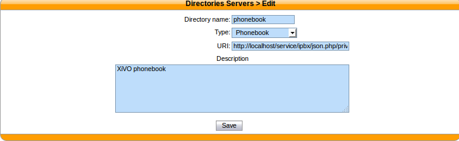
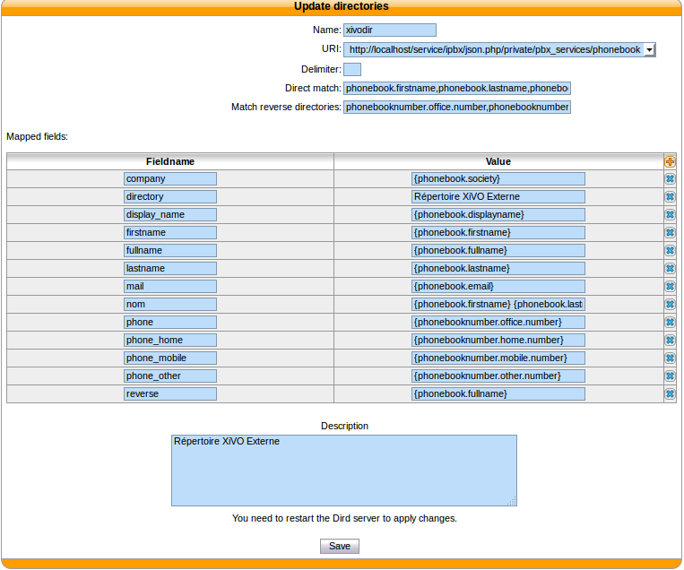

.. _phonebook-directory:

*********************
Phonebook directories
*********************

This type of directory source is the internal phonebook of a XiVO. The :guilabel:`URI` field is the one used to query the phonebook.

This directory type matches the :ref:`dird-backend-phonebook` backend in `xivo-dird`.

Available fields
================

General phone book section
--------------------------

These fields are set in the General tab of the phone book.

* phonebook.description
* phonebook.displayname
* phonebook.email
* phonebook.firstname
* phonebook.fullname (this value is automatically generated as *"<firstname> <lastname>"*, e.g. *"John Doe"*)
* phonebook.lastname
* phonebook.society
* phonebook.title
* phonebook.url

Phone numbers
-------------

These are the different phone numbers that are available

* phonebooknumber.fax.number
* phonebooknumber.home.number
* phonebooknumber.mobile.number
* phonebooknumber.office.number
* phonebooknumber.other.number

Addresses
---------

Each configured address can be accessed

Address uses the following syntax *phonebookaddress.[location].[field]*, e.g. *phonebookaddress.office.zipcode*.

Locations
^^^^^^^^^

* home
* office
* other

Fields
^^^^^^

* address1
* address2
* city
* country
* state
* zipcode
* phonebook.description
* phonebook.firstname
* phonebook.fullname
* phonebook.lastname
* phonebook.society
* phonebook.title
* phonebook.url
* phonebooknumber.fax.number
* phonebooknumber.home.number
* phonebooknumber.mobile.number
* phonebooknumber.office.number
* phonebooknumber.other.number

Example
=======

Adding a source
---------------

   :menuselection:`Configuration --> Management --> Directories`

   :guilabel:`URI` : ``http://localhost/service/ipbx/json.php/private/pbx_services/phonebook``

Configuring source access
-------------------------

Default phonebook are set in :menuselection:`Directories -> Definitions -> xivodir`.

   :menuselection:`Services --> CTI Server --> Directories --> Definitions`
