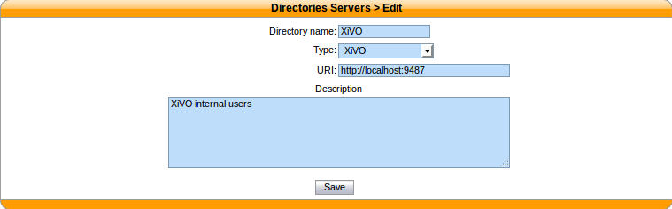
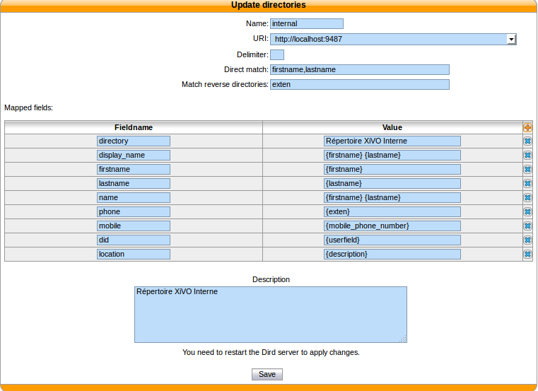

.. _xivo-directory:

****************
XiVO directories
****************

This type of directory is used to query the users of a XiVO. On a fresh install, the local XiVO is
already configured. The URI field for this type of directory should be the base URL of a
`xivo-confd` server.

This directory type matches the :ref:`dird-backend-xivo` backend in `xivo-dird`.

Available fields
================

* id
* agent_id
* line_id
* firstname
* lastname
* exten
* context
* mobile_phone_number
* userfield
* description
* voicemail_number

Example
=======

Adding a source
---------------

   :menuselection:`Configuration --> Management --> Directories`

Configuring source access
-------------------------

Here is an example of a configuration where the userfield was used as a free
field to store the DID number of the user and the description to store it's
location.

   :menuselection:`Services --> CTI Server --> Directories --> Definitions`
