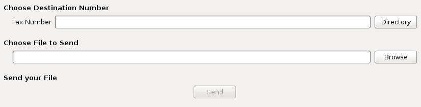

***
Fax
***

Fax transmission
================

It's possible to send faxes from XiVO using the fax Xlet in the XiVO client.

   The fax Xlet in the XiVO Client

The file to send must be in PDF format.

Fax reception
=============

Adding a fax reception DID
--------------------------

If you want to receive faxes from XiVO, you need to add incoming calls definition with the
`Application` destination and the `FaxToMail` application for every DID you want to receive faxes
from.

This applies even if you want the action to be different from sending an email, like putting it on a
FTP server. You'll still need to enter an email address in these cases even though it won't be used.

Note that, as usual when adding incoming call definitions, you must first define the incoming call
range in the used context.

.. figure:: images/Fax_recv_adding.png

Changing the email body
-----------------------

You can change the body of the email sent upon fax reception by editing :file:`/etc/xivo/mail.txt`.

The following variable can be included in the mail body:

* ``%(dstnum)s``: the DID that received the fax

If you want to include a regular percent character, i.e. ``%``, you must write it as ``%%`` in
:file:`mail.txt` or an error will occur when trying to do the variables substitution.

The ``agid`` service must be restarted to apply changes::

   service xivo-agid restart

Changing the email subject
--------------------------

You can change the subject of the email sent upon fax reception by editing
:file:`/etc/xivo/asterisk/xivo_fax.conf`.

Look for the ``[mail]`` section, and in this section, modify the value of the ``subject`` option.

The available variable substitution are the same as for the email body.

The ``agid`` service must be restarted to apply changes::

   service xivo-agid restart

Changing the email from
-----------------------

You can change the from of the email sent upon fax reception by editing
:file:`/etc/xivo/asterisk/xivo_fax.conf`.

Look for the ``[mail]`` section, and in this section, modify the value of the ``email_from`` option.

The ``agid`` service must be restarted to apply changes::

   service xivo-agid restart

Changing the email realname
---------------------------

You can change the realname of the email sent upon fax reception by editing
:file:`/etc/xivo/asterisk/xivo_fax.conf`.

Look for the ``[mail]`` section, and in this section, modify the value of the ``email_realname`` option.

The ``agid`` service must be restarted to apply changes::

   service xivo-agid restart

Using the advanced features
---------------------------

The following features are only available via the :file:`/etc/xivo/asterisk/xivo_fax.conf`
configuration file. They are not available from the web-interface.

The configuration file has documentation embedded in it in the form of comments, so we recommend you
reading them before editing the configuration file.

The way it works is the following:

* you first declare some backends, i.e. actions to be taken when a fax is received. A backend name
  looks like ``mail``, ``ftp_example_org`` or ``printer_office``.
* once your backends are defined, you can use them in your destination numbers. For example, when
  someone calls the DID 100, you might want the ``ftp_example_org`` and ``mail`` backend to be run,
  but otherwise, you only want the ``mail`` backend to be run.

Here's an example of a valid :file:`/etc/xivo/asterisk/xivo_fax.conf` configuration file::

   [general]
   tiff2pdf = /usr/bin/tiff2pdf
   mutt = /usr/bin/mutt
   lp = /usr/bin/lp

   [mail]
   subject = FAX reception to %(dstnum)s
   content_file = /etc/xivo/mail.txt
   email_from = no-reply+fax@xivo.io
   email_realname = Service Fax

   [ftp_example_org]
   host = example.org
   username = foo
   password = bar
   directory = /foobar

   [dstnum_default]
   dest = mail

   [dstnum_100]
   dest = mail, ftp_example_org

The section named ``dstnum_default`` will be used only if no DID-specific actions are defined.

After editing :file:`/etc/xivo/asterisk/xivo_fax.conf`, you need to restart the agid server
for the changes to be applied::

   service xivo-agid restart

.. _fax-ftp:

Using the FTP backend
^^^^^^^^^^^^^^^^^^^^^

The FTP backend is used to send a PDF version of the received fax to an FTP server.

An FTP backend is always defined in a section beginning with the ``ftp`` prefix. Here's an example
for a backend named ``ftp_example_org``::

   [ftp_example_org]
   host = example.org
   port = 2121
   username = foo
   password = bar
   directory = /foobar
   convert_to_pdf = 0

The ``port`` option is optional and defaults to 21.

The ``directory`` option is optional and if not specified, the document will be put in the user's
root directory.

The ``convert_to_pdf`` option is optional and defaults to 1. If it is set to 0, the TIFF file will
not be converted to PDF before being sent to the FTP server.

The uploaded file are named like ``${XIVO_SRCNUM}-${EPOCH}.pdf``.

Using the printer backend
^^^^^^^^^^^^^^^^^^^^^^^^^

To use the printer backend, you must have the ``cups-client`` package installed on your XiVO::

   $ apt-get install cups-client

The printer backend uses the ``lp`` command to print faxes.

A printer backend is always defined in a section beginning with the ``printer`` prefix.
Here's an example for a backend named ``printer_office``::

   [printer_office]
   name = office
   convert_to_pdf = 1

When a fax will be received, the system command ``lp -d office <faxfile>`` will be executed.

The ``convert_to_pdf`` option is optional and defaults to 1. If it is set to 0, the TIFF file will
not be converted to PDF before being printed.

.. warning:: You need a CUPS server set up somewhere on your network.

Using the mail backend
^^^^^^^^^^^^^^^^^^^^^^

By default, a mail backend named ``mail`` is defined. You can define more mail backends if you
want. Just look what the default mail backend looks like.

Using the log backend
^^^^^^^^^^^^^^^^^^^^^

There's also a log backend available, which can be used to write a line to a file every time a fax
is received.

Fax detection
=============

XiVO **does not currently support Fax Detection**. A workaround is described in the :ref:`fax-detection` section.

.. _fax-analog-gateway:

Using analog gateways
=====================

XiVO is able to provision Cisco SPA122 and Linksys SPA2102, SPA3102 and SPA8000 analog gateways which can be used to
connect fax equipments. This section describes the creation of custom template *for SPA3102* which
modifies several parameters.

.. note:: **With SPA ATA plugins >= v0.8**, you **should not need** to follow this section anymore since all of these parameters are now set in the base templates of all, except for Echo_Canc_Adapt_Enable, Echo_Supp_Enable, Echo_Canc_Enable.
.. note:: Be aware that most of the parameters are or could be country specific, i.e. :

   * Preferred Codec,
   * FAX Passthru Codec,
   * RTP Packet Size,
   * RTP-Start-Loopback Codec,
   * Ring Waveform,
   * Ring Frequency,
   * Ring Voltage,
   * FXS Port Impedance

#. Create a custom template for the SPA3102 base template::

    cd /var/lib/xivo-provd/plugins/xivo-cisco-spa3102-5.1.10/var/templates/
    cp ../../templates/base.tpl .

#. Add the following content before the ``</flat-profile>`` tag::

    <!-- CUSTOM TPL - for faxes - START -->

    
    <!-- Dial Plan: L{{ line_no }} -->
    <Dial_Plan_{{ line_no }}_ ua="na">([x*#].)</Dial_Plan_{{ line_no }}_>

    <Call_Waiting_Serv_{{ line_no }}_ ua="na">No</Call_Waiting_Serv_{{ line_no }}_>
    <Three_Way_Call_Serv_{{ line_no }}_ ua="na">No</Three_Way_Call_Serv_{{ line_no }}_>

    <Preferred_Codec_{{ line_no }}_ ua="na">G711a</Preferred_Codec_{{ line_no }}_>
    <Silence_Supp_Enable_{{ line_no }}_ ua="na">No</Silence_Supp_Enable_{{ line_no }}_>
    <Echo_Canc_Adapt_Enable_{{ line_no }}_ ua="na">No</Echo_Canc_Adapt_Enable_{{ line_no }}_>
    <Echo_Supp_Enable_{{ line_no }}_ ua="na">No</Echo_Supp_Enable_{{ line_no }}_>
    <Echo_Canc_Enable_{{ line_no }}_ ua="na">No</Echo_Canc_Enable_{{ line_no }}_>
    <Use_Pref_Codec_Only_{{ line_no }}_ ua="na">yes</Use_Pref_Codec_Only_{{ line_no }}_>
    <DTMF_Tx_Mode_{{ line_no }}_ ua="na">Normal</DTMF_Tx_Mode_{{ line_no }}_>

    <FAX_Enable_T38_{{ line_no }}_ ua="na">Yes</FAX_Enable_T38_{{ line_no }}_>
    <FAX_T38_Redundancy_{{ line_no }}_ ua="na">1</FAX_T38_Redundancy_{{ line_no }}_>
    <FAX_Passthru_Method_{{ line_no }}_ ua="na">ReINVITE</FAX_Passthru_Method_{{ line_no }}_>
    <FAX_Passthru_Codec_{{ line_no }}_ ua="na">G711a</FAX_Passthru_Codec_{{ line_no }}_>
    <FAX_Disable_ECAN_{{ line_no }}_ ua="na">yes</FAX_Disable_ECAN_{{ line_no }}_>
    <FAX_Tone_Detect_Mode_{{ line_no }}_ ua="na">caller or callee</FAX_Tone_Detect_Mode_{{ line_no }}_>

    <Network_Jitter_Level_{{ line_no }}_ ua="na">very high</Network_Jitter_Level_{{ line_no }}_>
    <Jitter_Buffer_Adjustment_{{ line_no }}_ ua="na">disable</Jitter_Buffer_Adjustment_{{ line_no }}_>
    

    <!-- SIP Parameters -->
    <RTP_Packet_Size ua="na">0.020</RTP_Packet_Size>
    <RTP-Start-Loopback_Codec ua="na">G711a</RTP-Start-Loopback_Codec>

    <!-- Regional parameters -->
    <Ring_Waveform ua="rw">Sinusoid</Ring_Waveform> <!-- options: Sinusoid/Trapezoid -->
    <Ring_Frequency ua="rw">50</Ring_Frequency>
    <Ring_Voltage ua="rw">85</Ring_Voltage>

    <FXS_Port_Impedance ua="na">600+2.16uF</FXS_Port_Impedance>
    <Caller_ID_Method ua="na">Bellcore(N.Amer,China)</Caller_ID_Method>
    <Caller_ID_FSK_Standard ua="na">bell 202</Caller_ID_FSK_Standard>

    <!-- CUSTOM TPL - for faxes - END -->

#. Reconfigure the devices with::

    xivo-provd-cli -c 'devices.using_plugin("xivo-cisco-spa3102-5.1.10").reconfigure()'

#. Then reboot the devices::

    xivo-provd-cli -c 'devices.using_plugin("xivo-cisco-spa3102-5.1.10").synchronize()'

Most of this template can be copy/pasted for a SPA2102 or SPA8000.

Using a SIP Trunk
=================

Fax transmission, to be successful, *MUST* use G.711 codec. Fax streams cannot be encoded with
lossy compression codecs (like G.729a).

That said, you may want to establish a SIP trunk using G.729a for all other communications to save
bandwith. Here's a way to be able to receive a fax in this configuration.

.. note:: There are some prerequisites:

     * your SIP Trunk must offer both G.729a and G.711 codecs
     * your fax users must have a customized outgoing calleridnum (for the codec change is based on
       this variable)

#. We assume that outgoing call rules and fax users with their DID are created
#. Create the file :file:`/etc/asterisk/extensions_extra.d/fax.conf` with the following content::

    ;; For faxes :
    ; The following subroutine forces inbound and outbound codec to alaw.
    ; For outbound codec selection we must set the variable with inheritance.
    ; Must be set on each Fax DID
    [pre-incall-fax]
    exten = s,1,NoOp(### Force alaw codec on both inbound (operator side) and outbound (analog gw side) when calling a Fax ###)
    exten = s,n,Set(SIP_CODEC_INBOUND=alaw)
    exten = s,n,Set(__SIP_CODEC_OUTBOUND=alaw)
    exten = s,n,Return()

    ; The following subroutine forces outbound codec to alaw based on outgoing callerid number
    ; For outbound codec selection we must set the variable with inheritance.
    ; Must be set on each outgoing call rule
    [pre-outcall-fax]
    exten = s,1,NoOp(### Force alaw codec if caller is a Fax ###)
    exten = s,n,GotoIf($["${CALLERID(num)}" = "0112697845"]?alaw:)
    exten = s,n,GotoIf($["${CALLERID(num)}" = "0112697846"]?alaw:end)
    exten = s,n(alaw),Set(__SIP_CODEC_OUTBOUND=alaw)
    exten = s,n(end),Return()

#. For each Fax users' DID add the following string in the ``Preprocess subroutine`` field::

    pre-incall-fax

#. For each Outgoing call rule add the the following string in the ``Preprocess subroutine`` field::

    pre-outcall-fax
