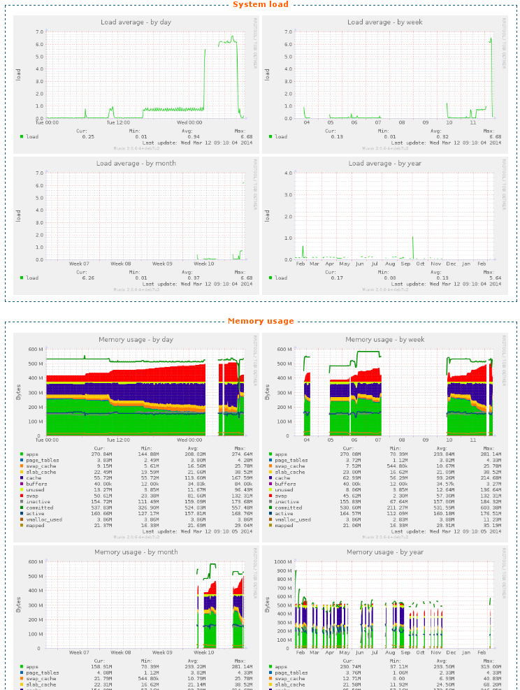

********
Graphics
********

The Services/Graphics section gives an overview of a XiVO system's history.
Graphics are available for the following ressources :

* CPU
* Entropy
* Interruptions
* IRQ Stats
* System Load
* Memory Usage
* Open Files
* Open Inodes
* Swap Usage

Each section is presented as a series of 4 graphics : daily, weekly, monthly
and yearly history. Each graphic can be clicked to zoom. All information is read only.

