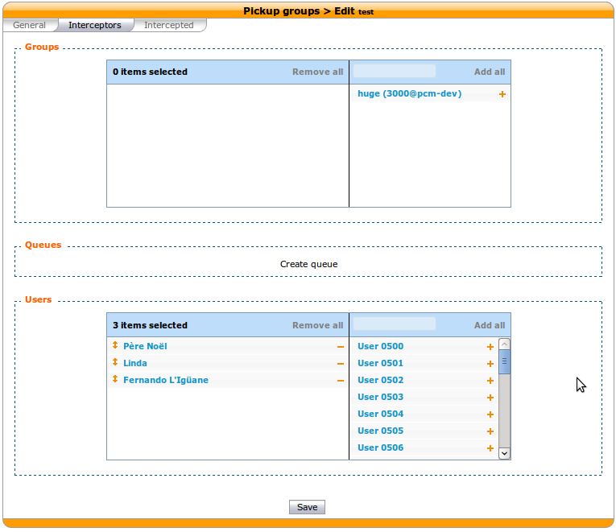
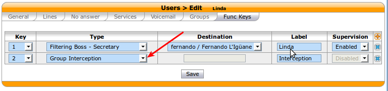

************
Group Pickup
************

Pickup groups allow users to intercept calls directed towards other users of the group. This
is done either by dialing a special extension or by pressing a function key.

Quick Summary
=============

In order to be able to use group pickup you have to:
 * Create a pickup group
 * Enable an extension to intercept calls
 * Add a function key to interceptors

Creating a Pickup Group
=======================

Pickup groups can be create in the :menuselection:`Services --> IPBX --> Call management --> Call
pickups` page.

In the *general* tab, you can define a name and a description for the pickup group.
In the *Interceptors* tab, you can define a list of users, groups or queues that can intercept
calls.
In the *Intercepted* tab, you can define a list of users, groups or queues that can be intercepted.

Enabling an Interception Extension
==================================

The pickup extension can be defined in the :menuselection:`Services --> IPBX --> IPBX services -->
Extensions` page.

The extension used by group pickup is called *Group interception* it's default value is *\*8*.

.. warning:: The extension must be enabled even if a function key is used.

Adding a Function Key to an Interceptor
=======================================

To assign a function to an interceptor, go to :menuselection:`Services --> IPBX --> IPBX settings
--> Users`, edit an interceptor and go to the *Func Keys* tab.

Add a new function key of type *Group Interception* and save.

