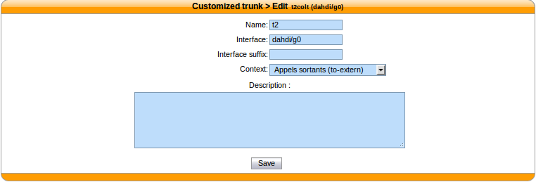
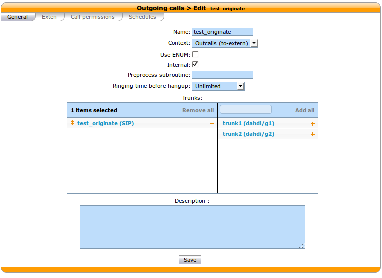
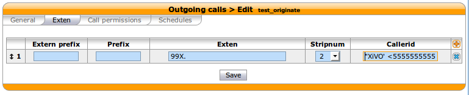

****************
Interconnections
****************

.. toctree::
   :maxdepth: 1

   two_xivo
   xivo_with_voip_provider
   xivo_with_pbx

Specific VoIP providers
=======================

.. toctree::
   :maxdepth: 1

   simonics

Create an interconnection
=========================

There are three types of interconnections :

* Customized
* SIP
* IAX

Customized interconnections
---------------------------

Customized interconnections are mainly used for interconnections using DAHDI or Local channels:

* *Name* : it is the name which will appear in the outcall interconnections list,
* *Interface* : this is the channel name (for DAHDI see :ref:`interco_dahdi_conf`)
* *Interface suffix* (optional) : a suffix added after the dialed number (in fact the Dial command will dial::

    <Interface>/<EXTEN><Interface suffix>

* *Context* : currently not relevant

.. _interco_dahdi_conf:

DAHDI interconnections
^^^^^^^^^^^^^^^^^^^^^^

To use your DAHDI links you must create a customized interconnection.

**Name** : the name of the interconnection like **e1_span1** or **bri_port1**

**Interface** : must be of the form ``dahdi/[group order][group number]`` where :

* ``group order`` is one of :

  * ``g`` : pick the first available channel in group,
    searching from lowest to highest,
  * ``G`` : pick the first available channel in group,
    searching from highest to lowest,
  * ``r`` : pick the first available channel in group, going in round-robin fashion
    (and remembering where it last left off), searching from lowest to highest,
  * ``R`` : pick the first available channel in group, going in round-robin fashion
    (and remembering where it last left off), searching from highest to lowest.

* ``group number`` is the group number to which belongs the span as defined in the
  :ref:`asterisk_dahdi_channel_conf`.

.. warning:: if you use a BRI card you MUST use per-port dahdi groups.
    You should not use a group like g0 which spans over several spans.
    

For example, add an interconnection to the menu :menuselection:`Services --> IPBX --> Trunk management --> Customized` ::

     Name : interconnection name
     Interface : dahdi/g0

Debug
=====

Interesting Asterisk commands: ::

    sip show peers
    sip show registry
    sip set debug on

Caller ID
=========

When setting up an interconnection with the public network or another PBX, it is possible to set a
caller ID in different places. Each way to configure a caller ID has it's own use case.

The format for a caller ID is the following ``"My Name" <9999>`` If you don't set the number part of
the caller ID, the dialplan's number will be used instead. This might not be a good option in most
cases.

Outgoing call caller ID
=======================

When you create an outgoing call, it's possible to set the it to internal, using the check box in
the outgoing call configuration menu. When this option is activated, the caller's caller ID will be
forwarded to the trunk. This option is use full when the other side of the trunk can reach the user
with it's caller ID number.

When the caller's caller ID is not usable to the called party, the outgoing call's caller id can
be fixed to a given value that is more use full to the outside world. Giving the public number here
might be a good idea.

A user can also have a forced caller ID for outgoing calls. This can be use full for someone who has
his own public number. This option can be set in the user's configuration page. The Outgoing
Caller ID id option must be set to Customize. The user can also set his outgoing caller ID to
anonymous.

.. figure:: images/user_custom_callerid.png
   :scale: 85%

The order of precedence when setting the caller ID in multiple place is the following.

#. Internal
#. User's outgoing caller ID
#. Outgoing call
#. Default caller ID
