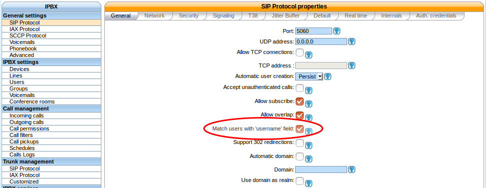
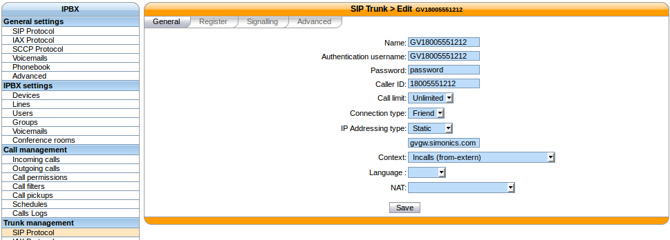
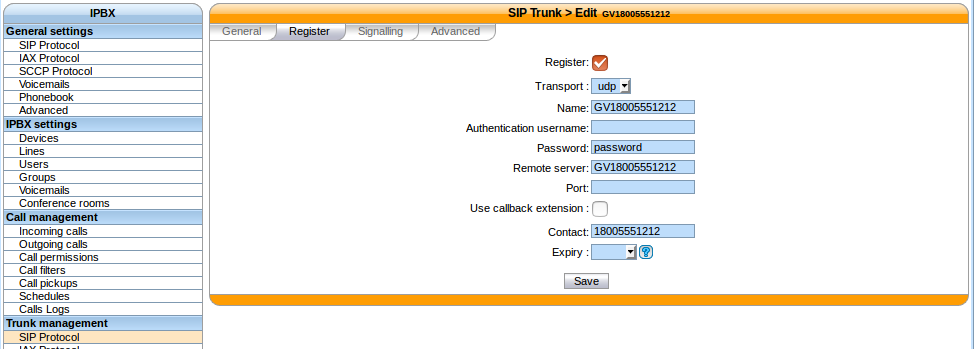
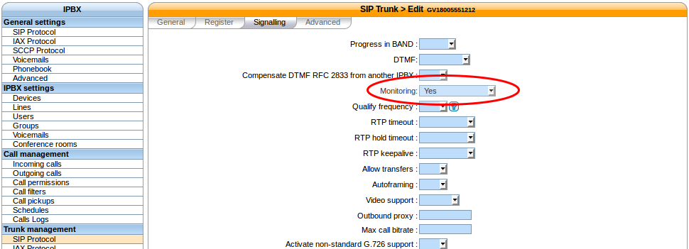

.. index:: interconnections/simonics

*****************
Simon Telephonics
*****************

The following configuration is based on the example found `here <http://support.simonics.com/support/solutions/articles/3000033840-asterisk-sip-conf>`_

* username: ``GV18005551212``
* password: ``password``
* exten: ``18005551212``
* host: ``gvgw.simonics.com``

General SIP configuration
=========================

Under :menuselection:`Services --> IPBX --> General settings --> SIP Protocol`.

* General

  * Match users with 'username' field: *checked*

Trunk settings
==============

Under :menuselection:`Services --> IPBX --> Trunk management --> SIP Protocol`.

* General

  * Name: ``GV18005551212``
  * Authentication username: ``GV18005551212``
  * Password: ``password``
  * Caller ID: ``18005551212``
  * Connection type: ``Friend``
  * IP Addressing type: ``static``

    * ``gvgw.simonics.com``

  * Context: ``<your incoming call context>``

* Register

  * Register: ``checked``
  * Transport: ``UDP``
  * Name: ``GV18005551212``
  * Password: ``password``
  * Remote Server: ``GV18005551212``
  * Contact: ``18005551212``

* Signaling

  * Monitoring: ``Yes``

Outgoing calls
==============

See the :ref:`voip_provider_outcall` section.

Incoming calls
==============

See the :ref:`voip_provider_incall` section.
