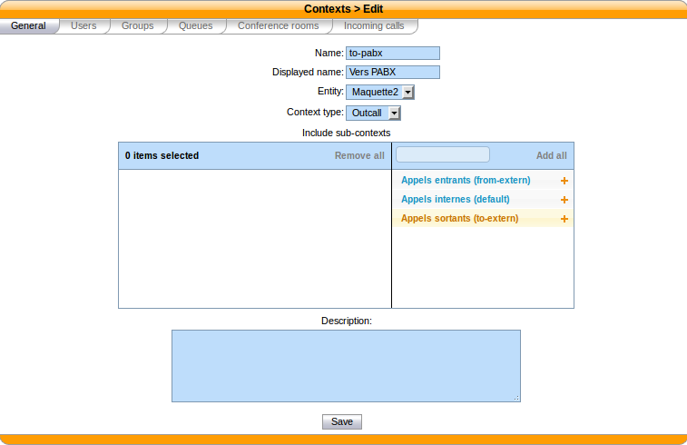
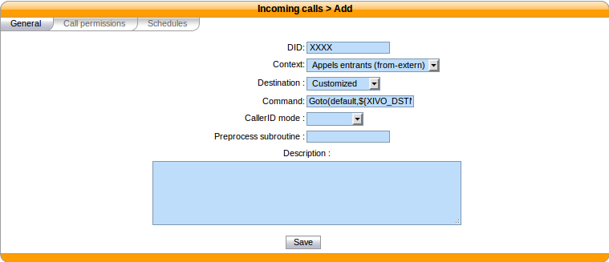
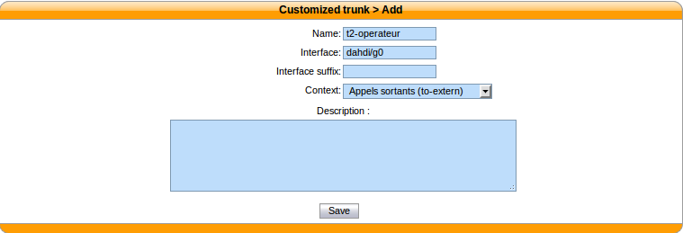
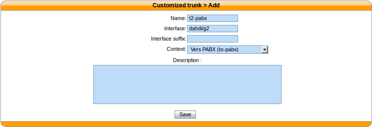
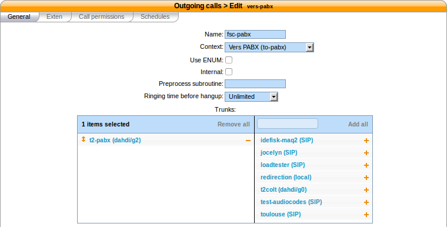
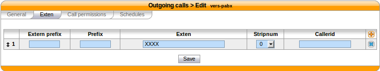

.. index:: interconnections

*********************************************
Interconnect a XiVO to a PBX via an ISDN link
*********************************************

The goal of this architecture can be one of:

* start a smooth migration between an old telephony system towards IP telephony with XiVO
* bring new features to the PBX like voicemail, conference, IVR etc.

First, XiVO is to be integrated transparently between the operator and the PBX.
Then users or features are to be migrated from the PBX to the XiVO. 

.. warning:: It requires a special call routing configuration on both the XiVO **and the PBX**.

.. figure:: images/xivo-pbx.png
   :align: center
   :scale: 65%

   Interconnect a XiVO to a PBX

Hardware
--------

General uses
============

You must have an ISDN card able to support both the provider and PBX ISDN links.

*Example :* If you have two provider links towards the PBX, XiVO should have a 4 spans card : 
two towards the provider, and two towards the PBX.

If you use two cards
====================

If you use two cards, you have to :

* Use a cable for clock synchronization between the cards
* Configure the *wheel* to define the cards order in the system.

Please refer to the section :ref:`Sync cable <sync_cable>`

Configuration
-------------

You have now to configure two files :

#. :file:`/etc/dahdi/system.conf`
#. :file:`/etc/asterisk/dahdi-channels.conf`

system.conf
===========

You mainly need to configure the ``timing`` parameter on each *span*. As a general rule :
* Provider *span* - XiVO will get the clock from the provider :
  the ``timing`` value is to be different from 0 (see :ref:`system_conf` section)
* PBX *span* - XiVO will provide the clock to the PBX :
  the ``timing`` value is to be set to 0 (see :ref:`system_conf` section)

Below is an example with two provider links and two PBX links::

    # Span 1: TE4/0/1 "TE4XXP (PCI) Card 0 Span 1" (MASTER)
    span=1,1,0,ccs,hdb3         # Span towards Provider
    bchan=1-15,17-31
    dchan=16
    echocanceller=mg2,1-15,17-31

    # Span 2: TE4/0/2 "TE4XXP (PCI) Card 0 Span 2" 
    span=2,2,0,ccs,hdb3         # Span towards Provider
    bchan=32-46,48-62
    dchan=47
    echocanceller=mg2,32-46,48-62

    # Span 3: TE4/0/3 "TE4XXP (PCI) Card 0 Span 3" 
    span=3,0,0,ccs,hdb3         # Span towards PBX
    bchan=63-77,79-93
    dchan=78
    echocanceller=mg2,63-77,79-93

    # Span 4: TE4/0/4 "TE4XXP (PCI) Card 0 Span 4" 
    span=4,0,0,ccs,hdb3         # Span towards PBX
    bchan=94-108,110-124
    dchan=109
    echocanceller=mg2,94-108,110-124

dahdi-channels.conf
===================

In the file :file:`/etc/asterisk/dahdi-channels.conf` you need to adjust, for each span :

* ``group`` : the group number (e.g. ``0`` for provider links, ``2`` for PBX links),
* ``context`` : the context (e.g. ``from-extern`` for provider links, ``from-pabx`` for PBX links)
* ``signalling`` : ``pri_cpe`` for provider links, ``pri_net`` for PBX side

.. warning:: most of the PBX uses overlap dialing for some destination (digits are sent one by one instead of by block).
  In this case, the ``overlapdial`` parameter has to be activated on the PBX spans::

    overlapdial = incoming

Below an example of :file:`/etc/asterisk/dahdi-channels.conf`::
 
    ; Span 1: TE4/0/1 "TE4XXP (PCI) Card 0 Span 1" (MASTER) 
    group=0,11
    context=from-extern
    switchtype = euroisdn
    signalling = pri_cpe
    channel => 1-15,17-31

    ; Span 2: TE4/0/2 "TE4XXP (PCI) Card 0 Span 2" 
    group=0,12
    context=from-extern
    switchtype = euroisdn
    signalling = pri_cpe
    channel => 32-46,48-62

    ; PBX link #1
    ; Span 3: TE4/0/3 "TE2XXP (PCI) Card 0 Span 3" 
    group=2,13
    context=from-pabx     ; special context for PBX incoming calls
    overlapdial=incoming  ; overlapdial activation 
    switchtype = euroisdn
    signalling = pri_net  ; behave as the NET termination
    channel => 63-77,79-93
    
    ; PBX link #2
    ; Span 4: TE4/0/4 "T4XXP (PCI) Card 0 Span 4" 
    group=2,14
    context=from-pabx     ; special context for PBX incoming calls
    overlapdial=incoming  ; overlapdial activation 
    switchtype = euroisdn
    signalling = pri_net  ; behave as the NET termination
    channel => 94-108,110-124

Passthru function
=================

Route PBX incoming calls
^^^^^^^^^^^^^^^^^^^^^^^^^

We first need to create a route for calls coming from the PBX

# Create a file named :file:`pbx.conf` in the directory :file:`/etc/asterisk/extensions_extra.d/`,
# Add the following lines in the file::

    [from-pabx]
    exten = _X.,1,NoOp(### Call from PBX ${CARLLERID(num)} towards ${EXTEN} ###)
    exten = _X.,n,Goto(default,${EXTEN},1) 

This dialplan routes incoming calls from the PBX in the ``default`` context of XiVO.
It enables call from the PBX :
* towards a SIP phone (in ``default`` context)
* towards outgoing destniation (via the ``to-extern`` context included in ``default`` context)

Create the to-pabx context
^^^^^^^^^^^^^^^^^^^^^^^^^^

In the webi, create a context named ``to-pabx``:

* Name : to-pabx
* Display Name : TO PBX
* Context type : Outcall
* Include sub-contexts : No context inclusion

This context will permit to route incoming calls from the XiVO to the PBX.

Route incoming calls to PBX
^^^^^^^^^^^^^^^^^^^^^^^^^^^

In our example, incoming calls on spans 1 and 2 (spans pluged to the provider) are routed by from-extern context.
We are going to create a default route to redirect incoming calls to the PBX.

Create an incoming call as below :

* DID : XXXX (according to the number of digits sent by the provider)
* Context : Incoming calls
* Destination : Customized
* Command : Goto(to-pabx,${XIVO_DSTNUM},1)

Create the interconnections
^^^^^^^^^^^^^^^^^^^^^^^^^^^

You have to create two interconnections :

* provider side : dahdi/g0
* PBX side : dahdi/g2

In the menu :menuselection:`Services --> IPBX --> Trunk management --> Customized` page :

* Name : t2-operateur
* Interface : dahdi/g0
* Context : to-extern

The second interconnection :

* Name : t2-pabx
* Interface : dahdi/g2
* Context : to-pabx

Create outgoing calls
^^^^^^^^^^^^^^^^^^^^^

You must create two rules of outgoing calls in the menu 
:menuselection:`Services --> IPBX --> Call management --> Outgoing calls` page :

1. Redirect calls to the PBX :

* Name : fsc-pabx
* Context : to-pabx
* Trunks : choose the *t2-pabx* interconnection

In the extensions tab :

* Exten : XXXX

2. Create a rule "fsc-operateur"::

* Name : fsc-operateur
* Context : to-extern
* Trunks : choose the "t2-operateur" interconnection

In the extensions tab::

    exten = X.
