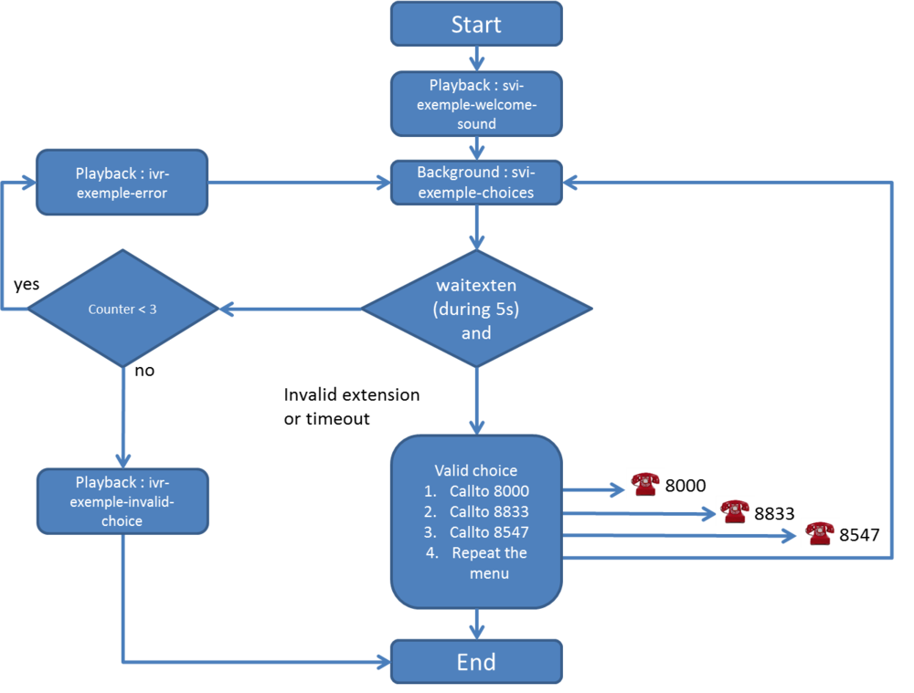
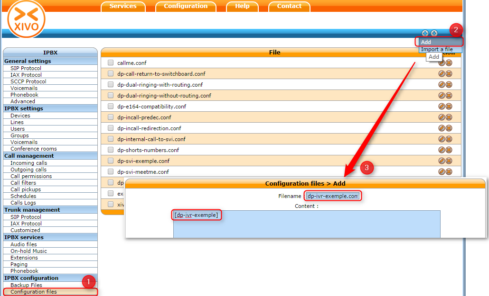
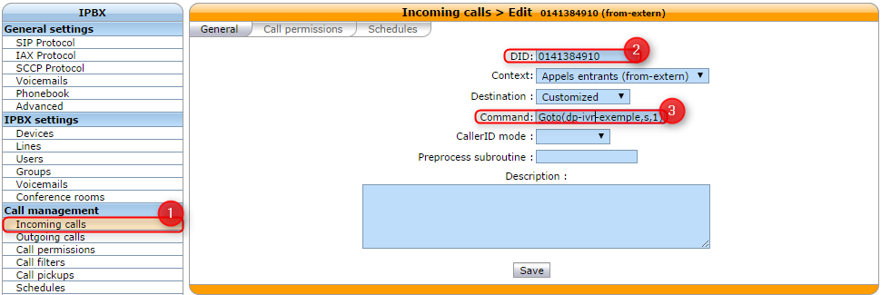
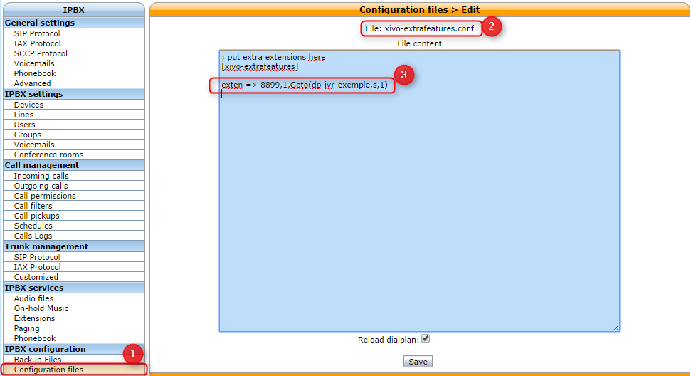
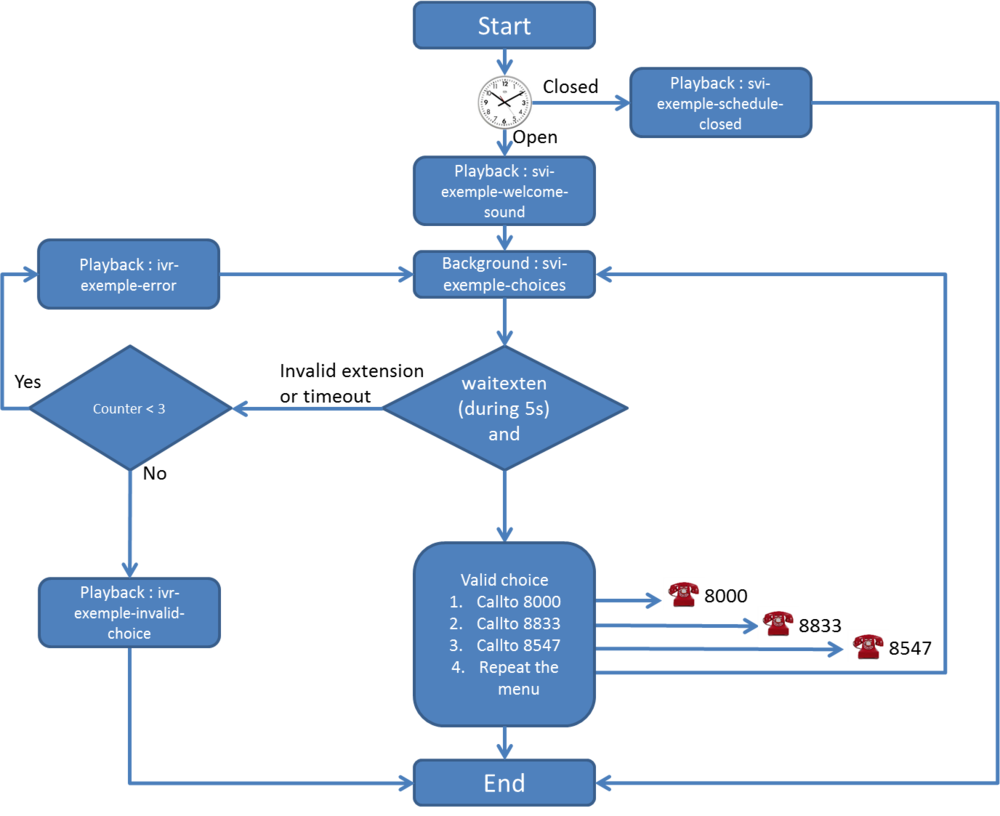
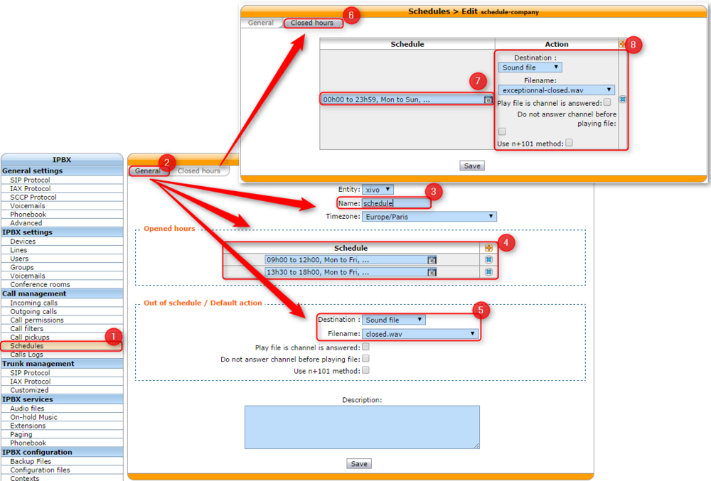
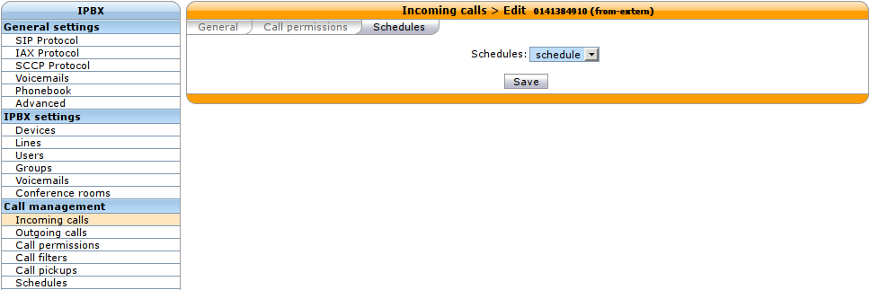

.. _ivr:

**************************
Interactive Voice Response
**************************

Introduction
============

   *Interactive voice response (IVR) is a technology that allows a computer to interact with humans
   through the use of voice and DTMF tones input via keypad. In telecommunications, IVR allows
   customers to interact with a company’s host system via a telephone keypad or by speech recognition,
   after which they can service their own inquiries by following the IVR dialogue.*

   -- Wikipedia

The IVR function is not yet available in graphic mode in XiVO. This functionality is currently
supported using scripts, also named dialplan.

Use Case: Minimal IVR
=====================

Flowchart
---------

Configuration File and Dialplan
-------------------------------

First step, you need to create a configuration file, that contain an asterisk context and your IVR
dialpan. In our example, both (file and context) are named dp-ivr-example.

Copy all these lines in the newly created configuration file (in our case, dp-ivr-example) :

::

   [dp-ivr-example]

   exten = s,1,NoOp(### dp-ivr-example.conf ###)
   same = n,NoOp(Set the context containing your ivr destinations.)
   same = n,Set(IVR_DESTINATION_CONTEXT=my-ivr-destination-context)
   same = n,NoOp(Set the directory containing your ivr sounds.)
   same = n,Set(GV_DIRECTORY_SOUNDS=/var/lib/xivo/sounds/ivr-sounds)
   same = n,NoOp(the system answers the call and waits for 1 second before continuing)
   same = n,Answer(1000)

   same = n,NoOp(the system plays the first part of the audio file "welcome to ...")
   same = n(first),Playback(${GV_DIRECTORY_SOUNDS}/ivr-example-welcome-sound)

   same = n,NoOp(variable "counter" is set to 0)
   same = n(begining),Set(counter=0)

   same = n,NoOp(variable "counter" is incremented and the label "start" is defined)
   same = n(start),Set(counter=$[${counter} + 1])

   same = n,NoOp(counter variable is now = ${counter})
   same = n,NoOp(waiting for 1 second before reading the message that indicate all choices)
   same = n,Wait(1)
   same = n,NoOp(play the message ivr-example-choices that contain all choices)
   same = n,Background(/var/lib/xivo/sounds/customer-sounds/ivr-example-choices)
   same = n,NoOp(waiting for DTMF during 5s)
   same = n,Waitexten(5)

   ;##### CHOICE 1 #####
   exten = 1,1,NoOp(pressed digit is 1, redirect to 8000 in ${IVR_DESTINATION_CONTEXT} context)
   exten = 1,n,Goto(${IVR_DESTINATION_CONTEXT},8000,1)

   ;##### CHOICE 2 #####
   exten = 2,1,NoOp(pressed digit is 2, redirect to 8833 in ${IVR_DESTINATION_CONTEXT} context)
   exten = 2,n,Goto(${IVR_DESTINATION_CONTEXT},8833,1)

   ;##### CHOICE 3 #####
   exten = 3,1,NoOp(pressed digit is 3, redirect to 8547 in ${IVR_DESTINATION_CONTEXT} context)
   exten = 3,n,Goto(${IVR_DESTINATION_CONTEXT},8547,1)

   ;##### CHOICE 4 #####
   exten = 4,1,NoOp(pressed digit is 4, redirect to start label in this context)
   exten = 4,n,Goto(s,start)

   ;##### TIMEOUT #####
   exten = t,1,NoOp(no digit pressed for 5s, call is redirected to 8000)
   exten = t,n,Goto(${IVR_DESTINATION_CONTEXT},8000,1)

   ;##### INVALID CHOICE #####
   exten = i,1,NoOp(if counter variable is 3 or more, then goto label "error")
   exten = i,n,GotoIf($[${counter}>=3]?error)
   exten = i,n,NoOp(pressed digit is invalid and less than 3 errors: the guide ivr-exemple-invalid-choice is now played)
   exten = i,n,Playback(${GV_DIRECTORY_SOUNDS}/ivr-example-invalid-choice)
   exten = i,n,Goto(s,start)
   exten = i,n(error),Playback(${GV_DIRECTORY_SOUNDS}/ivr-example-error)
   exten = i,n,Hangup()

IVR external dial
-----------------

To call the script dp-ivr-example from an external phone, you must create an incoming
call and redirect the call to the script dp-ivr-example with the command :

::

   Goto(dp-ivr-example,s,1)

IVR internal dial
-----------------

To call the script dp-ivr-example from an internal phone you must create an entry in the default
context (``xivo-extrafeatures`` is included in ``default``). The best way is to add the extension in
the file :file:`xivo-extrafeatures.conf`.

::

   exten => 8899,1,Goto(dp-ivr-example,s,1)

Use Case: IVR with a schedule
=============================

In many cases, you need to associate your IVR to a schedule to indicate when your company is closed.

Flowchart
---------

Create Schedule
---------------

First step, create your schedule (1) from the menu :menuselection:`Call management --> Schedules`.
In the General tab, give a name (3) to your schedule and configure the open hours (4) and select
the sound which is played when the company is closed.

In the Closed hours tab (6), configure all special closed days (7) and select the sound that
indicate to the caller that the company is exceptionally closed.

The IVR script is now only available during workdays.

Assign Schedule to Incall
-------------------------

Return editing your Incall (:menuselection:`Call management --> Incoming calls`) and assign the
newly created schedule in the "Schedules" tab

Use Case: IVR with submenu
==========================

Flowchart
---------

.. figure:: images/ivr7.png

Configuration File and Dialplan
-------------------------------

Copy all these lines (2 contexts) in a configuration file on your XiVO server :

::

   [dp-ivr-example]

   exten = s,1,NoOp(### dp-ivr-example.conf ###)
   same = n,NoOp(Set the context containing your ivr destinations.)
   same = n,Set(IVR_DESTINATION_CONTEXT=my-ivr-destination-context)
   same = n,NoOp(Set the directory containing your ivr sounds.)
   same = n,Set(GV_DIRECTORY_SOUNDS=/var/lib/xivo/sounds/ivr-sounds)
   same = n,NoOp(the system answers the call and waits for 1 second before continuing)
   same = n,Answer(1000)

   same = n,NoOp(the system plays the first part of the audio file "welcome to ...")
   same = n(first),Playback(${GV_DIRECTORY_SOUNDS}/ivr-example-welcome-sound)

   same = n,NoOp(variable "counter" is set to 0)
   same = n(begining),Set(counter=0)

   same = n,NoOp(variable "counter" is incremented and the label "start" is defined)
   same = n(start),Set(counter=$[${counter} + 1])

   same = n,NoOp(counter variable is now = ${counter})
   same = n,NoOp(waiting for 1 second before reading the message that indicate all choices)
   same = n,Wait(1)
   same = n,NoOp(play the message ivr-example-choices that contain all choices)
   same = n,Background(/var/lib/xivo/sounds/customer-sounds/ivr-example-choices)
   same = n,NoOp(waiting for DTMF during 5s)
   same = n,Waitexten(5)

   ;##### CHOICE 1 #####
   exten = 1,1,NoOp(pressed digit is 1, redirect to 8000 in ${IVR_DESTINATION_CONTEXT} context)
   exten = 1,n,Goto(${IVR_DESTINATION_CONTEXT},8000,1)

   ;##### CHOICE 2 #####
   exten = 2,1,NoOp(pressed digit is 2, redirect to 8833 in ${IVR_DESTINATION_CONTEXT} context)
   exten = 2,n,Goto(${IVR_DESTINATION_CONTEXT},8833,1)

   ;##### CHOICE 3 #####
   exten = 3,1,NoOp(pressed digit is 3, redirect to the submenu dp-ivr-submenu)
   exten = 3,n,Goto(dp-ivr-submenu,s,1)

   ;##### CHOICE 4 #####
   exten = 4,1,NoOp(pressed digit is 4, redirect to start label in this context)
   exten = 4,n,Goto(s,start)

   ;##### TIMEOUT #####
   exten = t,1,NoOp(no digit pressed until 5s, call is redirected to 8000)
   exten = t,n,Goto(${IVR_DESTINATION_CONTEXT},8000,1)

   ;##### INVALID CHOICE #####
   exten = i,1,NoOp(if counter variable is 3 or more, then goto label "error")
   exten = i,n,GotoIf($[${counter}>=3]?error)
   exten = i,n,NoOp(pressed digit is invalid and less than 3 errors: the guide ivr-exemple-invalid-choice is now played)
   exten = i,n,Playback(${GV_DIRECTORY_SOUNDS}/ivr-example-invalid-choice)
   exten = i,n,Goto(s,start)
   exten = i,n(error),Playback(${GV_DIRECTORY_SOUNDS}/ivr-example-error)
   exten = i,n,Hangup()

   [dp-ivr-submenu]

   exten = s,1,NoOp(### dp-ivr-submenu ###)
   same = n,NoOp(the system answers the call and waits for 1 second before continuing)
   same = n,Answer(1000)

   same = n,NoOp(variable "counter" is set to 0)
   same = n(begining),Set(counter=0)

   same = n,NoOp(variable "counter" is incremented and the label "start" is defined)
   same = n(start),Set(counter=$[${counter} + 1])

   same = n,NoOp(counter variable is now = ${counter})
   same = n,NoOp(waiting for 1 second before reading the message that indicate all choices)
   same = n,Wait(1)
   same = n,NoOp(play the message ivr-example-choices that contain all choices)
   same = n,Background(/var/lib/xivo/sounds/customer-sounds/ivr-example-submenu-choices)
   same = n,NoOp(waiting for DTMF during 5s)
   same = n,Waitexten(5)

   ;##### CHOICE 1 #####
   exten = 1,1,NoOp(pressed digit is 1, redirect to 8000 in ${IVR_DESTINATION_CONTEXT} context)
   exten = 1,n,Goto(${IVR_DESTINATION_CONTEXT},8000,1)

   ;##### CHOICE 2 #####
   exten = 2,1,NoOp(pressed digit is 2, redirect to 8001 in ${IVR_DESTINATION_CONTEXT} context)
   exten = 2,n,Goto(${IVR_DESTINATION_CONTEXT},8001,1)

   ;##### CHOICE 3 #####
   exten = 3,1,NoOp(pressed digit is 3, redirect to the previous menu dp-ivr-example)
   exten = 3,n,Goto(dp-ivr-example,s,1)

   ;##### TIMEOUT #####
   exten = t,1,NoOp(no digit pressed until 5s, call is redirected to 8000)
   exten = t,n,Goto(${IVR_DESTINATION_CONTEXT},8000,1)

   ;##### INVALID CHOICE #####
   exten = i,1,NoOp(if counter variable is 3 or more, then goto label "error")
   exten = i,n,GotoIf($[${counter}>=3]?error)
   exten = i,n,NoOp(pressed digit is invalid and less than 3 errors: the guide ivr-exemple-invalid-choice is now played)
   exten = i,n,Playback(${GV_DIRECTORY_SOUNDS}/ivr-example-invalid-choice)
   exten = i,n,Goto(s,start)
   exten = i,n(error),Playback(${GV_DIRECTORY_SOUNDS}/ivr-example-error)
   exten = i,n,Hangup()
