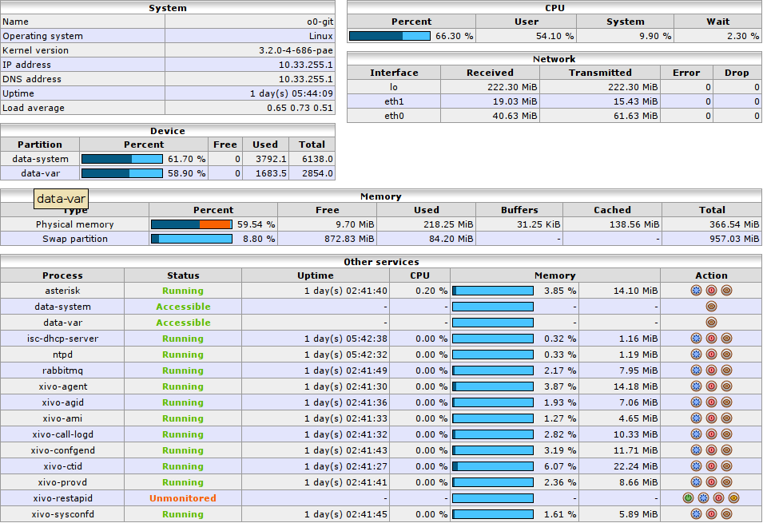

**********
Monitoring
**********

The Monitoring section gives an overview of a XiVO system's status and of all
monitored processes. It is divided into 6 sections :

* :ref:`monitoring-system`
* :ref:`monitoring-device`
* :ref:`monitoring-cpu`
* :ref:`monitoring-network`
* :ref:`monitoring-memory`
* :ref:`monitoring-other`

.. _monitoring-system:

System
======

Displays generic information about the operating system, network adresses,
uptime and load average. Read only.

.. _monitoring-device:

Device
======

Displays free/used space on physical storage partitions. Read only.

.. _monitoring-cpu:

CPU
===

Monitors the CPU usage. Read only.

.. _monitoring-network:

Network
=======

Displays network interfaces and corresponding network traffic. Read only.

.. _monitoring-memory:

Memory
======

Displays Physical and swap memory usage. Read only.

.. _monitoring-other:

Other Services
==============

Lists XiVO related processes (most of which are daemons) with their corresponding
status, uptime, ressource usage and controls to Restart service (blue button),
stop service (red button) and stop monitoring service (grey button).
