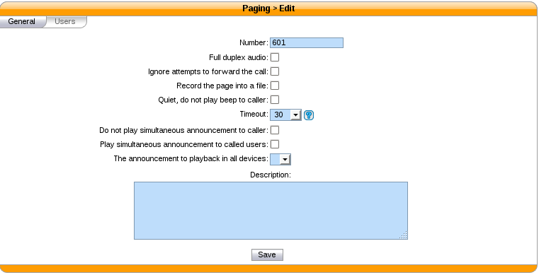

******
Paging
******

With XiVO, you can define paging (i.e. intercom) extensions to page a group of
users. When calling a paging extension, the phones of the specified users will
auto-answer, if they support it.

You can manage your paging extensions via the :menuselection:`Services --> IPBX --> Paging`
page.

When adding a new paging extension, the number can be anything; to call it,
you just need to prefix the paging number with ``*11``.
