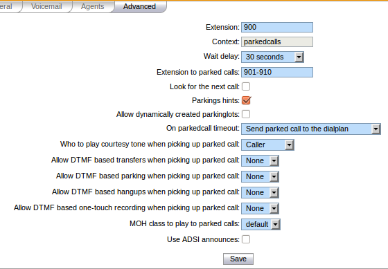

*******
Parking
*******

With XiVO it is possible to park calls, the same way you may park your car in a car parking.
If you define supervised keys on a phone set for all the users of a system, when a call is parked, all the users are able to
see that some one is waiting for an answer, push the phone key and get the call back to the phone.

.. figure:: images/parking_intro.png
   :scale: 85%

There is a default parking number, 700, which is already configured when you install XiVO,
but you may change the default configuration by editing the parking extension in menu
:menuselection:`Service --> IPBX --> IPBX Services --> Extensions --> Advanced --> Parking`

Using this extension, you may define the parking number used to park call, the parking lots, wether the sytem is rotating over
the parking lots to park the calls, enable parking hint if you want to be able to supervise the parking using phone keys and other
system default parameters.

You have two options in case of parking timeout :

* Callback the peer that parked this call

  In this case the call is sent back to the user who parked the call.

* Send park call to the dialplan

  In case you don't want to call back the user who parked the call, you have the option to send the call to any other extension or application.
  If the parking times out, the call is sent back to the dialplan in context ``[parkedcallstimeout]``.
  You can define this context in a dialplan configuration file :menuselection:`Service --> IPBX --> Configuration Files` where you may
  define this context with dialplan commands.

  Example::

   [parkedcallstimeout]
   exten = s,1,Noop('park call time out')
   same  =   n,Playback(hello-world)
   same  =   n,Hangup()

It is also usual to define supervised phone keys to be able to park and unpark calls as in the example below.

.. figure:: images/parking_phone_keys.png
   :scale: 90%
