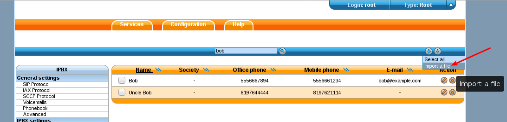

.. _phonebook:

*********
Phonebook
*********

Phone books can be defined in :menuselection:`Services --> IPBX --> IPBX Services -->
Phonebook`. The phone books can be used from the XiVO Client, from the phones directory look key if
the phone is compatible and are used to set the Caller ID for incoming calls.

You can add entries one by one or you can mass-import from a CSV file.

.. note:: To configure phonebook, see :ref:`directories`.

Mass-import contacts
====================

Go in the :menuselection:`Services --> IPBX --> IPBX Services --> Phonebook` section:

The file to be imported must be a CSV file, with a comma character (``,``) as field delimiter. The
file must be encoded in UTF-8.

Available fields are :

* title
* displayname
* firstname
* lastname
* society
* email
* url
* description

Address fields:

* address_<location>_address1
* address_<location>_address2
* address_<location>_city
* address_<location>_state
* address_<location>_zipcode
* address_<location>_country [#country]_

Available locations:

* home
* office
* other

Number fields:

* number_fax [#numeric]_
* number_office [#numeric]_
* number_home [#numeric]_
* number_mobile [#numeric]_
* number_other [#numeric]_

.. [#country] These fields must contain ISO country codes. The complete list is described `here`_.
.. [#numeric] These fields must contain only phone number characters: ``+`` and ``*`` are allowed,
              but not space, point, etc.
.. _here: http://www.iso.org/iso/country_codes/iso_3166_code_lists/country_names_and_code_elements.htm

Example::

    displayname,firstname,number_mobile,number_office,email,address_home_addres1,address_home_address2,address_home_country
    Alice,Alice,5555551234,5555557894,alice@example.com,123 wazo drv,apt. 42,CA
    Bob,Bob,5556661234,5556667894,bob@example.com,123 wazo drv,apt. 42,CA
