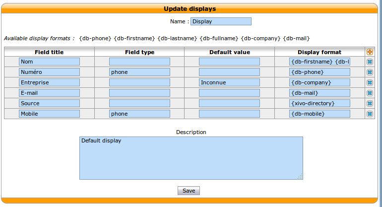
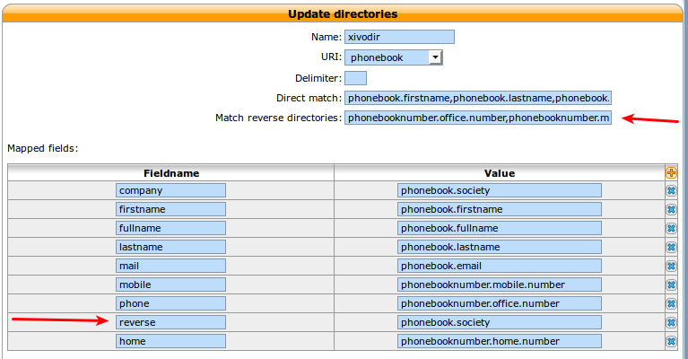

.. _phonebook:

*********
Phonebook
*********

A global phone book can be defined in :menuselection:`IPBX Service -> Phone book`. The phone book can be used from
the XiVO client, from the phones directory look key if the phone is compatible and are used to set
the Caller ID for incoming calls.

You can add entries one by one or you can mass-import from a CSV file.

Mass-import contacts
====================

Go in the :menuselection:`IPBX Services -> Phonebook` section and move your mouse cursor on the *+* button in the
upper right corner. Select *Import a file*.

The file to be imported must be a CSV file, with a pipe character *|* as field delimiter. The file
must be encoded in UTF-8 (without an initial `BOM`_).

Mandatory headers are :

* title (possible values : "mr", "mrs", "ms")
* displayname

Optional headers are :

* firstname
* lastname
* society
* mobilenumber [#numeric]_
* email
* url
* description
* officenumber [#numeric]_
* faxnumber [#numeric]_
* officeaddress1
* officeaddress2
* officecity
* officestate
* officezipcode
* officecountry [#country]_
* homenumber [#numeric]_
* homeaddress1
* homeaddress2
* homecity
* homestate
* homezipcode
* homecountry [#country]_
* othernumber [#numeric]_
* otheraddress1
* otheraddress2
* othercity
* otherstate
* otherzipcode
* othercountry [#country]_

.. [#numeric] These fields must contain only numeric characters, no space, point, etc.
.. [#country] These fields must contain ISO country codes. The complete list is described `here`_.
.. _here: http://www.iso.org/iso/country_codes/iso_3166_code_lists/country_names_and_code_elements.htm
.. _BOM: http://www.unicode.org/faq/utf_bom.html#BOM

.. _phonebook-fields:

Displayed fields
================

It's possible to add more fields to the display in the CTI client. The display can be customized in
the web interface under :menuselection:`Services -> CTI server -> Directories -> Display filter`.

Fields that can be displayed are set in :menuselection:`Directories -> Definitions -> xivodir`

The field name will be used to refer to this field in the directory display.

The fields in definition can be used with the following syntax *{db-[field-name]}*

General phone book section
--------------------------

These fields are set in the General tab of the phone book.

* phonebook.description
* phonebook.displayname
* phonebook.email
* phonebook.firstname
* phonebook.fullname (this value is automatically generated as *"<firstname> <lastname>"*, e.g. *"John Doe"*)
* phonebook.lastname
* phonebook.society
* phonebook.title
* phonebook.url

Phone numbers
-------------

These are the different phone numbers that are available

* phonebooknumber.fax.number
* phonebooknumber.home.number
* phonebooknumber.mobile.number
* phonebooknumber.office.number
* phonebooknumber.other.number

Addresses
---------

Each configured address can be accessed

Address uses the following syntax *phonebookaddress.[location].[field]*, e.g. *phonebookaddress.office.zipcode*.

Locations
^^^^^^^^^

* home
* office
* other

Fields
^^^^^^

* address1
* address2
* city
* country
* state
* zipcode

Each line is a field that will be displayed in the Remote Directory xlet.

Adding the fax to the directory display
---------------------------------------

#. In the definition section, add a field name *fax* with the value *phonebooknumber.fax.number*.
#. In the display filter section add a field with field title *Fax* and display format *{db-fax}*.
#. Restart the CTI Server

Now the fax should be available displayed in the Remote Directory xlet.

.. _reverse_lookup:

Reverse lookup
==============

It's possible to do reverse lookups on incoming calls to show a better caller ID name when
the caller is in one of our directories.

Reverse lookup will only be tried if at least one of the following conditions is true:

* The caller ID name is the same as the caller ID number
* The caller ID name is "unknown"

Also, reverse lookup is performed after :ref:`caller ID number normalization <callerid_num_normalization>` (since XiVO 13.11).

Some configuration must be in place to enable reverse directory lookups.

Match reverse fields
--------------------

The *Match reverse directories* field in :menuselection:`Services --> CTI Server --> Directories --> Definitions`
should contains the fields that are used by the reverse lookup. The list is comma separated
and each field that appears in this list must also appear in the *Value* column of the *Mapped Fields*
section, or the reverse lookup won't work.

Example::

   phonebooknumber.office.number,phonebooknumber.mobile.number,phonebooknumber.home.number

This line would match office, home and mobile numbers on incoming calls.

Displayed field
---------------

You have now to define which field should be used to display the result. This is done 
by defining a mapping between the field named *reverse* on the *Mapped fields* list and a database field.

Examples::

   reverse => phonebook.society
   or
   reverse => phonebook.fullname

The first example would show the contact's company name on the caller ID name, the second would
show his full name.

Include the directory
---------------------

To include a directory in reverse directory definition go to
:menuselection:`Services --> CTI Server --> Directories --> Reverse directories` and add the directories
to include to reverse lookups in the *Related directories* section.

Restart the CTI server and incoming caller IDs should be resolved using the specified directories.

