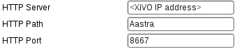

*******************
Basic Configuration
*******************

You have two options to get your phone to be provisioned:

* Set up a DHCP server
* Tell manually each phone where to get the provisioning informations

You may want to manually configure the phones if you are only trying Wazo or if your network
configuration does not allow the phones to access the Wazo DHCP server.

You may want to set up a DHCP server if you have a significant number of phones to connect, as no
manual intervention will be required on each phone.

.. _dhcpd-config:

Configuring the DHCP Server
===========================

Wazo includes a DHCP server that facilitate the auto-provisioning of telephony devices.
It is *not* activated by default.

There's a few things to know about the peculiarities of the included DHCP server:

* it only answers to DHCP requests from :ref:`supported devices <devices>`.
* it only answers to DHCP requests coming from the VoIP subnet (see :ref:`network configuration
  <network_configuration>`).

This means that if your phones are on the same broadcast domain than your computers,
and you would like the DHCP server on your Wazo to handle both your phones and your
computers, that won't do it.

The DHCP server is configured via ``PUT /dhcp``

.. _provd-plugins-mgmt:

Installing ``provd`` Plugins
============================

The installation and management of ``provd`` plugins is done via ``xivo-provd`` endpoint
``/provd/pg_mgr/install``

.. warning::
   If you uninstall a plugin that is used by some of your devices, they will be
   left in an unconfigured state and won't be associated to another plugin
   automatically.

It's possible there will be more than 1 plugin compatible with a given device. In these cases,
the difference between the two plugins is usually just the firmware version the plugins target.
If you are unsure about which version you should install, you should look for more information
on the vendor website.

It's good practice to only install the plugins you need and no more.

.. _alternative-plugins-repo:

Alternative plugins repository
------------------------------

By default, the list of plugins available for installation are the stable plugins for the
officially supported devices.

This can be changed with ``xivo-provd`` endpoint ``/provd/configure/plugin_server``

* ``http://provd.wazo.community/plugins/1/stable/`` -- :ref:`community supported devices
  <supported-devices>` "stable" repository
* ``http://provd.wazo.community/plugins/1/testing/`` -- officially supported devices "testing"
  repository
* ``http://provd.wazo.community/plugins/1/archive/`` -- officially supported devices "archive"
  repository

The difference between the stable and testing repositories is that the latter might contain plugins
that are not working properly or are still in development.

The archive repository contains plugins that were once in the stable repository.

After setting a new URL, you must refresh the list of installable plugins with
``/provd/pg_mgr/install/update``

How to manually tell the phones to get their configuration
==========================================================

If you have set up a DHCP server on Wazo and the phones can access it, you can skip this section.

The according provisioning plugins must be installed.

Aastra
------

On the web interface of your phone, go to :menuselection:`Advanced settings --> Configuration
server`, and enter the following settings:

Polycom
-------

On the phone, go to :menuselection:`Menu --> Settings --> Advanced --> Admin Settings --> Network
configuration --> Server Menu` and enter the following settings:

* Server type: HTTP
* Server address: ``http://<Wazo IP address>:8667/000000000000.cfg``

Then save and reboot the phone.

Snom
----

First, you need to run the following command on the Wazo server::

   sed -i 's/dhcp:stop/dhcp:proceed/' /var/lib/xivo-provd/plugins/xivo-snom-8.7.5.35/var/tftpboot/snom-general.xml

On the web interface of your phone, go to :menuselection:`Setup --> Advanced --> Update` and enter
the following settings:

.. figure:: img/config_server_snom.png

Yealink
-------

On the web interface of your phone, go to :menuselection:`Settings --> Auto Provision`, and enter
the following settings:

* Server URL: ``http://<Wazo IP address>:8667``

.. figure:: img/config_server_yealink.png

Save the changes by clicking on the :guilabel:`Confirm` button and then click on the
:guilabel:`Autoprovision Now` button.

Autoprovisioning a Device
=========================

Once you have installed the proper provd plugins for your devices and setup correctly your
DHCP server, you can then connect your devices to your network.

But first, ``GET /devices``. You will then see that no devices are currently known by your Wazo

You can then power on your devices on your LAN. For example, after you power on an Aastra 6731i and
give it the time to boot and maybe upgrade its firmware, you should then see the phone having its
first line configured as 'autoprov', and if you ``GET /devices``, you should see that your
Wazo now knows about your 6731i with ``status: not_configured``

You can then dial from your Aastra 6731i the provisioning code associated to a line of one of your user.
You will hear a prompt thanking you and your device should then reboot in the next few seconds.
Once the device has rebooted, it will then be properly configured for your user to use it. And also,
if you ``GET /devices``, you'll see the device with with ``status: configured``

Resetting a Device
==================

From REST API
-------------

To remove a phone from Wazo or enable a device to be used for another user:
possibilities :

* ``GET /devices/{device_id}/autoprov``
* ``GET /devices/{device_id}/synchronize``

The phone will restarts and display autoprov, ready to be used for another user.

.. _reset-to-autoprov-device:

From a Device
-------------

* Dial **\*guest** (\*48378) on the phone dialpad followed by **xivo** (9486) as a password

The phone restarts and display autoprov, ready to be used for another user.
