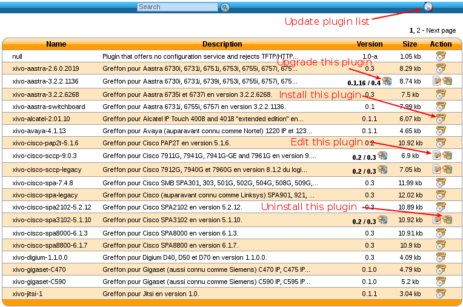
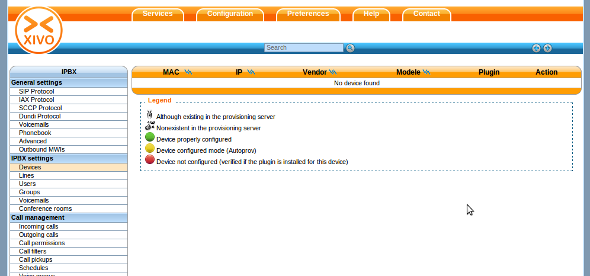
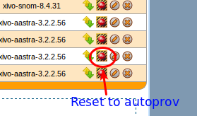

*******************
Basic Configuration
*******************

.. _dhcpd-config:

Configuring the DHCP Server
===========================

XiVO includes a DHCP server that facilitate the auto-provisioning of telephony devices.
It is *not* activated by default.

There's a few things to know about the peculiarities of the included DHCP server:

* it only answer to DHCP requests from :ref:`supported devices <devices>`.
* it only answer to DHCP requests coming from the VoIP subnet

This means that if your phones are on the same broadcast domain than your computers,
and you would like the DHCP server on your XiVO to handle both your phones and your
computers, that won't do it.

The DHCP server is configured via the :menuselection:`Configuration --> Network --> DHCP` page:

.. figure:: img/dhcp.png
   :scale: 85%

   :menuselection:`Configuration --> Network --> DHCP`

Active
   Activate/desactivate the DHCP server.

Pool start
   The lower IP address which will be assigned dynamically. This address should
   be in the VoIP subnet. Example: ``10.0.0.10``.

Pool end
   The higher IP address which will be assigned dynamically. This address should
   be in the VoIP subnet. Example: ``10.0.0.99``.

Extra network interfaces
   A list of space-separated network interface name. Example: ``eth0``.

   Useful if you have done some custom configuration in the :file:`/etc/dhcp/dhcpd_extra.conf`
   file. You need to explicitly specify the additional interfaces the DHCP server should
   listen on.

After saving your modifications, you need to click on :guilabel:`Apply system configuration`
for them to be applied.

.. _provd-plugins-mgmt:

Installing ``provd`` Plugins
============================

The installation and management of ``provd`` plugins is done via the
:menuselection:`Configuration --> Provisioning --> Plugin` page:

   :menuselection:`Configuration --> Provisioning --> Plugin`

The page shows the list of both the installed and installable plugins. You can
see if a plugin is installed or not by looking at the :guilabel:`Action` column.

Here's the list of other things that can be done from this page:

* update the list of installable plugins, by clicking on the top right icon. On a fresh
  XiVO installation, this is the first thing to do.
* install a new plugin
* upgrade an installed plugin
* uninstall an installed plugin
* edit an installed plugin, i.e. install/uninstall optional files that are specific to each plugin, like
  firmware or language files

After installing a new plugin, you are automatically redirected to its edit page. You
can then download and install optional files specific to the plugin. You are strongly
advised to install firmware and language files for the phones you'll use although
it's often not a strict requirement for the phones to work correctly.

.. warning::
   If you uninstall a plugin that is used by some of your devices, they will be
   left in an unconfigured state and won't be associated to another plugin
   automatically.

The search box at the top comes in handy when you want to find which plugin to install
for your device. For example, if you have a Cisco SPA508G, enter "508" in the search box
and you should see there's 1 plugin compatible with it.

.. note::
   If your device has a number in its model name, you should use only the number as the search keyword
   since this is what usually gives the best results.

It's possible there will be more than 1 plugin compatible with a given device. In these cases,
the difference between the two plugins is usually just the firmware version the plugins target.
If you are unsure about which version you should install, you should look for more information
on the vendor website.

It's good practice to only install the plugins you need and no more.

Autoprovisioning a Device
=========================

Once you have installed the proper provd plugins for your devices and setup correctly your
DHCP server, you can then connect your devices to your network.

But first, go to :menuselection:`Services --> IPBX --> Devices` page. You will then see that no
devices are currently known by your XiVO:

You can then power on your devices on your LAN. For example, after you power on an Aastra 6731i and
give it the time to boot and maybe upgrade its firmware, you should then see the phone having its first
line configured as 'autoprov', and if you refresh the devices page, you should see that your XiVO
now knows about your 6731i:

.. figure:: img/Autoprov_new_aastra_6731i.png
   :scale: 85%

You can then dial from your Aastra 6731i the provisioning code associated to a line of one of your user.
You will hear a prompt thanking you and your device should then reboot in the next few seconds.
Once the device has rebooted, it will then be properly configured for your user to use it. And also,
if you update the device page, you'll see that the icon next to your device has now passed to green:

.. figure:: img/Autoprov_cfg_aastra_6731i.png
   :scale: 85%

Resetting a Device
==================

From the Device List in the Webi
--------------------------------

To remove a phone from XiVO or enable a device to be used for another user there are two different
possibilities :

* click on the ``reset to autoprov`` button on the web interface

The phone will restarts and display autoprov, ready to be used for another user.

From the User Form in the Webi
------------------------------

Device With one User Only Associated
^^^^^^^^^^^^^^^^^^^^^^^^^^^^^^^^^^^^

Edit the user associated to the device and put the device field to null.

* click on the ``Save`` button on the web interface

The phone doesn't restart and the phone is in autoprov mode in the device list.

You can synchronize the device to reboot it.

Device with Several Users Associated
^^^^^^^^^^^^^^^^^^^^^^^^^^^^^^^^^^^^

Edit the primary user associated to the terminal (one with the line 1) and put the device field to null.

* click on the ``Save`` button on the web interface

The primary line of the phone has been removed, so the device will lose its funckeys associated
to primary user but there others lines associated to the device will stay provisionned.

The phone doesn't restart and the phone is in autoprov mode in the device list.

You can synchronize the device for reboot it.

From a Device
-------------

* Dial **\*guest** (\*48378) on the phone dialpad followed by **xivo** (9486) as a password

The phone restarts and display autoprov, ready to be used for another user.
