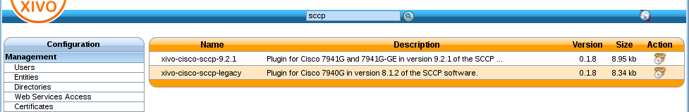
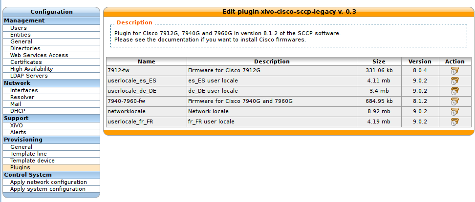
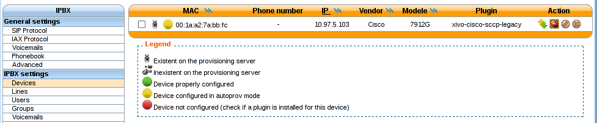
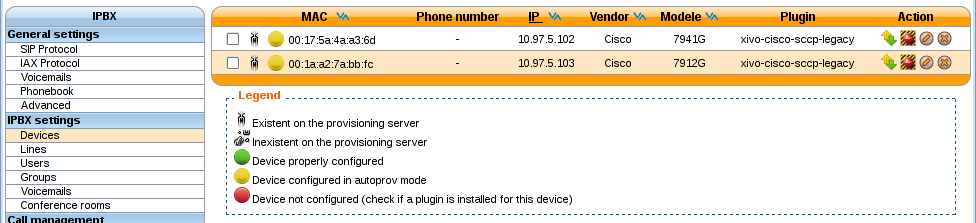
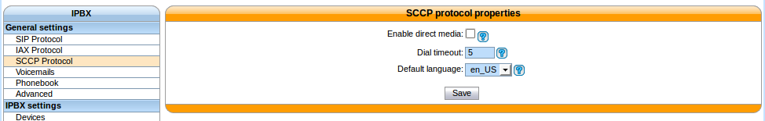
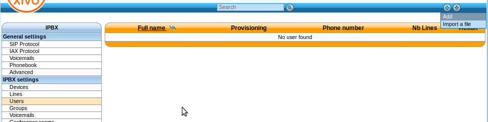
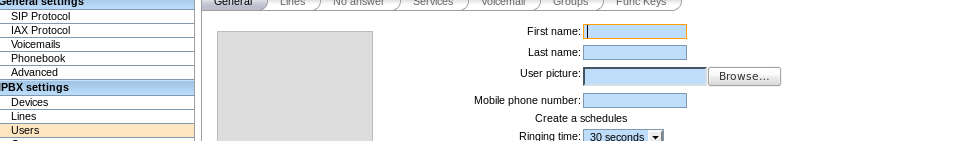
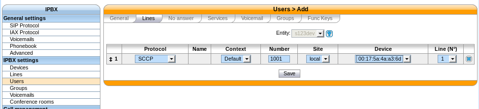

.. _sccp-configuration:

******************
SCCP Configuration
******************

Provisioning
------------

To be able to provision SCCP phones you should :

* activate the :ref:`dhcp_configuration`,
* activate the :ref:`dhcp-integration`,

Then install a plugin for SCCP Phone:
 :menuselection:`Configuration --> Provisioning --> Plugins`

   Installing xivo cisco-sccp plugin

At this point you should have a fully functional DHCP server that provides IP address to your
phones.  Depending on what type of CISCO phone you have, you need to install the plugin sccp-legacy,
sccp-9.0.3 or both.

.. note:: Please refer to the :ref:`Provisioning page <cisco-provisioning>` for more information on
          how to install CISCO firmwares.

Once your plugin is installed, you'll be able to edit which firmwares and locales you need.
If you are unsure, you can choose all without any problem.

   Editing the xivo-cisco-sccp-legacy plugin

Now if you connect your first SCCP phone, you should be able to see it in the device list.

Listing the detected devices:
 :menuselection:`Services --> IPBX --> IPBX settings --> Devices`

   Device list

When connecting a second SCCP phone, the device will be automatically detected as well.

   Device list

SCCP General Settings
---------------------

Review SCCP general settings:
 :menuselection:`Services  --> IPBX --> IPBX settings --> SCCP general settings`

   SCCP general settings

User creation
-------------

The last step is to create a user with a **SCCP line**.

Creating a user with a SCCP line:
 :menuselection:`Services --> IPBX --> IPBX settings --> Users`

   Add a new user

   Edit user informations

Before saving the newly configured user, you need to select the `Lines` menu and add a SCCP line.
Now, you can save your new user.

   Add a line to a user

Congratulations ! Your SCCP phone is now ready to be called !

Function keys
-------------

With SCCP phones, the only function keys that can be configured are:

* :guilabel:`Key`: Only the order is important, not the number
* :guilabel:`Type`: ``Customized``; Any other type doesn't work
* :guilabel:`Destination`: Any valid extension
* :guilabel:`Label`: Any label
* :guilabel:`Supervision`: ``Enabled`` or ``Disabled``

Direct Media
------------

SCCP Phones support directmedia (direct RTP). In order for SCCP phones to use directmedia, one must enable the directmedia option in SCCP general settings:
 :menuselection:`Services  --> IPBX --> IPBX settings --> SCCP general settings`

.. _sccp-features:

Features
--------

+------------------------------+-----------+
| Features                     | Supported |
+==============================+===========+
| Receive call                 | Yes       |
+------------------------------+-----------+
| Initiate call                | Yes       |
+------------------------------+-----------+
| Hangup call                  | Yes       |
+------------------------------+-----------+
| Transfer call                | Yes       |
+------------------------------+-----------+
| Congestion Signal            | Yes       |
+------------------------------+-----------+
| Autoanswer (custom dialplan) | Yes       |
+------------------------------+-----------+
| Call forward                 | Yes       |
+------------------------------+-----------+
| Multi-instance per line      | Yes       |
+------------------------------+-----------+
| Message waiting indication   | Yes       |
+------------------------------+-----------+
| Music on hold                | Yes       |
+------------------------------+-----------+
| Context per line             | Yes       |
+------------------------------+-----------+
| Paging                       | Yes       |
+------------------------------+-----------+
| Direct RTP                   | Yes       |
+------------------------------+-----------+
| Redial                       | Yes       |
+------------------------------+-----------+
| Speed dial                   | Yes       |
+------------------------------+-----------+
| BLF (Supervision)            | Yes       |
+------------------------------+-----------+
| Resync device configuration  | Yes       |
+------------------------------+-----------+
| Do not disturb (DND)         | Yes       |
+------------------------------+-----------+
| Group listen                 | Yes       |
+------------------------------+-----------+
| Caller ID                    | Yes       |
+------------------------------+-----------+
| Connected line ID            | Yes       |
+------------------------------+-----------+
| Group pickup                 | Yes       |
+------------------------------+-----------+
| Auto-provisioning            | Not yet   |
+------------------------------+-----------+
| Multi line                   | Not yet   |
+------------------------------+-----------+
| Codec selection              | Yes       |
+------------------------------+-----------+
| NAT traversal                | Not yet   |
+------------------------------+-----------+
| Type of Service (TOS)        | Manual    |
+------------------------------+-----------+

Telephone
---------

+-------------+-------------+------------------+----------------+
| Device type | Supported   | Firmware version | Timezone aware |
+=============+=============+==================+================+
| 7905        | Should work |                  |                |
+-------------+-------------+------------------+----------------+
| 7906        | Yes         | SCCP11.9-0-3S    | Yes            |
+-------------+-------------+------------------+----------------+
| 7911        | Yes         | SCCP11.9-0-3S    | Yes            |
+-------------+-------------+------------------+----------------+
| 7912        | Yes         | 8.0.4(080108A)   | No             |
+-------------+-------------+------------------+----------------+
| 7920        | Yes         | 3.0.2            | No             |
+-------------+-------------+------------------+----------------+
| 7921        | Yes         | 1.4.5.3          | Yes            |
+-------------+-------------+------------------+----------------+
| 7931        | Yes         | SCCP31.9-0-3S    | Yes            |
+-------------+-------------+------------------+----------------+
| 7937        | Testing     |                  |                |
+-------------+-------------+------------------+----------------+
| 7940        | Yes         | 8.1(2.0)         | No             |
+-------------+-------------+------------------+----------------+
| 7941        | Yes         | SCCP41.9-0-3S    | Yes            |
+-------------+-------------+------------------+----------------+
| 7941GE      | Yes         | SCCP41.9-0-3S    | Yes            |
+-------------+-------------+------------------+----------------+
| 7942        | Yes         | SCCP42.9-0-3S    | Yes            |
+-------------+-------------+------------------+----------------+
| 7945        | Testing     |                  |                |
+-------------+-------------+------------------+----------------+
| 7960        | Yes         | 8.1(2.0)         | No             |
+-------------+-------------+------------------+----------------+
| 7961        | Yes         | SCCP41.9-0-3S    | Yes            |
+-------------+-------------+------------------+----------------+
| 7962        | Yes         | SCCP42.9-0-3S    | Yes            |
+-------------+-------------+------------------+----------------+
| 7965        | Testing     |                  |                |
+-------------+-------------+------------------+----------------+
| 7970        | Testing     |                  |                |
+-------------+-------------+------------------+----------------+
| 7975        | Testing     |                  |                |
+-------------+-------------+------------------+----------------+
| CIPC        | Yes         | 2.1.2            | Yes            |
+-------------+-------------+------------------+----------------+

Models not listed in the table above won't be able to connect to Asterisk at all. Models listed as
"Testing" are not yet officially supported in XiVO: use them at your own risk.

The "Timezone aware" column indicates if the device supports the timezone tag in its configuration
file, i.e. in the file that the device request to the provisioning server when it boots.  If you
have devices that don't support the timezone tag and these devices are in a different timezone than
the one of the XiVO, you can look at `the issue #5161 <https://projects.xivo.io/issues/5161>`_ for
a potential solution.
