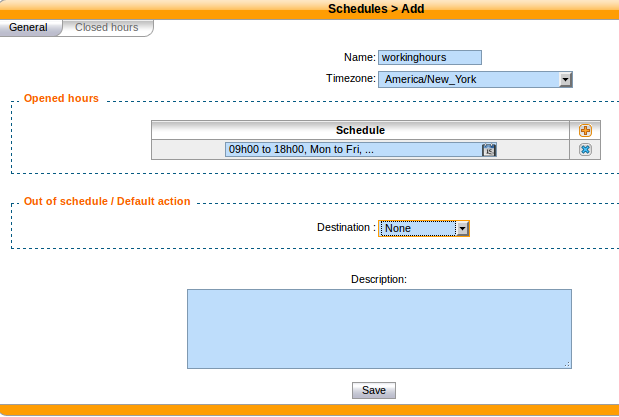
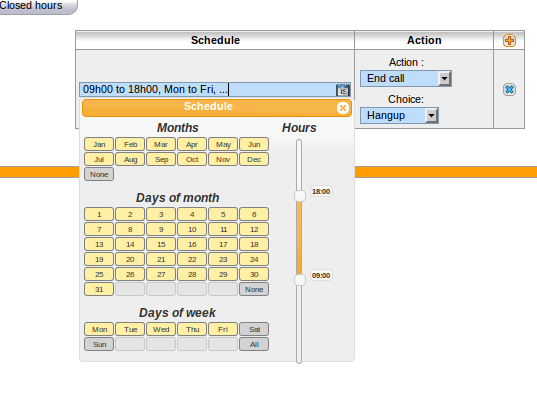

.. _schedules:

*********
Schedules
*********

Schedules are specific time frames that can be defined to open or close a service.
Within schedules you may specify opening days and hours or close days and hours.

A default destination as user, group ... can be defined when the schedule is in closed state.

Schedules can be applied to :

* Users
* Groups
* Inbound calls
* Outbound calls
* Queues

Creating Schedules
==================

   Creating a schedule

A schedule is composed of a name, a timezone, one or more opening hours or days that you may setup using a calendar widget,
a destination to be used when the schedule state is closed.

.. figure:: schedule_calendar.png
   :scale: 85%

   Schedule calendar widget

With the calendar widget you may select months, days of month, days of week and opening time.

You may also optionaly select closed hours and destination to be applied when period is inside the main schedule.
For example, your main schedule is opened between 08h00 and 18h00, but you are closed between 12h00 and 14h00.

   Schedule closed hours

Using Schedule on Users
=======================

When you have a schedule associated to a user, if this user is called during a closed
period, the caller will first hear a prompt saying the call is being transferred before
being actually redirected to the closed action of the schedule.

If you don't want this prompt to be played, you can change the behaviour by:

#. editing the :file:`/etc/xivo/asterisk/xivo_globals.conf` file and setting the
   ``XIVO_FWD_SCHEDULE_OUT_ISDA`` to ``1``
#. reloading the asterisk dialplan with an ``asterisk -rx "dialplan reload"``.
