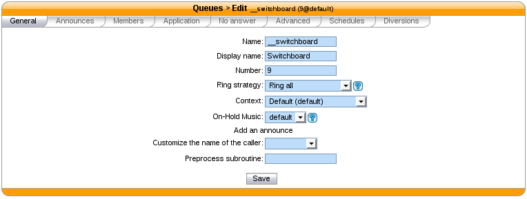
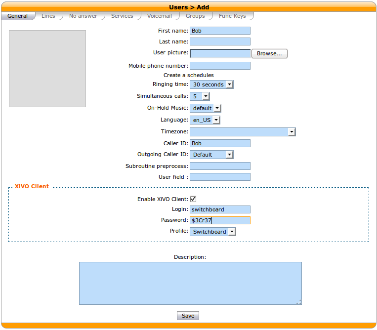
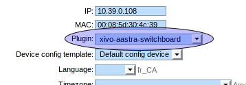
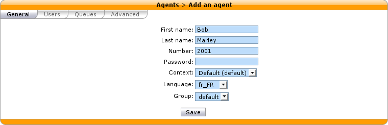
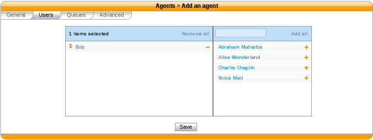
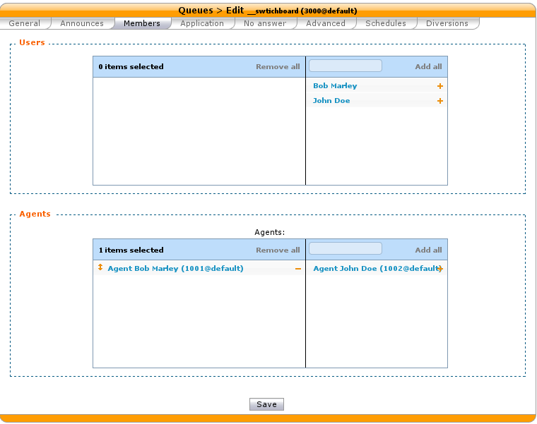
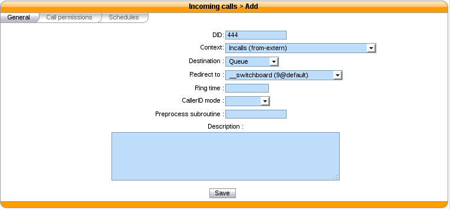
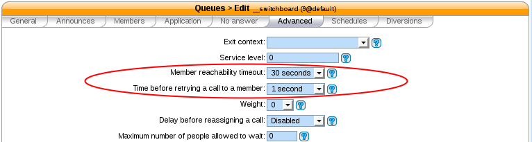
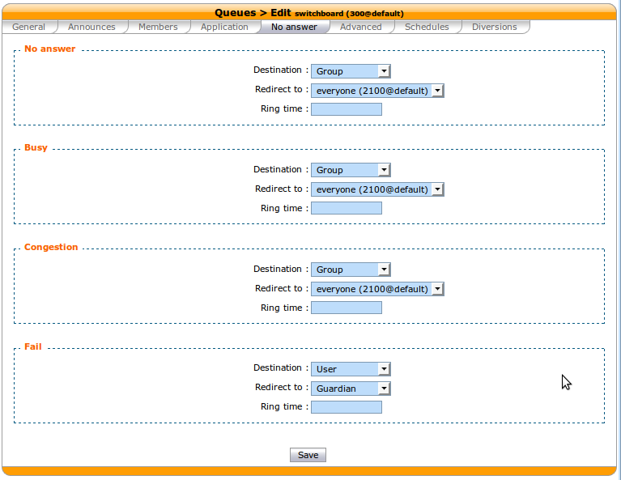
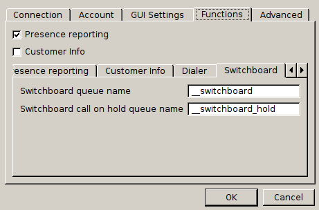

.. _switchboard_configuration:

*************************
Switchboard Configuration
*************************

Be sure to read the :ref:`limitations <switchboard_limitations>` before configuring a switchboard.

Server configuration
====================

Quick Summary
-------------

In order to configure a switchboard on your XiVO, you need to:

* Create a queue for your switchboard
* Create a queue for your switchboard's calls on hold
* Create the users that will be operators
* Activate the switchboard option for your phone
* Create an agent for your user
* Assign the incoming calls to the switchboard queue
* For each operator, add a function key for logging in or logging out from the switchboard queue.
* Set "no answer" destinations on the switchboard queue

.. _switchboard_supported_devices:

Supported Devices
-----------------

The supported phones for the switchboard are:

+------------+----------+--------------+--------------------------------+
| Brand      | Model    | XiVO version | Plugin version                 |
+============+==========+==============+================================+
| Aastra     | 6755i    | >= 14.07     | >= xivo-aastra-3.3.1-SP2, v1.0 |
+------------+----------+--------------+--------------------------------+
| Aastra     | 6757i    | >= 14.07     | >= xivo-aastra-3.3.1-SP2, v1.0 |
+------------+----------+--------------+--------------------------------+
| Aastra     | 6735i    | >= 14.07     | >= xivo-aastra-3.3.1-SP2, v1.2 |
+------------+----------+--------------+--------------------------------+
| Aastra     | 6737i    | >= 14.07     | >= xivo-aastra-3.3.1-SP2, v1.2 |
+------------+----------+--------------+--------------------------------+
| Polycom    | VVX 400  | >= 15.11     | >= xivo-polycom-5.3.0, v1.3    |
+------------+----------+--------------+--------------------------------+
| Polycom    | VVX 410  | >= 15.11     | >= xivo-polycom-5.3.0, v1.3    |
+------------+----------+--------------+--------------------------------+
| Snom       | 720      | >= 14.14     | >= xivo-snom-8.7.3.25.5, v1.0  |
+------------+----------+--------------+--------------------------------+
| Snom       | D725     | >= 14.14     | >= xivo-snom-8.7.5.17, v1.4    |
+------------+----------+--------------+--------------------------------+
| Yealink    | T46G     | >= 15.01     | >= xivo-yealink-72.0, v1.22.1  |
+------------+----------+--------------+--------------------------------+

Create a Queue for Your Switchboard
-----------------------------------

All calls to the switchboard will first be distributed to a switchboard queue.

To create this queue, go to :menuselection:`Services --> Call center --> Queues` and click the add button.

The following configuration is mandatory

* The :menuselection:`General --> Name` field has to be *__switchboard*
* The :menuselection:`General --> Ring strategy` field has to be *Ring all*
* The :menuselection:`General --> Preprocess subroutine` field has to be *xivo_subr_switchboard*
* The :menuselection:`Application --> Allow caller to hang up call` option has to be *enabled*
* The :menuselection:`Application --> Allow callee to transfer the call` option has to be *enabled*
* The :menuselection:`Advanced --> Member reachability timeout` option has to be *disabled*
* The :menuselection:`Advanced --> Time before retrying a call to a member` option has to be *1 second*
* The :menuselection:`Advanced --> Delay before reassigning a call` option has to be *disabled*
* The :menuselection:`Advanced --> Call a member already on` option has to be *disabled*
* The :menuselection:`Advanced --> Autopause agents` option has to be *No*

Other important fields

* The :menuselection:`General --> Display name` field is the name displayed in the XiVO client xlets and in the statistics
* The :menuselection:`General --> Number` field is the number that will be used to reach the switchboard internally (typically *9*)

Create a Queue for Your Switchboard on Hold
-------------------------------------------

The switchboard uses a queue to track its calls on hold.

To create this queue, go to :menuselection:`Services --> Call center --> Queues` and click the add button.

The following configuration is mandatory

* The :menuselection:`General --> Name` field has to be *__switchboard_hold*
* The :menuselection:`General --> Number` field has to be a valid number in a context reachable by the switchboard

Other important fields

* The :menuselection:`General --> Display name` field is the name displayed in the XiVO client xlets and in the statistics

.. warning:: This queue MUST have **NO** members

Create the Users that Will be Operators
---------------------------------------

Each operator needs to have a user configured with a line. The XiVO client profile has to be set to *Switchboard*.

The following configuration is mandatory for switchboard users

* The :menuselection:`General --> First name` field has to be set
* The :menuselection:`General --> Enable XiVO Client` option has to be *enabled*
* The :menuselection:`General --> Login` field has to be set
* The :menuselection:`General --> Password` field has to be set
* The :menuselection:`General --> Profile` field has to be set to *Switchboard*
* The :menuselection:`Lines --> Number` field has to have a valid extension
* The :menuselection:`Lines --> Device` field has to be a :ref:`supported device <switchboard_supported_devices>`
* The :menuselection:`Services --> Enable call transfer` option has to be *enabled*
* The :menuselection:`Services --> Enable supervision` option has to be *enabled*

.. _switchboard_device_option:

Activate the Switchboard Option for your Phone
----------------------------------------------

The switchboard option must be activated on the phone. It's possible to activate this option only on
:ref:`supported phones <switchboard_supported_devices>` and plugins.

* Edit device associated to your user in :menuselection:`Services --> Devices`
* Check the switchboard checkbox and save
* Synchronize your phone to apply the changes

Polycom Phones
^^^^^^^^^^^^^^

To be able to use a Polycom phone for the switchboard, the XiVO must be able to do HTTP requests to
the phone. This might be problematic if there's a NAT between your XiVO and your phone.

It's possible to configure the Polycom switchboard via the :ref:`configuration files
<configuration-files>` of xivo-ctid. The following options are available::

   switchboard_polycom:
       username: xivo_switchboard
       password: xivo_switchboard
       answer_delay: 0.5

You will also need to change the XML API username/password by creating a :ref:`custom template
<provd-custom-templates>` for your phone.

Snom Phones
^^^^^^^^^^^

When using a Snom switchboard, you must not configure a function key on position 1.

To be able to use a Snom phone for the switchboard, the XiVO must be able to do HTTP requests to
the phone. This might be problematic if there's a NAT between your XiVO and your phone. The
following command should work from your XiVO's bash command line ``wget http://guest:guest@<phone IP
address>/command.htm?key=SPEAKER``. If this command does not activate the phone's speaker, your
network configuration will have to be *fixed* before you can use the Snom switchboard.

It's possible to configure the Snom switchboard via the :ref:`configuration files
<configuration-files>` of xivo-ctid. The following options are available::

   switchboard_snom:
       username: guest
       password: guest
       answer_delay: 0.5

You have to change the username and password option if you have changed the administrator
username or administrator password for your phone in :menuselection:`Configuration --> Provisioning
--> Template Device`.

Create an Agent for the Operator
--------------------------------

Each operator needs to have an associated agent.

.. warning:: Each agent MUST ONLY be a member of the Switchboard queue

To create an agent:

* Go to :menuselection:`Services --> Call center --> Agents`
* Click on the group `default`
* Click on the `Add` button

* Associate the user to the agent in the `Users` tab

* Assign the Agent to the *Switchboard* Queue (**and ONLY to the Switchboard queue**)

Send Incoming Calls to the *Switchboard* Queue
----------------------------------------------

Incoming calls must be sent to the *Switchboard* queue to be distributed to
the operators. To do this, we have to change the destination of our incoming
call for the switchboard queue.

In this example, we associate our incoming call (DID *444*) to our *Switchboard* queue:

Set "No Answer" Destinations on the *Switchboard* Queue
-------------------------------------------------------

When there are no operators available to answer a call, "No Answer" destinations
should be used to redirect calls towards another destination.

You also need to set the timeout of the Switchboard queue to know when calls will be
redirected.

.. figure:: images/queue_application.png

The reachability timeout must not be disabled nor be too short.

The time before retrying a call to a member should be as low as possible (1 second).

In this example we redirect "No Answer", "Busy" and "Congestion" calls to the
*everyone* group and "Fail" calls to the *guardian* user.

You can also choose to redirect all the calls to another user or a voice mail.

XiVO Client configuration
=========================

Directory xlet
--------------

The transfer destination is chosen in the Directory xlet. You **must** follow the :ref:`directory-xlet` section to be able to use it.

.. _switchboard_configuration_multi_queues:

Configuration for multiple switchboards
---------------------------------------

The above documentation can be used for multiple switchboards on the same
XiVO by replacing the *__switchboard* and *__switchboard_hold* queues name
and configuring the operators XiVO client accordingly in the
:menuselection:`XiVO Client --> Configure --> Functions --> Switchboard` window.

All switchboard queues should be added to the xivo-ctid configuration. New
queues can be added by adding a file in :file:`/etc/xivo-ctid/conf.d`. For
example, the following content should be used for a new switchboard queue
names *__switchboard_two* and an hold queue names *__switchboard_hold_two*.

.. code-block:: javascript

  {"switchboard_queues": {"__switchboard_two": true},
   "switchboard_hold_queues": {"__switchboard_hold_two": true}}
