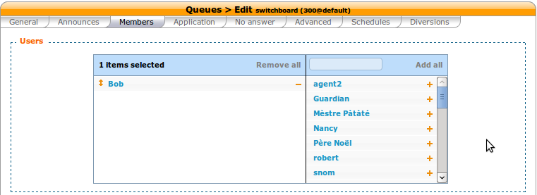

*************************
Configuring a Switchboard
*************************

This page describe the supported configuration to have a switchboard on your XiVO.

Quick Summary
=============

In order to configure a switchboard on your XiVO, you have to:

* Create a queue for your switchboard
* Create the users that will be operators
* Assign the incoming calls to the switchboard queue
* Add a function key to each user that will operate the switchboard to log to the switchboard queue
* Set no answer destinations on the switchboard queue

Overview
========

The chosen architecture for the switchboard is to have a queue for calls distributed to the operator.
When a call is received, it is distributed to the operators.

The supported phones for the switchboard are the *Aastra 6755i* and *Aastra 6757i*.

Create a Queue for Your Switchboard
-----------------------------------

All calls to the switchboard will first be distributed to a queue.

The queue must be called ``__switchboard``.
For this example, we will use the following configuration:

* Switchboard queue name *__switchboard*
* Switchboard queue number *300*

To create this queue, go to :menuselection:`Services --> Call center --> Queues` and click the add button.

.. figure:: images/queue_general.png
   :scale: 85%

Update Your Phone Firmware
--------------------------

The firmware version for Aastra phones *6755i* and *6757i* must be at least
0.3. See :ref:`provd-plugins-mgmt` for more details.

Create the Users that Will be Operators
---------------------------------------

Each operators need to have a configured user with a line. The XiVO client profile has to be *Switchboard*.

For this example, we will use the following configuration:

* First name *Bob*
* Line number *1674*
* Login *switchboard*
* Password *$3Cr37*

.. figure:: images/user_general.png
   :scale: 85%

The selected device is a *Aastra 6755i* or *Aastra 6757i*.

.. figure:: images/user_lines.png
   :scale: 85%

Assign the User to the *Switchboard* Queue
------------------------------------------

Each operator should be assigned to the *Switchboard* queue.

Send Incoming Calls to the *Switchboard* Queue
----------------------------------------------

Incoming calls should be sent to the *Switchboard* queue to be distributed to the operators. To do this, we
have to change the destination of our incoming call to the queue.

In this example, we associate our incoming call to our *Switchboard* queue:

* DID *444*

.. figure:: images/incall_general.png
   :scale: 85%

Set No Answer Destinations on the *Switchboard* Queue
-----------------------------------------------------

No answer destinations should be set on the *Switchboard* queue to avoid hanging up on callers.

In this example we send most no answer destinations to our *everyone* group and fails to the *guardian*.
The group's *no answer* destinations could be set to *guardian* or a voice mail and *guardian* *no answer*
destination should be set to a voice mail.

.. figure:: images/queue_no_answer.png
   :scale: 85%

Use XiVO Client to transfer calls
---------------------------------

When the user ``Bob`` connects his XiVO Client, he gets the Switchboard profile.

.. figure:: images/xivoclient-switchboard.png
   :scale: 85%

The two main Xlets of this profile are the Switchboard Xlet and the Contacts Xlet.

1. The Switchboard Xlet lists the incoming calls waiting to be answered. When your
phone is ringing, the oldest waiting call can be answered by clicking on it or
by pressing ``Enter``.

2. The Contacts Xlet lists and searches among the users of the company. See the
page about the :ref:`contact-xlet` for how to transfer calls.
