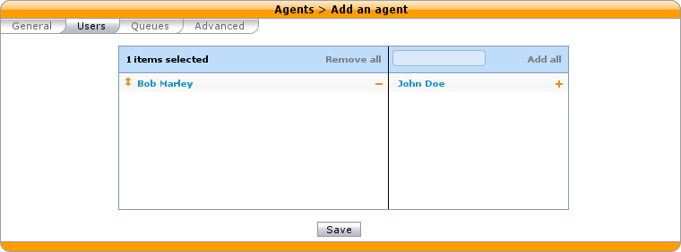
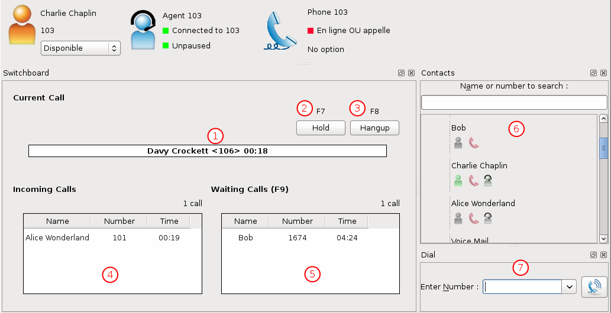

*************************
Configuring a Switchboard
*************************

This page describes the configuration needed to have a switchboard on your XiVO.

Quick Summary
=============

In order to configure a switchboard on your XiVO, you need to:

* Create a queue for your switchboard
* Create the users that will be operators
* Assign the incoming calls to the switchboard queue
* For each operator, add a function key for logging in or logging out from the switchboard queue.
* Set "no answer" destinations on the switchboard queue

Overview
========

The switchboard works in a similar way to a queue: When a call is received, it is distributed to the operators logged in.

The supported phones for the switchboard are the *Aastra 6755i* and *Aastra 6757i*.

Create a Queue for Your Switchboard
-----------------------------------

All calls to the switchboard will first be distributed to a queue.

The queue must be called ``__switchboard``.
For this example, we will use the following configuration:

* Switchboard queue name *__switchboard*
* Switchboard queue number *300*

To create this queue, go to :menuselection:`Services --> Call center --> Queues` and click the add button.

.. figure:: images/queue_general.png
   :scale: 85%

Update Your Phone Firmware
--------------------------

The firmware version for Aastra phones *6755i* and *6757i* must be at least
0.3. See :ref:`provd-plugins-mgmt` for more details.

Create the Users that Will be Operators
---------------------------------------

Each operator needs to have a user configured with a line. The XiVO client profile has to be set to *Switchboard*.

In this example, we will use the following configuration:

* First name *Bob*
* Line number *1674*
* Login *switchboard*
* Password *$3Cr37*
* Profile *Switchboard*

.. figure:: images/user_general.png
   :scale: 85%

Select a *Aastra 6755i* or *Aastra 6757i* device in the *Lines* tab

.. figure:: images/user_lines.png
   :scale: 85%

Create an Agent for the Operator
--------------------------------

Each operator needs to have an associated agent.

To create an agent:

* Go to :menuselection:`Services --> Call center --> Agents`
* Click on the group `default`
* Click on the `Add` button

.. figure:: images/agent_add.png
   :scale: 85%

* Don't forget to associate the user to the agent in the `Users` tab

Assign the Agents to the *Switchboard* Queue
------------------------------------------

After creating the agents, the operators should be assigned to the *Switchboard* queue.

.. figure:: images/agent_queue.png
   :scale: 85%

Send Incoming Calls to the *Switchboard* Queue
----------------------------------------------

Incoming calls should be sent to the *Switchboard* queue to be distributed to the operators. To do this, we
have to change the destination of our incoming call to the queue.

In this example, we associate our incoming call (DID *444*) to our *Switchboard* queue:

.. figure:: images/incall_general.png
   :scale: 85%

Set "No Answer" Destinations on the *Switchboard* Queue
-----------------------------------------------------

When there are no operators available to answer a call, "No Answer" destinations should be used to redirect calls
towards another destination.

In this example we redirect "No Answer", "Busy" and "Congestion" calls to the *everyone* group and "Fail" calls to the *guardian* user.

You can also choose to redirect all the calls to another user or a voice mail.

.. figure:: images/queue_no_answer.png
   :scale: 85%

Use the XiVO Client to transfer calls
-------------------------------------

When the user ``Bob`` connects with his XiVO Client, he gets the Switchboard profile.

.. note:: If you don't see the Switchboard Xlet, right-click on the grey
          bar at the right of the *Help* menu and check the line *Switchboard*:

.. figure:: images/enable-switchboard.png

The two main Xlets of this profile are the Switchboard Xlet and the Contacts Xlet.

1. The Switchboard Xlet lists the incoming calls waiting to be answered. When your
phone is ringing, the oldest call can be answered by clicking on it or
by pressing ``Enter``.

2. The Contacts Xlet lists and searches among the users of the company. See the
page about the :ref:`contact-xlet` on how to transfer calls.
