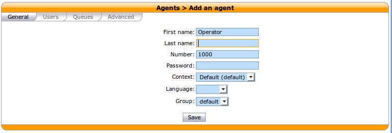
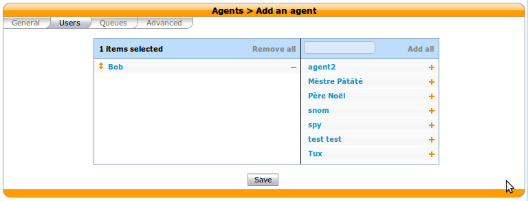
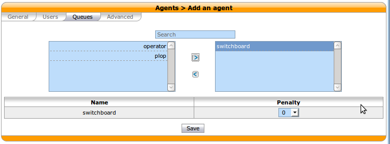

***************************
Configuring a Switchboard
***************************

This page describe the supported configuration to have a switchboard on your XiVO.

Quick Summary
=============

In order to configure a switchboard on your XiVO, you have to:

* Create a queue for your switchboard
* Create the users that will be operators
* Create agents for users that will be operating the switchboard
* Assign the incoming calls to the switchboard queue
* Add a function key to each user that will operate the switchboard to log to the switchboard queue
* Set no answer destinations on the switchboard queue

Overview
========

The chosen architecture for the switchboard is to have a queue for calls distributed to the operator.
When a call is received, it is distributed to the operators.

The supported phone for the switchboard is a `Aastra 6757i`.

Create a Queue for Your Switchboard
-----------------------------------

All calls to the switchboard will first be distributed to a queue.

For this example, we will use the following configuration:

* Switchboard queue name `switchboard`
* Switchboard queue number `300`

To create this queue, go to `Services` -> `Call center` -> `Queues` and click the add button.

.. figure:: images/queue_general.png
  :scale: 85%

Create the Users that Will be Operators
---------------------------------------

Each operators need to have a configured user with a line. The XiVO client profile has to be `Switchboard`.

For this example, we will use the following configuration:

* First name `Bob`
* Line number `1674`
* Login `switchboard`
* Password `$3Cr37`

.. figure:: images/user_general.png
  :scale: 85%

The selected device is a `Aastra 6757i`.

.. figure:: images/user_lines.png
  :scale: 85%

Create an Agent to the Operator Users
-------------------------------------

Each operators needs to be associated to an agent. And this agent should be associated to the `switchboard` queue.

For this example, `Bob` will be associated to an agent with the following configuration:

* First name `Operator`
* Number `1000`

The agent then has to be associated to our user `Bob` and to the queue `Switchboard`.

Send Incoming Calls to the Switchboard Queue
--------------------------------------------

Incoming calls should be sent to the `Switchboard` queue to be distributed to the operators. To do this, we
have to change the destination of our incoming call to the queue.

In this example, we associate our incoming call to our `Switchboard` queue:

* DID `444`

.. figure:: images/incall_general.png
  :scale: 85%

Set Function Keys to the Operators to Login and Logout
------------------------------------------------------

To assign a function key to login and logout, edit user `Bob` and in the `Func Keys` tab add an entry to
`Connect/Disconnect a static agent`.

.. figure:: images/user_keys.png
  :scale: 85%

The `Destination` fields contains our previously created agent. The `Label` field will be the string next
to the function key on the operator's phone. The `Supervision` is set to enable to light up the key when
the operator is active.

Set No Answer Destinations on the `Switchboard` Queue
------------------------------------------------------

No answer destinations should be set on the `Switchboard` queue to avoid hanging up on callers.

In this example we send most no answer destinations to our `everyone` group and fails to the `guardian`.
The group's `no answer` destinations could be set to `guardian` or a voice mail and `guardian` `no answer`
destination should be set to a voice mail.

.. figure:: images/queue_no_answer.png
  :scale: 85%

