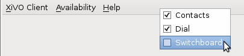
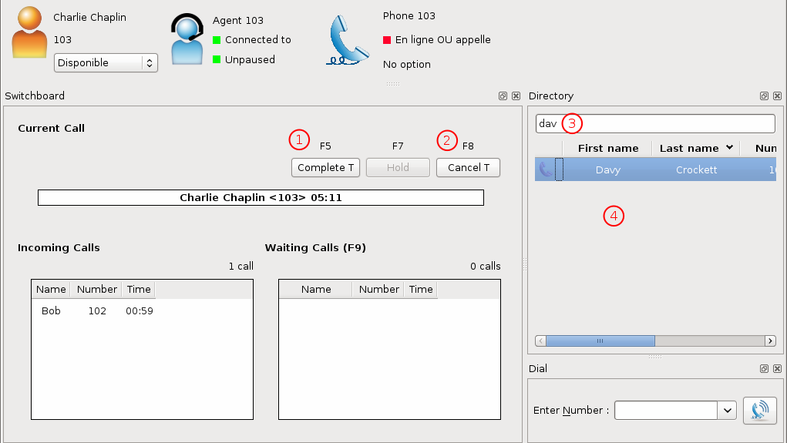

.. _switchboard_usage:

*****************
Switchboard Usage
*****************

.. warning::

  The :ref:`switchboard configuration <switchboard_configuration>` must be completed before using the switchboard. This includes :

    * Device, User, Agent and Queues configuration (see above),
    * Directory xlet configuration (see :ref:`directory-xlet`)

  If it's not the case, the user must disconnect his XiVO client and reconnect.

Be sure to read the :ref:`limitations <switchboard_limitations>` before using the switchboard.

The XiVO Client Switchboard Profile
-----------------------------------

When the user connects with his XiVO Client, he gets the Switchboard profile.

.. figure:: images/xivoclient-answering.png

1. *Current Call* frame
2. *Answer* button
3. *Call* button
4. *Blind transfer* button
5. *Attended transfer* button
6. *Hold* button
7. *Hangup* button
8. *Incoming Calls* list
9. *Waiting Calls* list
10. *Directory* Xlet
11. *Dial* Xlet

.. note:: If you don't see the Switchboard Xlet, right-click on the grey
          bar at the right of the *Help* menu and check *Switchboard*:

The operator can login his agent using a function key or an extension to start
receiving calls.

Call flow
---------

Answering an incoming call
^^^^^^^^^^^^^^^^^^^^^^^^^^

When the switchboard receives a call, the new call is added to the *Incoming Calls* list on the left
and the phone starts ringing. The user can answer this call by:

* clicking on any call in the list
* clicking the *Answer* button
* pressing the *Enter* key

.. note:: The XiVO Client must be the active window for the keyboard shortcuts
          to be handled

The operator can select which call to answer by:

* clicking directly on the incoming call
* pressing *F6* to select the incoming calls frame and pressing the up and down arrow keys

Selecting a call to answer while talking will not answer the call.

Once the call has been answered, it is removed from the incoming calls list and
displayed in the *Current Call* frame.

Making a Call
^^^^^^^^^^^^^

The switchboard operator can do the following operations:

* Press the *Call* button or press *F3*
* Search for the call destination in the directory xlet
* Press to confirm the selection and start the call

Hanging Up a Call
^^^^^^^^^^^^^^^^^

The switchboard operator can hang up its current call by either:

* Clicking the *Hangup* button
* Pressing the *F8* key

If the operator has placed a new call via the *Directory* or *Dial* xlet and that call
has not yet been answered, he can cancel it in the same way.

Distributing a call
^^^^^^^^^^^^^^^^^^^

Once the call has been answered and placed in the current call frame, the operator has 3 choices:

* transfer the call to another user

  * using the *Blind transfer* button or the *F4* key.
  * using the *Attended transfer* button or the *F5* key

* put the call on hold using the *Hold* button or the *F7* key
* end the call using the *Hangup* button or the *F8* key.

Transferring a call
^^^^^^^^^^^^^^^^^^^

Transfer buttons allow the operator to select towards which destination he wishes to transfer the call. This is made through the *Directory* xlet. For defails about the xlet *Directory* usage and configuration see :ref:`directory-xlet`.

Once the destination name has been entered, press *Enter*. If multiple destinations are displayed, you can choose by:

* double-clicking on the destination
* using *Up*/*Down* arrows then:

  * pressing *Enter*
  * pressing the transfer button again

Blind transfers are straightforward: once the call is transferred, the operator is free to manage other calls.

Attended transfers are a bit more complicated: the operator needs to wait for the transfer destination to answer before completing the transfer.

In this example, the operator is currently asking *Bernard Marx* if he can transfer *Alice Wonderland* to him.

1. *Complete transfer* button
2. *Cancel transfer* button
3. Transfer destination filtering field (xlet *Directory*)
4. Transfer destination list (xlet *Directory*)

Once the destination has answered, you can:

* cancel the transfer with *F8* key
* complete the transfer with *F5* key

.. note:: The operator can not complete an attended transfer while the transfer destination is ringing. In this case, the operator must cancel the attended transfer and use the *Blind transfer* action.

Putting a call on hold
^^^^^^^^^^^^^^^^^^^^^^

If the user places the call on hold, it will be removed from the *Current call*
frame and displayed in the *Waiting calls* list. The time counter shows how long
the call has been waiting, thus it will be reset each time the call returns in
the *Waiting calls* list. The calls are ordered from the oldest to the newest.

Retrieving a call on hold
^^^^^^^^^^^^^^^^^^^^^^^^^

Once a call has been placed on hold, the operator will most certainly want to
retrieve that call later to distribute it to another destination.

To retrieve a call on hold:

* click the desired call in the *Waiting calls* list
* with the keyboard:

  * move the focus to the *Waiting calls* list (*F9* key)
  * choose the desired call with the arrow keys
  * press the *Enter* key.

Once a call has been retrieved from the *Waiting calls* list, it is moved back
into the *Current Call* frame, ready to be distributed.
