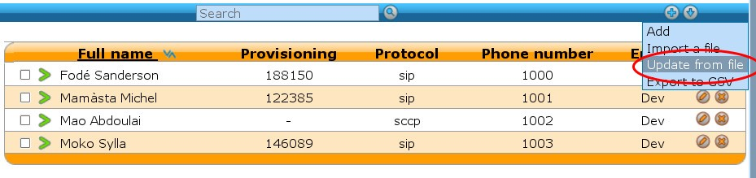
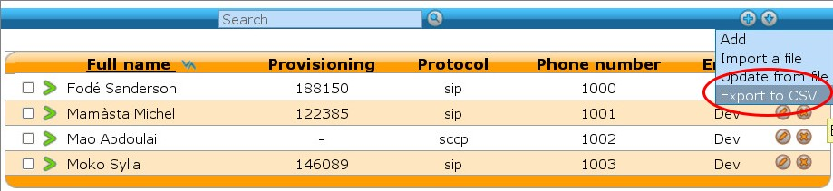

**********************
User Import and Export
**********************

CSV Import
==========

Users can be imported and associated to other resources by use of a CSV file. CSV Importation can be
used in situations where you need to modify many users at the same in an efficient manner, or for
migrating users from one system to another. A CSV file can be created and edited by spreadsheet
tools such as Excel, LibreOffice/OpenOffice Calc, etc.

CSV file
--------

The first line of a CSV file contains a list of field names (also sometimes called "columns"). Each
new line afterwards are users to import. CSV data must respect the following conditions:

*  Files must be encoded in UTF-8
*  Fields must be separated with a ``,``
*  Fields can be optionally quoted with a ``"``
*  Double-quotes can be escaped by writing them twice (e.g. ``Robert ""Bob"" Jenkins``)
*  Empty fields or headers that are not defined will be considered null.
*  Fields of type `bool` must be either ``0`` for false, or ``1`` for true.
*  Fields of type `int` must be a positive number

In the following tables, columns have been grouped according to their resource. Each resource is
created and associated to its user when all required fields for that resource are present.

User
~~~~

+--------------------------+--------+----------+-----------------------------------+-----------------------------------------------------------+
| Field                    | Type   | Required | Values                            | Description                                               |
+==========================+========+==========+===================================+===========================================================+
| entity_id                | int    | Yes      |                                   | Entity ID (Defined in menu :menuselection:`Configuration  |
|                          |        |          |                                   | --> Management --> Entities`)                             |
+--------------------------+--------+----------+-----------------------------------+-----------------------------------------------------------+
| firstname                | string | Yes      |                                   | User's firstname                                          |
+--------------------------+--------+----------+-----------------------------------+-----------------------------------------------------------+
| lastname                 | string |          |                                   | User's lastname                                           |
+--------------------------+--------+----------+-----------------------------------+-----------------------------------------------------------+
| email                    | string |          |                                   | User's email                                              |
+--------------------------+--------+----------+-----------------------------------+-----------------------------------------------------------+
| language                 | string |          | de_DE, en_US, es_ES, fr_FR, fr_CA | User's language                                           |
+--------------------------+--------+----------+-----------------------------------+-----------------------------------------------------------+
| mobile_phone_number      | string |          |                                   | Mobile phone number                                       |
+--------------------------+--------+----------+-----------------------------------+-----------------------------------------------------------+
| outging_caller_id        | string |          |                                   | Customize outgoing caller id for this user                |
+--------------------------+--------+----------+-----------------------------------+-----------------------------------------------------------+
| enabled                  | bool   |          |                                   | Enable/Disable the user                                   |
+--------------------------+--------+----------+-----------------------------------+-----------------------------------------------------------+
| supervision_enabled      | bool   |          |                                   | Enable/Disable supervision                                |
+--------------------------+--------+----------+-----------------------------------+-----------------------------------------------------------+
| call_transfer_enabled    | bool   |          |                                   | Enable/Disable call transfers                             |
+--------------------------+--------+----------+-----------------------------------+-----------------------------------------------------------+
| simultaneous_calls       | int    |          |                                   | Number of calls a user can have on his phone              |
|                          |        |          |                                   | simultaneously                                            |
+--------------------------+--------+----------+-----------------------------------+-----------------------------------------------------------+
| ring_seconds             | int    |          | Must be a multiple of 5           | Number of seconds a call will ring before ending          |
+--------------------------+--------+----------+-----------------------------------+-----------------------------------------------------------+
| call_permission_password | string |          |                                   | Overwrite all passwords set in call permissions           |
|                          |        |          |                                   | associated to the user                                    |
+--------------------------+--------+----------+-----------------------------------+-----------------------------------------------------------+

CTI Profile
~~~~~~~~~~~

+---------------------+--------+-------------------------+--------+------------------------------------------------------------------------+
| Field               | Type   | Required                | Values | Description                                                            |
+=====================+========+=========================+========+========================================================================+
| cti_profile_enabled | bool   | No                      |        | Activates the XiVO Client account for this user                        |
+---------------------+--------+-------------------------+--------+------------------------------------------------------------------------+
| username            | string | Yes, if profile enabled |        | XiVO Client username                                                   |
+---------------------+--------+-------------------------+--------+------------------------------------------------------------------------+
| password            | string | Yes, if profile enabled |        | XiVO Client password                                                   |
+---------------------+--------+-------------------------+--------+------------------------------------------------------------------------+
| cti_profile_name    | string | Yes, if profile enabled |        | XiVO Client profile (Defined in menu :menuselection:`Services -->      |
|                     |        |                         |        | CTI server --> Profiles`)                                              |
+---------------------+--------+-------------------------+--------+------------------------------------------------------------------------+

Phone
~~~~~

+---------------+--------+----------+-----------+------------------------------------------------------------------------------------------+
| Field         | Type   | Required | Values    | Description                                                                              |
+===============+========+==========+===========+==========================================================================================+
| exten         | string | Yes      |           | Number for calling the user. The number must be inside the range of acceptable numbers   |
|               |        |          |           | defined for the context                                                                  |
+---------------+--------+----------+-----------+------------------------------------------------------------------------------------------+
| context       | string | Yes      |           | Context                                                                                  |
+---------------+--------+----------+-----------+------------------------------------------------------------------------------------------+
| line_protocol | string | Yes      | sip, sccp | Line protocol                                                                            |
+---------------+--------+----------+-----------+------------------------------------------------------------------------------------------+
| sip_username  | string |          |           | SIP username                                                                             |
+---------------+--------+----------+-----------+------------------------------------------------------------------------------------------+
| sip_secret    | string |          |           | SIP secret                                                                               |
+---------------+--------+----------+-----------+------------------------------------------------------------------------------------------+

Incoming call
~~~~~~~~~~~~~

+---------------------+--------+----------+--------+---------------------------------------------------------------------------------------+
| Field               | Type   | Required | Values | Description                                                                           |
+=====================+========+==========+========+=======================================================================================+
| incall_exten        | string | Yes      |        | Number for calling the user from an incoming call (i.e outside of XiVO). The number   |
|                     |        |          |        | must be inside the range of acceptable numbers defined for the context.               |
+---------------------+--------+----------+--------+---------------------------------------------------------------------------------------+
| incall_context      | string | Yes      |        | context used for calls coming from outside of XiVO                                    |
+---------------------+--------+----------+--------+---------------------------------------------------------------------------------------+
| incall_ring_seconds | int    |          |        | Number of seconds a call will ring before ending                                      |
+---------------------+--------+----------+--------+---------------------------------------------------------------------------------------+

Voicemail
~~~~~~~~~

+---------------------------+--------+----------+---------------------------+------------------------------------------------------------+
| Field                     | Type   | Required | Values                    | Description                                                |
+===========================+========+==========+===========================+============================================================+
| voicemail_name            | string | Yes      |                           | Voicemail name                                             |
+---------------------------+--------+----------+---------------------------+------------------------------------------------------------+
| voicemail_number          | string | Yes      |                           | Voicemail number                                           |
+---------------------------+--------+----------+---------------------------+------------------------------------------------------------+
| voicemail_context         | string | Yes      |                           | Voicemail context                                          |
+---------------------------+--------+----------+---------------------------+------------------------------------------------------------+
| voicemail_password        | string |          | A sequence of digits or # | Voicemail password                                         |
+---------------------------+--------+----------+---------------------------+------------------------------------------------------------+
| voicemail_email           | string |          |                           | Email for sending notifications of new messages            |
+---------------------------+--------+----------+---------------------------+------------------------------------------------------------+
| voicemail_attach_audio    | bool   |          |                           | Enable/Disable attaching audio files to email message      |
+---------------------------+--------+----------+---------------------------+------------------------------------------------------------+
| voicemail_delete_messages | bool   |          |                           | Enable/Disable deleting message after notification is sent |
+---------------------------+--------+----------+---------------------------+------------------------------------------------------------+
| voicemail_ask_password    | bool   |          |                           | Enable/Disable password checking                           |
+---------------------------+--------+----------+---------------------------+------------------------------------------------------------+

Call permissions
~~~~~~~~~~~~~~~~

+------------------+--------+----------+-------------------------------------------+-----------------------------------------------------+
| Field            | Type   | Required | Values                                    | Description                                         |
+==================+========+==========+===========================================+=====================================================+
| call_permissions | string |          | list separated by semicolons (``;``)      | Names of the call permissions to assign to the user |
+------------------+--------+----------+-------------------------------------------+-----------------------------------------------------+

Importing a file
----------------

Once your file is ready, you can import it via :menuselection:`Services --> IPBX --> IPBX settings
--> Users`. At the top of the page there is a plus button. A submenu will appear when the mouse is
on top. Click on Import a file.

.. figure:: images/Import_user_menu.png
   :scale: 80%
   :alt: Import users

   Import Users

Examples
~~~~~~~~

The following example defines 3 users who each have a phone number. The first 2 users have a SIP
line, where as the last one uses SCCP::

    entity_id,firstname,lastname,exten,context,line_protocol
    1,John,Doe,1000,default,sip
    1,George,Clinton,1001,default,sip
    1,Bill,Bush,1002,default,sccp

The following example imports a user with a phone number and a voicemail::

    entity_id,firstname,lastname,exten,context,line_protocol,voicemail_name,voicemail_number,voicemail_context
    1,John,Doe,1000,default,sip,Voicemail for John Doe,1000,default

The following exmple imports a user with both an internal and external phone number (e.g. incoming
call)::

    entity_id,firstname,lastname,exten,context,line_protocol,incall_exten,incall_context
    1,John,Doe,1000,default,sip,2050,from-extern

CSV Update
==========

The field list for an update is the same as for an import with the addition of the column uuid,
which is mandatory. For each line in the CSV file, the updater goes through the following steps:

#. Find the user, using the uuid
#. For each resource (line, voicemail, extension, etc) find out if it already exists.
#. If an existing resource was found, associate it with the user. Otherwise, create it.
#. Update all remaining fields

The following restrictions must also be respected during update:

* Columns that are not included in the CSV header will not be updated.
* A field that is empty (i.e, “”) will be converted to NULL, which will unset the value.
* A line’s protocol cannot be changed (i.e you cannot go from “sip” to “sccp” or vice-versa).
* An incall cannot be updated if the user has more than one incall associated.

Updating is done through the same menu as importing (:menuselection:`Services --> IPBX --> IPBX
settings --> Users`). A submenu will appear when the mouse is on top. Click on `Update from file` in
the submenu.

   :menuselection:`Services --> IPBX --> IPBX settings --> Users --> Update from file`

CSV Export
==========

CSV exports can be used as a scaffold for updating users, or as a means of importing users into
another system. An export will generate a CSV file with the same list of columns as an import, with
the addition of uuid and provisioning_code.

Exports are done through the same menu as importing (:menuselection:`Services --> IPBX --> IPBX
settings --> Users`).  Click on `Export to CSV` in the submenu. You will be asked to download a
file.

   :menuselection:`Services --> IPBX --> IPBX settings --> Users --> Export to CSV`
