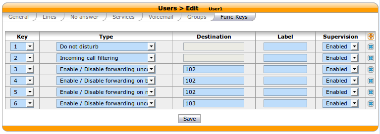
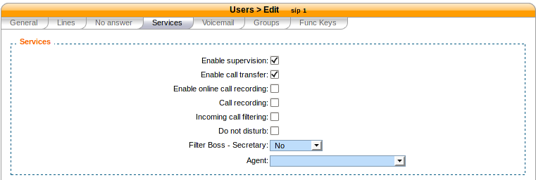

*****
Users
*****

Users Configuration.

.. index:: users

Importing Users
===============

You may import your users using a csv comma separated file. Users and lines are automatically created.

How to import users
-------------------

Once you have saved your file, you can import your users via
the :menuselection:`Services --> IPBX --> IPBX settings --> Users` page by clicking on the plus button.

.. figure:: images/Import_user_menu.png
   :scale: 80%
   :alt: Import users

   Import Users

Supported fields
----------------

+-------------------------+------------------------------------------------------+-------------------------------------------------------------------------+
| Field                   | Values                                               | Description                                                             |
|                         |                                                      |                                                                         |
+=========================+======================================================+=========================================================================+
|                         |                                                      |                                                                         |
+-------------------------+------------------------------------------------------+-------------------------------------------------------------------------+
| **[section user]**      | **To add a user**                                    |                                                                         |
+-------------------------+------------------------------------------------------+-------------------------------------------------------------------------+
| entityid                | int                                                  | entity id (configuration menu) ``Must be a valid entityid``             |
+-------------------------+------------------------------------------------------+-------------------------------------------------------------------------+
| firstname *             | string                                               | User firstname                                                          |
+-------------------------+------------------------------------------------------+-------------------------------------------------------------------------+
| lastname                | string                                               | User lastname                                                           |
+-------------------------+------------------------------------------------------+-------------------------------------------------------------------------+
| language **             | enum `['de_DE', 'en_US', 'es_ES', 'fr_FR', 'fr_CA']` | Locale ``Must be set if you add a voicemail``                           |
+-------------------------+------------------------------------------------------+-------------------------------------------------------------------------+
| enableclient            | bool `[0, 1]`                                        | If set to 1, username and password fields have to be set                |
+-------------------------+------------------------------------------------------+-------------------------------------------------------------------------+
| username                | string                                               | XiVO Client username                                                    |
+-------------------------+------------------------------------------------------+-------------------------------------------------------------------------+
| password                | string                                               | XiVO Client password                                                    |
+-------------------------+------------------------------------------------------+-------------------------------------------------------------------------+
| profileclient           | string                                               | XiVO Client profile defined in menu: `Services > CTI server > Profiles` |
+-------------------------+------------------------------------------------------+-------------------------------------------------------------------------+
| outcallerid             | string                                               | Customize outgoing caller id for this user                              |
+-------------------------+------------------------------------------------------+-------------------------------------------------------------------------+
| agentnumber             | string                                               | Associated agent number                                                 |
+-------------------------+------------------------------------------------------+-------------------------------------------------------------------------+
| mobilephonenumber       | string                                               | Mobile phone number                                                     |
+-------------------------+------------------------------------------------------+-------------------------------------------------------------------------+
| bosssecretary           | enum `['no','boss','secretary']`                     | Filter: Boss - Secretary                                                |
+-------------------------+------------------------------------------------------+-------------------------------------------------------------------------+
| enablehint              | bool `[0, 1]`                                        | Enable/Disable supervision                                              |
+-------------------------+------------------------------------------------------+-------------------------------------------------------------------------+
| enablexfer              | bool `[0, 1]`                                        | Enable/Disable call transfers                                           |
+-------------------------+------------------------------------------------------+-------------------------------------------------------------------------+
|                         |                                                      |                                                                         |
+-------------------------+------------------------------------------------------+-------------------------------------------------------------------------+
| **[section line]**      | **To add a line to an user**                         |                                                                         |
+-------------------------+------------------------------------------------------+-------------------------------------------------------------------------+
| phonenumber *           | string                                               | User phone number creates a line ``Must exist in context <context>``    |
+-------------------------+------------------------------------------------------+-------------------------------------------------------------------------+
| context *               | string                                               | context name ``internal context must exist e.g. default``               |
+-------------------------+------------------------------------------------------+-------------------------------------------------------------------------+
| protocol *              | enum `['sip', 'sccp']`                               | Line protocol                                                           |
+-------------------------+------------------------------------------------------+-------------------------------------------------------------------------+
| linename                | string                                               | Line name (SIP only)                                                    |
+-------------------------+------------------------------------------------------+-------------------------------------------------------------------------+
| linesecret              | string                                               | Line secret (SIP only)                                                  |
+-------------------------+------------------------------------------------------+-------------------------------------------------------------------------+
|                         |                                                      |                                                                         |
+-------------------------+------------------------------------------------------+-------------------------------------------------------------------------+
| **[section incall]**    | **To add an incall to an user**                      |                                                                         |
+-------------------------+------------------------------------------------------+-------------------------------------------------------------------------+
| incallexten *           | string                                               | DID number ``incallexten must exist in context <incallcontext>``        |
+-------------------------+------------------------------------------------------+-------------------------------------------------------------------------+
| incallcontext *         | string                                               | Context name ``incall context must exist e.g. from-extern``             |
+-------------------------+------------------------------------------------------+-------------------------------------------------------------------------+
| incallringseconds       | int                                                  | Ring time in seconds                                                    |
+-------------------------+------------------------------------------------------+-------------------------------------------------------------------------+
|                         |                                                      |                                                                         |
+-------------------------+------------------------------------------------------+-------------------------------------------------------------------------+
| **[section voicemail]** | **To add a voicemail to a user**                     | You must set a language to use this section                             |
+-------------------------+------------------------------------------------------+-------------------------------------------------------------------------+
| voicemailname *         | string                                               | Voicemail fullname                                                      |
+-------------------------+------------------------------------------------------+-------------------------------------------------------------------------+
| voicemailmailbox *      | string                                               | Mailbox number                                                          |
+-------------------------+------------------------------------------------------+-------------------------------------------------------------------------+
| voicemailpassword       | string                                               | Password voicemail                                                      |
+-------------------------+------------------------------------------------------+-------------------------------------------------------------------------+
| voicemailemail          | string                                               | Mail to send a notification when a message is received                  |
+-------------------------+------------------------------------------------------+-------------------------------------------------------------------------+
| voicemailattach         | bool `[0, 1]`                                        | Enable/Disable attach the audio file to your mail                       |
+-------------------------+------------------------------------------------------+-------------------------------------------------------------------------+
| voicemaildelete         | bool `[0, 1]`                                        | Enable/Disable delete message after notification                        |
+-------------------------+------------------------------------------------------+-------------------------------------------------------------------------+
| voicemailskippass       | bool `[0, 1]`                                        | Enable/Disable password checking                                        |
+-------------------------+------------------------------------------------------+-------------------------------------------------------------------------+

.. warning::
   "*", this field is required - valid by section

.. warning::
   "**", this field is required if you add a voicemail

Examples
--------

First step is to create a text file containing the users you want to create. Here's a basic example::

   entityid|firstname|lastname|phonenumber|context|protocol|mobilephonenumber
   1|John|Doe|1000|default|sip|00123456789
   1|George|Clinton|1001|default|sip|00123456789
   1|Bill|Bush|1002|default|sip|00123456789

This example defines 3 users:

 * John Doe with one SIP line with number 1000
 * George Clinton with one SIP line with number 1001
 * Bill Bush with one SIP line with number 1002

.. note::

   Note that the number you use must all be in the range you defined for your default context.

Text file to add a simple user with a line and voicemail::

   entityid|firstname|lastname|language|phonenumber|context|protocol|voicemailname|voicemailmailbox|voicemailpassword
   1|John|Doe|en_US|1000|default|sip|John Doe|1000|1234

Text file to add a simple user with a line and incall::

   entityid|firstname|lastname|phonenumber|context|protocol|incallexten|incallcontext
   1|John|Doe|1000|default|sip|2050|from-extern

Function keys
=============

Function keys can be configured to customize the user's phone keys. Key types are pre-defined and
can be browsed through the Type drop-down list. The Supervision field allows the key to be
supervised. A supervised key will light up when enabled. In most cases, a user cannot add multiple
times exactly the same function key (example : two user function keys pointing to the same user).
Adding the same function key multiple times can lead to undefined behavior and
generally will delete one of the two function keys.

.. warning::

   SCCP device only supports type "Customized".

For User keys, start to key in the user name in destination, XiVO will try to complete with the corresponding user.

If the forward unconditionnal function key is used with no destionation the user will be prompted when the user
presses the function key and the BLF will monitor *ALL* unconditionnal forward for this user.

Extensions
==========

`*3` (online call recording)
----------------------------

To enable online call recording, you must check the "Enable online call recording" box in the user form.

   Users Services

When this option is activated, the user can press ``*3`` during a conversation to start/stop online
call recording. The recorded file will be available in the :file:`monitor` directory of the
:menuselection:`Services --> IPBX --> Audio files` menu.

`*26` (call recording)
----------------------

You can enable/disable the recording of all calls for a user in 2 different way:

1. By checking the "Call recording" box of the user form.

   Users Services

2. By using the extension `*26` from your phone (the "call recording" option must be activated
   in :menuselection:`Services --> IPBX --> Extensions`).

When this option is activated, all calls made to or made by the user will be recorded in the :file:`monitor`
directory of the :menuselection:`Services --> IPBX --> Audio files` menu.
