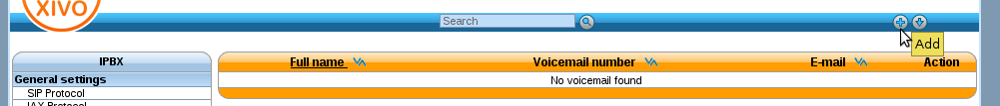
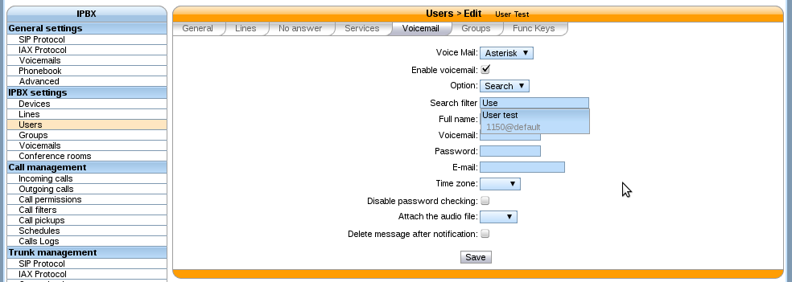
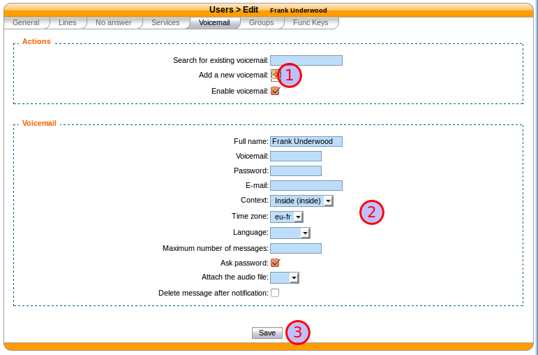
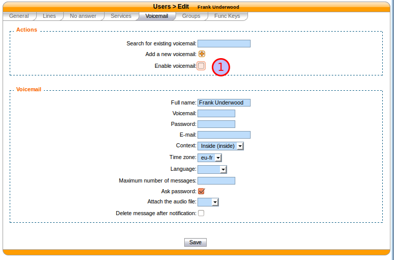
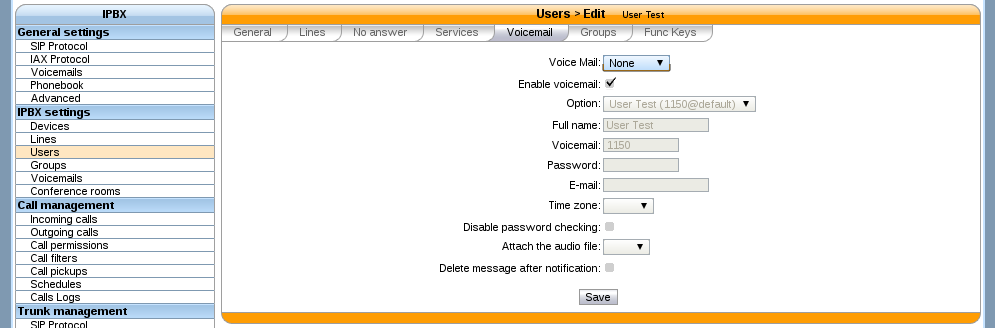
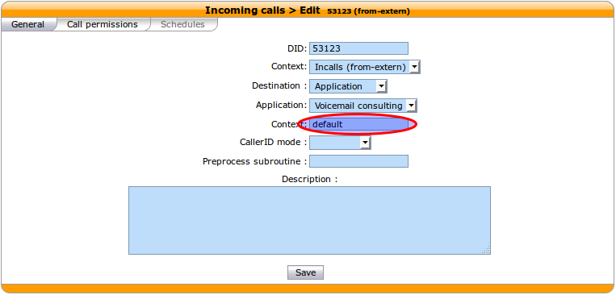

*********
Voicemail
*********

Voicemail Configuration.

General Configuration
=====================

You can configure general settings for your voicemail service in :menuselection:`Services --> IPBX --> General Settings --> Voicemails` page.

Adding voicemail
================

There are 2 ways to add a voicemail. First is with :menuselection:`Services --> IPBX --> IPBX settings --> Voicemails` page, 2nd is editing user's configuration.

1 - Via :menuselection:`Services --> IPBX --> IPBX settings --> Voicemails`
---------------------------------------------------------------------------

In here you can add some voicemails and configure them by clicking on the plus button.

   Add voicemail from voicemails menu

Once your voicemails are configured, you have to edit the users configuration to search the voicemails previously created and then associate them to your users.

   Search voicemail for specific user

2 - On user's configuration
---------------------------

The other way is to directly add the voicemail from user's configuration in the 'voicemail' tab :

   Add voicemail from user configuration

.. warning::

   In this way, the language has to be set in user's general configuration

Deactivating voicemail
======================

You can deactivate user's voicemail by un-checking 'Enable voicemail' option on the Voicemail tab from user's configuration:

   Deactivate user's voicemail

Disassociating voicemail
========================

You can disassociate a voicemail from a user by selecting the 'None' option on 'Voice Mail' select box, from user's configuration:

   Disassociate voicemail

.. warning::

   Note that disassociating a voicemail from its user don't delete that voicemail.

Deleting voicemail
==================

Delete voicemail is done on :menuselection:`Services --> IBX --> IPBX settings --> Voicemails`

.. warning::

   * Deleting a voicemail is irreversible. It deletes all messages associated with that voicemail.
   * If concerned user still have messages waiting for him, you have to manually reboot the phone.

Disable password checking
=========================

This option allows to skip password checking for the voicemail when it is consulted from the inside. More precisely, password
checking will be skipped:

* when calling the voicemail with \*98
* when calling the voicemail with \*99<voicemail number>

But it will not be skipped when the voicemail is consulted through an incoming call. For instance, let's consider the following
incoming call:

With such a configuration, when calling this incoming call from the outside, we will be asked for:

* the voicemail number we want to consult
* the voicemail password, **even if the "Disable password checking option" is activated**

And then, we will be granted access to the voicemail.

Take note that the second "context" field contains the context of the voicemail. Voicemails of other contexts
will not be accessible through this incoming call.

Advanced configuration
======================

Remote *xivo-confd*
-------------------

If *xivo-confd* is on a remote host, *xivo-confd-client* configuration will be
required to be able to change the voicemail passwords using a phone.

This configuration should be added to ``/etc/default/asterisk``

.. code-block:: sh

    export CONFD_HOST=localhost
    export CONFD_PORT=9486
    export CONFD_HTTPS=true
    export CONFD_USERNAME=<username>
    export CONFD_PASSWORD=<password>
    export CONFD_AUTH_METHOD=digest
