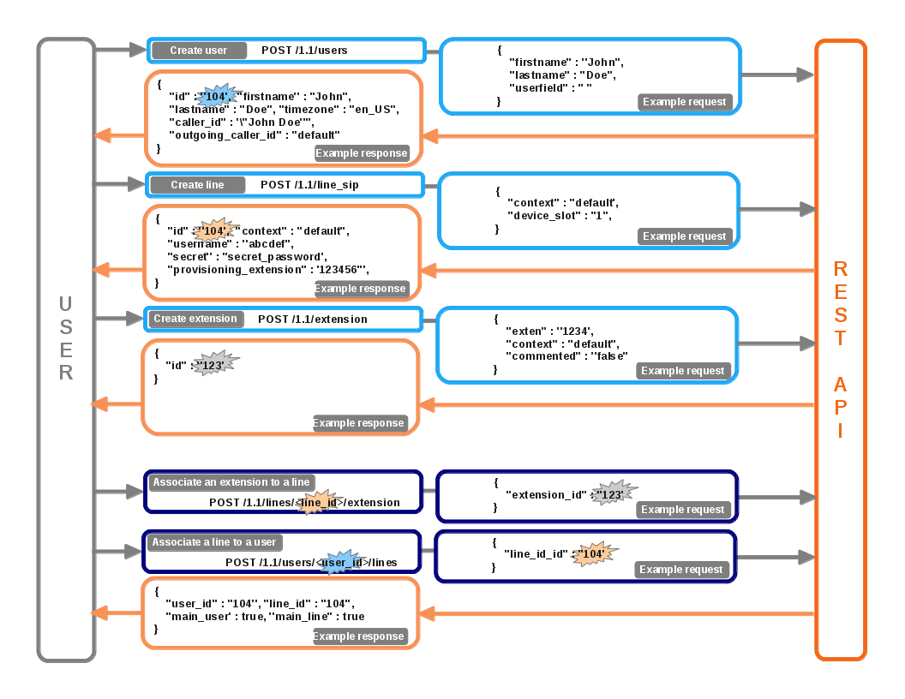

*********************
REST API 1.1 examples
*********************

User - Line - Extension association
===================================

   Download source. :download:`(source) <resources/User_case_ULE.odg>`

Voicemail - User association
============================

.. figure:: resources/User_case_Voicemail.png

    Download source. :download:`(source) <resources/User_case_Voicemail.odg>`

Multiple users for a line association
=====================================

.. figure:: resources/n_User_1_device_ULE.png

    Download source. :download:`(source) <resources/n_User_1_device_ULE.odg>`
