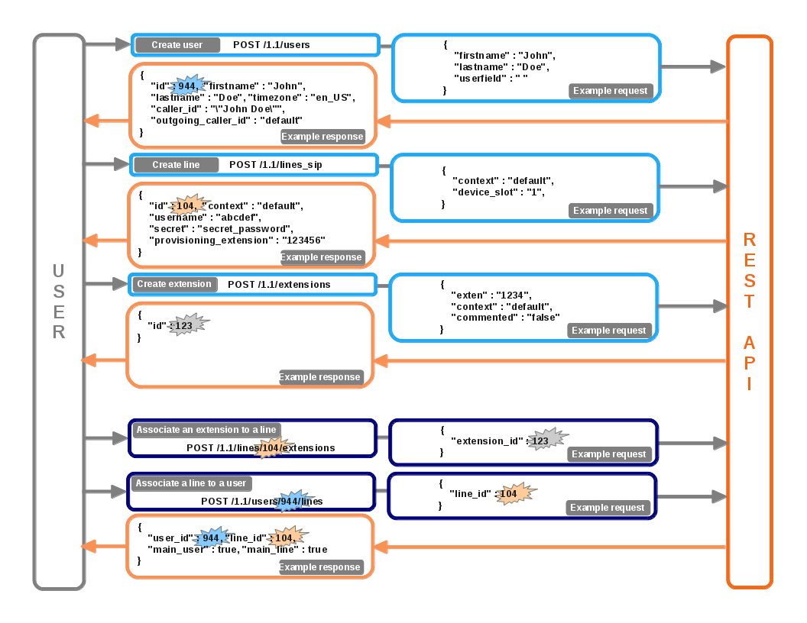
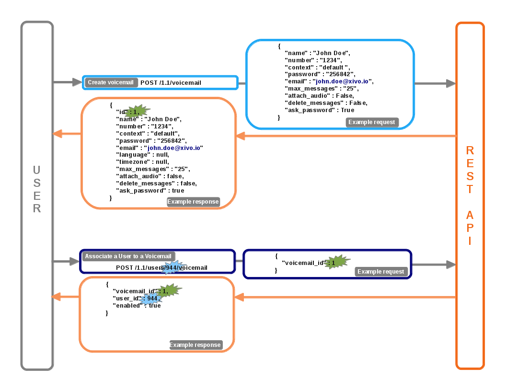
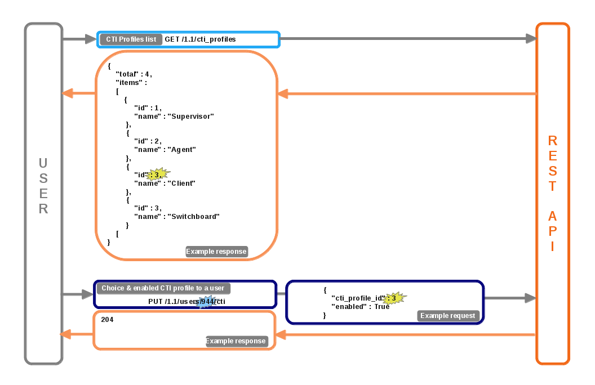
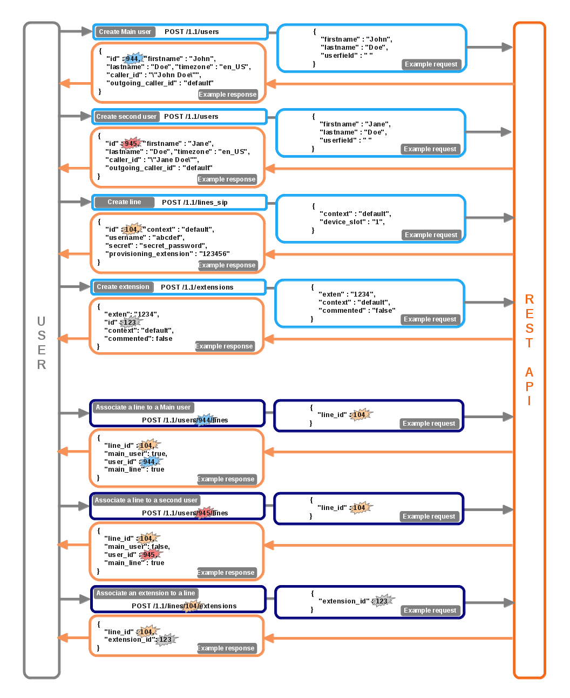

*********************
REST API 1.1 examples
*********************

Create User for a line and a exten
==================================

Add user, line and exten with association
-----------------------------------------

   Download source. :download:`(source) <resources/User_case_ULE.odg>`

Add voicemail with association
------------------------------

    Download source. :download:`(source) <resources/User_case_Voicemail.odg>`

Choice and add CTI profile with association
-------------------------------------------

    Download source. :download:`(source) <resources/User_CTI_Profiles.odg>`

Multiple users for a line association
=====================================

    Download source. :download:`(source) <resources/n_User_1_device_ULE.odg>`
