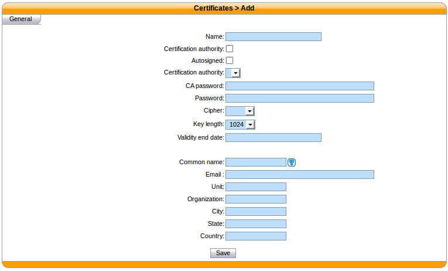

************
Certificates
************

XiVO offers the possibility to create and manage X.509 certificates via the
the :menuselection:`Configuration --> Management --> Certificates` page.

These certificates can be used for:

* enabling SIP TLS
* enabling encryption between the CTI server and the XiVO clients

Creating certificates
=====================

You can add a certificate by clicking on the add button at the top right of the page.
You'll then be shown this page:

   Adding a certificate

You should look at the `examples`_ if you don't know which attributes to set
when creating your certificates.

Removing certificates
=====================

When removing a certificate, you should remove all the files related to that
certificates.

.. warning::
   If you remove a certificate that is used somewhere in XiVO, then you need
   to manually reconfigure that portion of XiVO.
   
   For example, if you remove the certificate files used for SIP TLS, then you need to
   manually disable SIP TLS or asterisk will look for certificate file but it won't
   be able to find them.

Examples
========

In the following examples, if a field is not specified than you should leave it
at its default value.

Creating certificates for SIP TLS
---------------------------------

You need to create both a CA certificate and a server certificate.

CA certificate:

* :guilabel:`Name` : phones-CA
* :guilabel:`Certification authority (checkbox)` : checked
* :guilabel:`Autosigned` : checked
* :guilabel:`Valid end date` : at least one day in the future
* :guilabel:`Common name` : the :abbr:`FQDN (Fully Qualified Domain Name)` of your XiVO
* :guilabel:`Organization` : your organization's name, or blank

Server certificate:

* :guilabel:`Name` : phones
* :guilabel:`Certification authority (select)` : phones-CA
* :guilabel:`Valid end date` : at least one day in the future
* :guilabel:`Common name` : the :abbr:`FQDN (Fully Qualified Domain Name)` of your XiVO
* :guilabel:`Organization` : your organization's name, or blank

Creating certificate for CTI server
-----------------------------------

* :guilabel:`Name` : xivo-ctid
* :guilabel:`Autosigned` : checked
* :guilabel:`Valid end date` : at least one day in the future
* :guilabel:`Common name` : the :abbr:`FQDN (Fully Qualified Domain Name)` of your XiVO
* :guilabel:`Organization` : your organization's name, or blank
