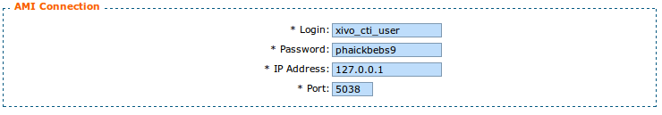

**********
CTI Server
**********

.. index:: ctiserver

The CTI server configuration options can be found in the web-interface under the services tab. 

General options
===============

The general options allow the administrator to manage network connections between the CTI server 
and other services and clients.

The section named AMI connection allow the administrator to configure the
information that is required to connect to the Asterisk Manager Interface
(AMI). These fields should match the entries in `/etc/asterisk/manager.conf`.

The section named Listening Ports allows the administrator to specify listening
addresses and ports for the CTI server's interfaces.

* Fast AGI is the CTI server's entry point for the Asterisk dialplan. This
  address and port have nothing to do with the listening port and address of
  xivo-agid.
* CTI and CTIs are for the client's connection and secure connection respectively.
* Web Interface is for the port used to receive events from the XiVO web interface
* Info server a debugging console to do some introspection on the state of the CTI server
* Announce is used to notify the CTI server when a dialplan reload is requested

.. image:: images/listening_ports.png

The timeout section allow the administrator to configure multiple timeouts.

* Update period is a poll delay to retrieve new information from the web services.
* Socket timeout is the default timeout used for network connections.
* Login timeout is the timeout before a CTI connection is dropped if the
  authentication is not completed.

.. image:: images/cti_timeout.png

Parting options are used to isolate XiVO users from each other. These options
should be used when using the same XiVO for different enterprises.

Context separation is based on the user's line context. This mean that a user
with no line is not the member of any context and will not be able to do
anything with the CTI client.

.. image:: images/parting_options.png

Sheet configuration
===================

Sheet and/or Directory variables
--------------------------------

In the sheet configuration, 3 kinds of variables are available

`xivo-` prefixed ones are those for which the keywords are reserved and set inside the CTI server:
 
 * `xivo-where` for sheet events, is the event triggering the sheet
 * `xivo-origin` is the place from where the lookup is requested (did, internal, forcelookup)
 * `xivo-direction` is either incoming or internal
 * `xivo-did` is the DID number
 * `xivo-calleridnum`
 * `xivo-calleridname`
 * `xivo-calleridrdnis` contains information whether there was a transfer
 * `xivo-calleridton` is the Type Of Network (national, international)
 * `xivo-calledidnum`
 * `xivo-calledidname`
 * `xivo-context`
 * `xivo-ipbxid` (`xivo-astid` in 1.1)
 * `xivo-directory` : for directory requests, it is the directory database the item has been found
 * `xivo-queuename` is the queue called
 * `xivo-agentnumber` is the agent number called
 * `xivo-date` is the formatted date string
 * `xivo-time` is the formatted time string
 * `xivo-channel` is the asterisk channel value (for advanced users)
 * `xivo-uniqueid` is the asterisk uniqueid value (for advanced users)

`db-` prefixed ones are those defined in the WEBI configuration, and depend on the matching list. Common values are :
 
 * `db-phone`
 * `db-firstname`
 * `db-lastname`
 * `db-company`

`dbr-` contains one single item `dbr-display` that is used in the setting of what is displayed on phones, 
and is typically a mix of firstname and lastname

`dp-` prefixed ones are the variables set through the dialplan (through UserEvent application)

sheet line items
----------------

 * title : (anything, "title", default value, variable pattern)
 * text item : (anything, "text", default value, variable pattern)
 * ui form : (anything, "form", anything, "qtui")
 * user picture : (anything, "picture", anything, {xivo-callerpicture})

urlauto syntaxes
----------------

 * `http://x.y.z.co.fr/anything` opens the URL on the default browser
 * `tcp://x.y.z.co.fr:4545/?var1=a1&var2=a2&var3=v3` connects to TCP port 4545 on x.y.z.co.fr, sends the string `var1=a1&var2=a2&var3=v3`, then closes
 * `udp://x.y.z.co.fr:4545/?var1=a1&var2=a2&var3=v3` connects to UDP port 4545 on x.y.z.co.fr, sends the string `var1=a1&var2=a2&var3=v3`, then closes

.. note:: any string that would not be understood as an URL will be handled like
   it is a process to launch and will be executed as it is written

For `tcp://` and `udp://`, it is a requirement that the string between `/` and `?` is empty.
An extension of it could be to define other serialization methods, if needed.

Dialplan interaction
--------------------

* UserEvents, dialplan2cti
* FAGI's
