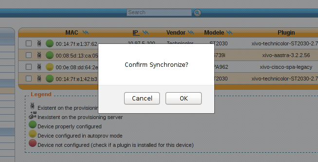
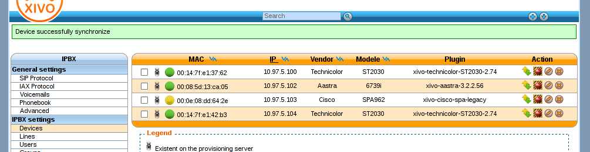
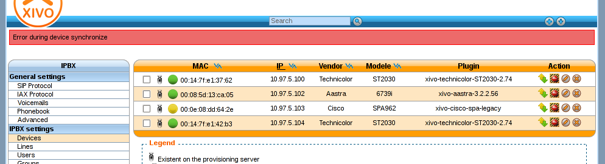
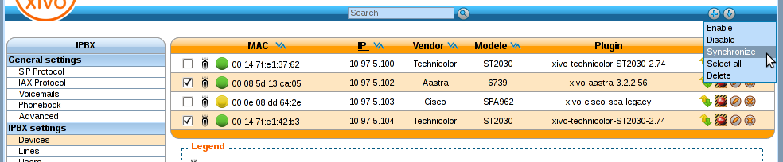
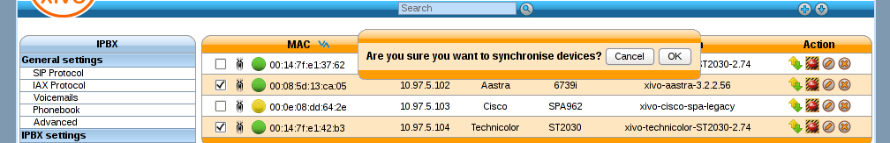
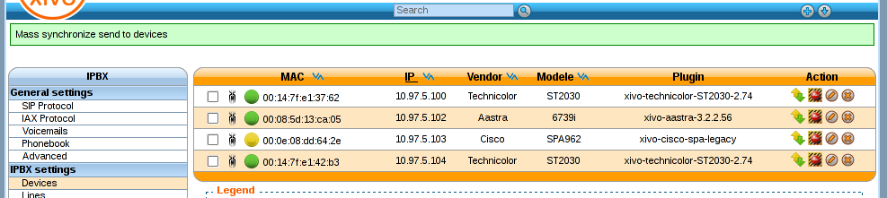

*******
Devices
*******

Devices Configuration.

.. index:: devices

Synchronize a device
====================

You first have to display list devices.

   Click on synchronize button for a device.

.. figure:: images/list_devices.png
   :scale: 80%
   :alt: List devices

   List devices
    
You will see a pop-up to confirm synchronization
 Click on <ok> button.

   Alert confirm  synchronize

You must wait until the full synchronization process to determine the state back.
This can take several seconds. It is important to wait and do nothing during that time.

.. figure:: images/request_processing.png
   :scale: 80%
   :alt: Request page processing

   Request synchronisation processing

If synchronization is successful, an information balloon green warn you of success.

   Device successfully synchronize

If synchronization fails, an information balloon red warning you of success.

   Error during device synchronize
    

Synchronize multiple devices
============================

.. warning:: By using multiple synchronization, the state of return will not be returned.

Select the devices you want to synchronize by checking the boxes.

   Synchronize selected devices

A pop-up will emerge to request confirmation.

   Synchronize selected devices confirmation

If synchronization mass was successfully sent to devices., an information balloon green warn you of success.

   Mass synchronize request successfully send
