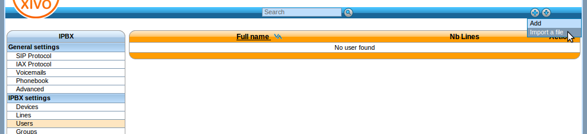

*****
Users
*****

Users Configuration.

.. index:: users

Importing Users
===============

You may import your users using a csv comma separated file. Users and lines are automatically created.

How to import users
-------------------

First step is to create a text file containing the users you want to create. Here's a basic example:

::

 firstname|lastname|phonenumber|context|protocol
 John|Doe|1001|default|sip
 Jane|Doe|1002|default|sip

This example defines 2 users, one named John Doe with one SIP line with number 1001 and another named Jane Doe with one SIP line with number 1002.

Note that the number you use must all be in the range you defined for your default context.

Once you have saved your file, you can import your users via 
the :menuselection:`Services > IPBX > IPBX settings > Users` page by clicking on the plus button. 

    
    Import Users

Supported fields
----------------

+-------------------+---------------------------------------------------------------------------------+
| Field             | Description                                                                     |
|                   |                                                                                 |
+===================+=================================================================================+
| entityid          | entity name (configuration menu)                                                |
+-------------------+---------------------------------------------------------------------------------+
| firstname         | User first name                                                                 |
+-------------------+---------------------------------------------------------------------------------+
| lastname          | User last name                                                                  |
+-------------------+---------------------------------------------------------------------------------+
| phonenumber       | User phone number create a line                                                 |
+-------------------+---------------------------------------------------------------------------------+
| context           |                                                                                 |
+-------------------+---------------------------------------------------------------------------------+
| protocol          | ``sip sccp``                                                                    |
+-------------------+---------------------------------------------------------------------------------+
| enableclient      | Y  --> username and password have to be set                                     |
+-------------------+---------------------------------------------------------------------------------+
| username          | xivo client username                                                            |
+-------------------+---------------------------------------------------------------------------------+
| password          | xivo client password                                                            |
+-------------------+---------------------------------------------------------------------------------+
| profileclient     | xivo client profile define in :menuselection:`Services > CTI server > Profiles` |
+-------------------+---------------------------------------------------------------------------------+
| outcallerid       | Customize outgoing caller id for this user                                      |
+-------------------+---------------------------------------------------------------------------------+
| agentnumber       | Associated agent number                                                         |
+-------------------+---------------------------------------------------------------------------------+
| mobilephonenumber | Mobile phone number                                                             |
+-------------------+---------------------------------------------------------------------------------+
| bosssecretary     | Valid values [``boss secretary``]                                               |
+-------------------+---------------------------------------------------------------------------------+
|                   |                                                                                 |
+-------------------+---------------------------------------------------------------------------------+
|                   |                                                                                 |
+-------------------+---------------------------------------------------------------------------------+
