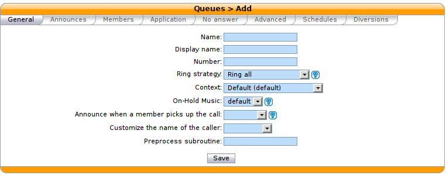

******
Queues
******

Call queues are managed on the
:menuselection:`Services --> Call Center --> Queues` page:

   :menuselection:`Services --> Call Center --> Queues`

Ring strategy
   Define how queue members are called when a call enters the queue.

   * Name : used as an unique id, cannot be ``general``
   * Display name : Displayed on the supervisor screens
   * Linear: for each call, call the first member, then the second, etc.
   * Least recent: call the member who has least recently hung up a call.
   * Fewest calls: call the member with the fewest completed calls.
   * Round robin memory: call the "next" member after the one who answered.
   * Random: call a member at random
   * Weight random: same as random, but taking the member penalty into account.
   * Ring all: call all members at the same time.

   .. warning::

      When editing a queue, you can't change the ring strategy to linear. This
      is due to an asterisk limitation. Unfortunately, if you want to change the
      ring strategy of a queue to linear, you'll have to delete and create a new
      queue with the right strategy.

.. figure:: queue_appli.png
    :scale: 85%

